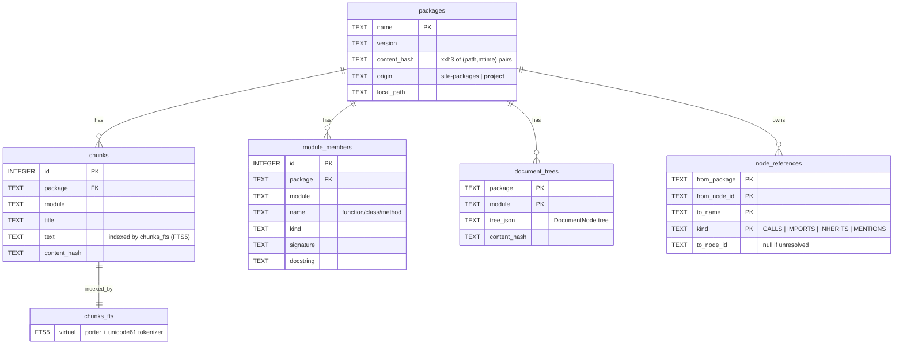

# pydocs-mcp — Documentation

The deep-dive companion to the [README](README.md). The README is the
30-second overview; this file covers the retrieval pipeline, reference graph,
two-level cache, configuration, database schema, the full CLI reference, and MCP
client integration. For the *extensibility* surface (storage backends, new
pipeline steps, planned features), see [EXTENSIONS.md](EXTENSIONS.md); for
contributor architecture rules, see [CLAUDE.md](CLAUDE.md).

---

## Retrieval pipeline

Every query runs through a **`RetrieverPipeline`** — an sklearn-shaped chain of
**named, addressable steps** (`Pipeline([(name, step), …])`). A `RetrieverPipeline`
*is* a `RetrieverStep`, so pipelines compose recursively: nest one as a step
inside another for sub-routing, and address any step by name
(`pipeline["fetch"]`) for introspection or testing.

### The default chunk-search pipeline (BM25)

The shipped default (`python/pydocs_mcp/pipelines/chunk_search.yaml`) is a
seven-step BM25 chain:

1. `pre_filter` — parse + validate + scope-split; writes a typed result to
   `state.scratch` for the fetcher.
2. `chunk_fetcher` — FTS5 `MATCH` with pre-filter pushdown (metadata filters run
   *inside* SQLite).
3. `bm25_scorer` — flip the sign so higher = better.
4. `metadata_post_filter` — apply any remaining `SearchQuery.post_filter`
   in-memory.
5. `top_k_filter` — sort by relevance, keep top K.
6. `limit` — cap the final item count.
7. `token_budget_formatter` — render the composite chunk for MCP output.

### Dense and hybrid retrieval

Two more retrieval modes ship as opt-in pipeline presets:

- **Dense** (`chunk_search_dense.yaml`, `chunk_search_dense_ranked.yaml`) — a
  `DenseFetcherStep` + `DenseScorerStep` query the TurboQuant vector store using
  embeddings from the configured `Embedder` (FastEmbed `BAAI/bge-small-en-v1.5`
  by default; OpenAI optional).
- **Hybrid** (`chunk_search_hybrid.yaml`, `chunk_search_hybrid_ranked.yaml`) — a
  `ParallelStep` runs the BM25 and dense branches concurrently, then an
  `RRFFusionStep` merges them with reciprocal-rank fusion into one ranking.

Select a preset by pointing the chunk pipeline at it in your config overlay (see
[Configuration](#configuration)); the default remains BM25.

Embedder inference runs on CPU by default. Pass `--gpu` to `serve` / `index` to
move it onto CUDA — same vectors, same cache, lower latency (see
[GPU inference](#gpu-inference---gpu)).

### Routing

`ConditionalStep` and `RouteStep` route per query type — e.g. send long or
structural queries down a different branch than short keyword lookups — without
modifying the branches themselves.

### Building pipelines in Python

For tests, benchmarks, or embedded usage, build an `IngestionPipeline` and a
`RetrieverPipeline` programmatically, no YAML required:

```python
import asyncio
import tempfile
from pathlib import Path

from pydocs_mcp.application import ProjectIndexer
from pydocs_mcp.db import build_connection_provider, open_index_database
from pydocs_mcp.extraction import (
    AstMemberExtractor,
    PipelineChunkExtractor,
    StaticDependencyResolver,
    build_ingestion_pipeline,
)
from pydocs_mcp.models import SearchQuery
from pydocs_mcp.retrieval.config import AppConfig
from pydocs_mcp.retrieval.pipeline import (
    PerCallConnectionProvider,
    RetrieverPipeline,
    RetrieverState,
)
from pydocs_mcp.retrieval.steps import (
    BM25ScorerStep,
    ChunkFetcherStep,
    LimitStep,
    MetadataPostFilterStep,
    TokenBudgetStep,
    TopKFilterStep,
)
from pydocs_mcp.storage.factories import (
    build_sqlite_indexing_service,
    build_sqlite_uow_factory,
)
from pydocs_mcp.storage.sqlite import SqliteChunkRepository


async def main() -> None:
    # 1. Fresh SQLite + ingestion pipeline from default AppConfig
    db_path = Path(tempfile.mkstemp(suffix=".sqlite")[1])
    open_index_database(db_path).close()
    config = AppConfig.load()

    indexer = ProjectIndexer(
        indexing_service=build_sqlite_indexing_service(db_path),
        dependency_resolver=StaticDependencyResolver(),
        chunk_extractor=PipelineChunkExtractor(pipeline=build_ingestion_pipeline(config)),
        member_extractor=AstMemberExtractor(),
        uow_factory=build_sqlite_uow_factory(db_path),
    )
    await indexer.index_project(Path("/path/to/your/project"))
    await SqliteChunkRepository(provider=build_connection_provider(db_path)).rebuild_index()

    # 2. RetrieverPipeline composed from named, addressable steps
    provider = PerCallConnectionProvider(cache_path=db_path)
    pipeline = RetrieverPipeline(
        name="chunk_search",
        steps=(
            ("fetch", ChunkFetcherStep(provider=provider)),
            ("score", BM25ScorerStep(name="bm25_scorer")),
            ("post_filter", MetadataPostFilterStep(name="metadata_post_filter")),
            ("topk", TopKFilterStep(name="top_k_filter")),
            ("limit", LimitStep(name="limit")),
            ("budget", TokenBudgetStep(name="token_budget_formatter")),
        ),
    )

    # 3. Run a search
    state = await pipeline.run(RetrieverState(query=SearchQuery(terms="async retry")))
    if state.result is not None:
        print(state.result.items[0].text[:500])


asyncio.run(main())
```

---

## CLI reference

The CLI mirrors the MCP tools one-to-one — same pipelines, same scoring, same
rendering.

```bash
# Serve as an MCP server (the most common entry point)
pydocs-mcp serve /path/to/project
pydocs-mcp serve . --no-inspect --depth 2 --workers 8 --config ./my-pydocs.yaml
pydocs-mcp serve . --gpu            # run embedder inference on CUDA (see "GPU inference" below)

# Index only (no server) — useful for one-shot benchmark setups
pydocs-mcp index .
pydocs-mcp index . --force          # clear cache + re-index
pydocs-mcp index . --skip-project   # only index deps, not the project
pydocs-mcp index . --gpu            # index with CUDA-accelerated embeddings

# Search (mirrors the MCP `search` tool)
pydocs-mcp search "batch inference"
pydocs-mcp search "predict" --kind api -p vllm
pydocs-mcp search "handle request" -p __project__

# Navigate to a specific target (mirrors the MCP `lookup` tool)
pydocs-mcp lookup                                      # list packages
pydocs-mcp lookup fastapi.routing.APIRouter            # class overview
pydocs-mcp lookup fastapi.routing.APIRouter --show tree
pydocs-mcp lookup fastapi.routing.APIRouter.include_router --show callers
pydocs-mcp lookup requests.auth.HTTPBasicAuth --show inherits
```

### GPU inference (`--gpu`)

`serve`, `index`, and `watch` accept `--gpu` to run **embedder inference on
CUDA** — it covers all embedders: FastEmbed and the `sentence_transformers`
provider (single-vector dense) and PyLate (late-interaction / multi-vector). It needs no YAML change and
applies to both index-time and query-time embedding.

```bash
pydocs-mcp index . --gpu     # CUDA-accelerated indexing
pydocs-mcp serve . --gpu     # CUDA for both the initial index and query-time embedding
```

`--gpu` is a **runtime latency knob only**: it does not change retrieval results
and does not trigger a re-index — the execution device is excluded from the
index-cache key, so the same `.tq` / fast-plaid index is shared across CPU and
GPU runs. It requires the matching GPU runtime for whichever embedder you use
(`onnxruntime-gpu`, `fastembed-gpu`, or a CUDA build of torch for PyLate); see
[INSTALL.md](INSTALL.md#gpu-inference-optional). With the default CPU runtimes
installed, FastEmbed/ONNX fall back to CPU and only the PyLate path requires real
CUDA. The benchmark runner takes the same `--gpu` flag.

### `search` flags

```bash
# --kind docs  → markdown / docstring chunks only
# --kind api   → ModuleMember rows (functions, classes, signatures)
# --kind any   → both, merged + scored together (default)
pydocs-mcp search "predict" --kind api
pydocs-mcp search "router include" --kind any --limit 20

# Restrict to one package. PyPI names are normalized to the DB form
# (e.g. "Flask-Login" → "flask_login"), so either spelling works.
pydocs-mcp search "auth" -p Flask-Login

# Search only YOUR project source via the __project__ sentinel.
pydocs-mcp search "handle request" -p __project__

# Restrict by SCOPE: project | deps | all (default all).
pydocs-mcp search "retry" --scope project
pydocs-mcp search "retry" --scope deps

# Cap client-visible results (default 10; top-K is also configurable in YAML).
pydocs-mcp search "logging" --limit 5

# Point at a different project (default is cwd).
pydocs-mcp search "celery beat" --project-dir /path/to/other/project

# Force the pure-Python fallback (debug the Rust substitution boundary).
pydocs-mcp search "tokenizer" --no-rust
```

`search` finds candidates by relevance; `lookup` jumps to a specific known name.
`lookup`'s `--show` accepts `{default, tree, callers, callees, inherits}`.

### MCP tool reference

The surface is **intentionally fixed at two tools** — they cover every workflow,
and pinning them keeps MCP clients stable across server retunes (see
[Configuration](#configuration)).

| Tool | Signature | Purpose |
|---|---|---|
| `search` | `search(query, kind, package, scope, limit)` | Full-text / hybrid search across indexed docs + code. `kind` ∈ `{docs, api, any}`. |
| `lookup` | `lookup(target, show)` | Navigate to a specific named target. `show` ∈ `{default, tree, callers, callees, inherits}`. Empty target lists indexed packages. |

---

## Live re-indexing

The file-system watcher re-triggers indexing on edits so subsequent
queries see fresh data. Two modes are available, each tuned for a
different workflow:

```bash
pydocs-mcp serve . --watch   # MCP server + watcher (for AI clients connected over stdio)
pydocs-mcp watch .            # watcher only (no MCP server; index stays fresh for CLI `search` / `lookup`)
```

Use `serve --watch` when an AI client (Claude Code, Cursor, Continue.dev)
is connected over stdio and you want the index to refresh as you edit.
Use `watch` when you don't need an MCP server running — for example, you
prefer the CLI `search` / `lookup` commands, or you want to keep the
index fresh from an IDE-driven workflow without leaving an idle FastMCP
stdio process. Both modes share the same YAML knobs under `serve.watch.*`.

Without either mode, the server (or `pydocs-mcp index`) indexes once and
exits — today's behavior, unchanged.

### Install

The watcher uses `watchdog`, which ships as an optional extra:

```bash
pip install pydocs-mcp[watch]
pydocs-mcp serve . --watch    # or:
pydocs-mcp watch .
```

Without the `[watch]` extras, both `pydocs-mcp serve --watch` and
`pydocs-mcp watch` exit with an actionable install hint. Default
`pydocs-mcp serve` (no `--watch`) does not require `watchdog`.

### How it works

1. The watcher monitors the project root (NOT `site-packages/` —
   dependency changes are rare and user-initiated; re-run
   `pydocs-mcp index .` after `pip install`).
2. File-system events for paths matching `extensions` AND not matching
   any `ignore_globs` pattern are queued.
3. Events are **debounced** by `debounce_ms` — N edits within the
   window collapse into a single reindex. Editor atomic-save sequences
   (temp create → delete → rename) naturally fall under the same
   trigger.
4. Edits arriving during an in-flight reindex schedule **exactly one**
   follow-up reindex (no thundering herd from `git checkout` /
   `git rebase` rewrites).
5. The two-level cache (`packages.content_hash` + `chunks.content_hash`)
   makes the no-change case <100 ms; only modified packages are
   re-extracted, only added/changed chunks are re-embedded.

### YAML knobs (`serve.watch.*`)

All tunables live in YAML — no MCP tool params change (the MCP
surface stays at the fixed 2 tools: `search`, `lookup`). The CLI
`--watch` flag overrides `enabled` at runtime.

```yaml
# pydocs-mcp.yaml
serve:
  watch:
    enabled: false              # CLI --watch overrides this at runtime
    debounce_ms: 500            # 1 .. 60_000 ms; 500ms is editor-safe
    extensions: [".py", ".md", ".ipynb"]
    ignore_globs:
      - "**/__pycache__/**"
      - "**/.git/**"
      - "**/.venv/**"
      - "**/node_modules/**"
      - "**/.pytest_cache/**"
      - "**/*.pyc"
```

### Trade-offs

- **Memory + one OS event handle** for the watcher process — small,
  but headless / CI deployments that never edit code should leave
  `--watch` off.
- **Brief query-latency hit during reindex** — SQLite WAL mode allows
  concurrent readers, so MCP queries continue serving stale-but-correct
  data while the reindex transaction commits.
- **Reindex failures are logged but do not crash the MCP server** —
  the server keeps serving the previous index. Check the logs if
  results look stale.

---

## Reference graph

At indexing time the AST walker captures **`CALLS` / `IMPORTS` / `INHERITS`**
edges (and optionally **`MENTIONS`** in markdown, via a YAML toggle) into the
`node_references` SQLite table. `lookup(target, show=…)` answers four shapes over
the same surface:

- `show="callers"` — every site that calls this method, project-wide (your code
  + every dep).
- `show="callees"` — every method this one calls.
- `show="inherits"` — the inheritance graph above this class.
- `show="tree"` — the structural `DocumentNode` tree for the module, the same
  shape used for structural rendering.

Cross-package edges resolve through a rule-based resolver (see
`python/pydocs_mcp/application/reference_service.py` and the resolver it
composes): it matches an edge's target name against indexed qualified names,
preferring exact matches and falling back to suffix matches under strictness
controls, with guards to avoid combinatorial blow-ups on deeply nested
attribute chains. Unresolved targets are still stored (with a null
`to_node_id`) so a later index pass can resolve them.

Capture is on by default and tuned via YAML
(`reference_graph.capture.{enabled,kinds}`); `MENTIONS` is opt-in.

---

## Two-level cache

Each project gets a `.db` (SQLite — chunks + metadata + reference graph) plus a
matching `.tq` (TurboQuant — dense vectors) under `~/.pydocs-mcp/`. The SQLite
filename is `{dirname}_{path_hash}.db`, where `path_hash` is a 10-char slug of
the absolute project path, so two projects in different directories never share
state.

### Skip when nothing changed

Subsequent indexing runs do a quick metadata scan and skip when nothing changed
(typically <100 ms):

- For every package (your project + each dep), the indexer collects
  `(file_path, mtime)` pairs, joins them into one buffer, and hashes it with
  **xxh3-64** → stored in `packages.content_hash`.
- Before re-indexing a package, it recomputes the hash and compares. **Match →
  skip the whole package** (no parsing, no chunking, no embedding, no writes).
  Mismatch → re-extract that package only.
- `mtime` + path (not file contents) is the signal: cheap to read in bulk, and
  the file tree is the source-of-truth. Reading contents would defeat the speed
  goal.

### Chunk-level diff-merge

When a package *is* re-extracted, work happens at chunk granularity. Each chunk
carries a `content_hash`:

```
content_hash = SHA-256( package \0 module \0 title \0 text \0 pipeline_hash )
```

`IndexingService.reindex_package` diffs incoming chunks against the persisted set
by this hash: unchanged chunks keep their row **and** their vector, removed
chunks are wiped atomically from **both** stores via the `CompositeUnitOfWork`,
and only added chunks are re-embedded.

The `pipeline_hash` slot is what makes model swaps automatic:

```
pipeline_hash = SHA-256( embedder identity (provider, model_name, dim, bit_width)
                         |  ingestion.yaml raw bytes )
```

Any change to the embedder config *or* any edit to `ingestion.yaml` (even
whitespace — raw bytes are hashed, deliberately conservative) changes
`pipeline_hash`, which changes every chunk's `content_hash`. The diff-merge then
sees all chunks as "added" and re-embeds through the normal add path — no
separate "force re-embed" code path, no manual cache wipe.

### Clearing

`pydocs-mcp index . --force` calls `IndexingService.clear_all`, which wipes
SQLite + TurboQuant atomically through the same `CompositeUnitOfWork` — no
half-deleted state if a crash lands mid-clear. Both files are always rebuildable
from source, so deleting `~/.pydocs-mcp/*.db` and the matching `.tq` is always
safe.

---

## Configuration

The MCP tool surface is pinned at two tools forever. Every other knob — ranking
weights, fusion algorithm, embedder identity, reference-graph capture toggles,
chunking strategies, output limits, formatter choice — lives in `AppConfig`
(pydantic-settings) with **layered defaults**:

```
shipped defaults/default_config.yaml   (lowest priority)
  → shipped pipeline blueprints (pipelines/*.yaml)
  → your overlay (--config ./my-pydocs.yaml or PYDOCS_CONFIG_PATH)
  → env vars (PYDOCS_*)                (highest priority)
```

This keeps MCP clients (Claude Code, Cursor, IDE extensions) stable across
deployments while giving you per-project experiment tracking: two YAMLs produce
two comparable retrieval runs with nothing rebuilt client-side. (This is exactly
what the [benchmark harness](benchmarks/README.md) exploits.)

### Shipped blueprints

- `pipelines/chunk_search.yaml` — default chunk search (BM25).
- `pipelines/chunk_search_ranked.yaml` — BM25, ranked top-K (no composite
  collapse).
- `pipelines/chunk_search_dense.yaml` / `…_dense_ranked.yaml` — dense retrieval.
- `pipelines/chunk_search_hybrid.yaml` / `…_hybrid_ranked.yaml` — BM25 + dense
  fused via RRF.
- `pipelines/member_search.yaml` — default member search.
- `pipelines/ingestion.yaml` — default ingestion (discovery → read → chunk →
  reference capture → flatten → content-hash → embed → package build).

### Pipeline schema

```yaml
name: chunk_search
steps:
  - name: fetch                 # addressable + greppable
    type: chunk_fetcher         # a registered step type
    params: { schema_name: chunk }
  - name: score
    type: bm25_scorer
    params: {}
  # …
```

Each step entry needs a `name:`, a registered `type:`, and `params:` matching the
step's dataclass fields.

### Example overlay

```yaml
# my-pydocs.yaml
extraction:
  chunking:
    markdown:
      max_heading_level: 4         # default: 3
search:
  output:
    default_limit: 20              # default: 10
reference_graph:
  capture:
    enabled: true
    kinds: [calls, imports, inherits, mentions]   # opt into MENTIONS
```

```bash
pydocs-mcp serve . --config ./my-pydocs.yaml
# or: PYDOCS_CONFIG_PATH=./my-pydocs.yaml pydocs-mcp serve .
```

Every tunable is listed in `python/pydocs_mcp/defaults/default_config.yaml` —
read it as the canonical reference.

---

## Database schema (simplified)

The SQLite file holds six tables. The schema is versioned via
`PRAGMA user_version`; a mismatch on open drops the known tables and re-indexes
from scratch. Dense vectors are **not** in SQLite — they live in the per-project
`.tq` TurboQuant sidecar.



| Table | What it stores | Where it's read |
|---|---|---|
| `packages` | One row per indexed package + the cache-skip `content_hash`. Project source is stored under the sentinel `name = "__project__"`. | Indexing skip-check, `lookup` (list packages) |
| `chunks` | Documentation + source chunks (markdown sections, docstrings, code blocks). `content_hash` powers the chunk-level reindex-skip; the dense vector for each chunk lives in the `.tq` sidecar, not in this row. | `search(query, kind="docs")` via FTS5 + dense scoring |
| `chunks_fts` | FTS5 virtual table mirroring `chunks.title` + `chunks.text` + `chunks.package`, with Porter stemming + unicode61. | `search` BM25 ranking (fused with dense via RRF) |
| `module_members` | Functions, classes, methods, attributes — name + signature + docstring + kind. | `search(query, kind="api")`, `lookup(target)` |
| `document_trees` | The hierarchical `DocumentNode` tree per module. | `lookup(…, show="tree")` |
| `node_references` | The reference graph: one row per (`from_node`, `to_name`, `kind`) edge. | `lookup(…, show="callers"\|"callees"\|"inherits")` |

The schema is documented in [python/pydocs_mcp/db.py](python/pydocs_mcp/db.py).

---

## Architecture

Hexagonal layout. `application/` services
(`IndexingService`, `ProjectIndexer`, `DocsSearch`, `ApiSearch`, `PackageLookup`,
`ModuleInspector`, `LookupService`, `ReferenceService`, `TreeService`) depend
only on **Protocols** defined in `storage/protocols.py` — `ChunkStore`,
`PackageStore`, `ModuleMemberStore`, `DocumentTreeStore`, `ReferenceStore`,
`Embedder`, `UnitOfWork`, `TextSearchable`, `VectorSearchable`,
`HybridSearchable`, `ResultFuser`, `FilterAdapter`. Concrete adapters
(`Sqlite*` repositories, `TurboQuantStore` / `TurboQuantUnitOfWork`,
the `SearchBackend` / `SqliteCompositeBackend` capability factory,
`CompositeUnitOfWork`) live behind them.

The composition root (`server.py` + `__main__.py` + `storage/factories.py`)
builds one `uow_factory` closure and threads it through every service. Rust
acceleration sits behind a substitution boundary: `_fast.py` resolves to
`_native` (compiled) or `_fallback.py` (pure Python) with identical signatures on
both sides, so the package works with or without the compiled extension.

```
pydocs-mcp/
├── Cargo.toml                  # Rust dependencies
├── pyproject.toml              # Python package config (maturin mixed layout)
├── src/lib.rs                  # Rust: walker, hasher, chunker, parser (PyO3)
└── python/pydocs_mcp/
    ├── __main__.py             # CLI entry (serve / index / search / lookup)
    ├── _fast.py / _fallback.py # Rust-or-pure-Python substitution boundary
    ├── db.py                   # SQLite schema + cache lifecycle + FTS rebuild
    ├── deps.py                 # Dependency resolution
    ├── extraction/             # Chunkers, member extractors, ingestion pipeline, embedders
    ├── application/            # Use-case services (indexing, search, lookup, references, trees)
    ├── storage/                # SQLite + TurboQuant adapters, Protocols, UnitOfWork
    ├── retrieval/              # RetrieverStep ABC + RetrieverPipeline + steps/
    ├── defaults/               # Shipped default_config.yaml
    ├── pipelines/              # Built-in pipeline YAML blueprints
    └── server.py               # MCP server (2 tools: search + lookup)
```

Every layer boundary is a Protocol and every swappable component has a registry,
so new backends and steps land as one file each with no modification to existing
code. The full extension menu — vector-store backends, filter formats, pipeline
steps, fusion algorithms, planned features — is catalogued in
[EXTENSIONS.md](EXTENSIONS.md); the contributor-facing rules (SOLID, async
patterns, MCP API rules, single-source-of-truth defaults) are in
[CLAUDE.md](CLAUDE.md).

---

## Design patterns

Beyond the hexagonal layout above, pydocs-mcp leans on a small set of
named patterns that together explain *why* the codebase looks the way
it does. Each one resolves a specific tradeoff and lives behind a
recognizable file shape — once you spot the pattern, adding a new
backend / step / service usually reduces to copying one of these.

### Architectural patterns

| Pattern | Where in the code | What it buys |
|---|---|---|
| **Hexagonal / Ports & Adapters** | `storage/protocols.py`, `application/protocols.py`, `retrieval/protocols.py` define the ports; `Sqlite*` / `TurboQuant*` / `FastPlaidUnitOfWork` are the adapters, fronted by the `SearchBackend` / `SqliteCompositeBackend` capability factory (`storage/search_backend.py`). | Application code never imports a concrete `Sqlite*` type — swapping SQLite for Postgres / DuckDB / a hosted vector store is a pure adapter change, not a service rewrite. |
| **Repository pattern** | One class per persisted entity: `SqlitePackageRepository`, `SqliteChunkRepository`, `SqliteModuleMemberRepository`, `SqliteDocumentTreeStore`, `SqliteReferenceRepository`. | Each entity's SQL lives in exactly one place. New columns mean editing one file. |
| **Unit of Work + Composite UoW** | `SqliteUnitOfWork`, `TurboQuantUnitOfWork`, `FastPlaidUnitOfWork`, plus `CompositeUnitOfWork` (`storage/composite_uow.py`) that fans out to children. | Multi-store writes (chunks → vectors → multi-vectors → mapping table) commit or roll back atomically. Application services depend on `uow_factory: Callable[[], UnitOfWork]` and don't know which backends are wired. |
| **Pipeline pattern (sklearn-shaped)** | `RetrieverPipeline = [(name, RetrieverStep), …]` for reads; `IngestionPipeline` + `IngestionStage` for writes. `Pipeline` IS a `Step`, so sub-pipelines nest without an adapter. | YAML presets compose by name. Parallel branches, fusion, re-rankers all land as new steps without touching existing ones. |
| **Strategy pattern** | Chunkers (`AstPythonChunker`, etc.), member extractors (`AstMemberExtractor`, `InspectMemberExtractor`), dependency resolvers, single-vector embedders (`FastEmbedEmbedder`, `OpenAIEmbedder`), multi-vector embedders (`PyLateEmbedder`). | Swap behavior at the boundary that needs it. Each strategy is one file. |
| **Composition root** | `server.py`, `__main__.py`, `storage/factories.py`. Everywhere else takes a closure. | Wiring decisions live in exactly three files. Every other module is testable in isolation. |
| **Registry + decorator** | `@step_registry.register("name")`, `@stage_registry.register("name")`, `@predicate("name")`, `@formatter_registry.register("name")`. | Extensions become YAML-addressable with one decorator. The shipped `EXTENSIONS.md` menu IS the registry. |
| **Substitution boundary** | `_fast.py` resolves to either the compiled Rust `_native` extension or the pure-Python `_fallback.py`. Identical signatures both sides. | The package works with or without the Rust extension; tests don't have to fork by build mode. |
| **Null Object pattern** | `NullTreeService`, `NullReferenceService` (read-loud), `NullVectorStore`, `NullMultiVectorStore` (write-silent). Wired by the composition root when a backend is disabled. | `if x is not None:` guards disappear from every consumer. The Protocol field is *always* present; behavior just becomes a no-op or an actionable error. |
| **Filter tree → Adapter (hexagonal seam)** | Retrieval emits backend-neutral `Filter` trees (`storage/filters.py`); the `FilterAdapter` Protocol translates to SQL at the storage boundary. The same tree feeds fast-plaid via the `subset=` argument for late-interaction. | No retrieval step ever imports `SqliteFilterAdapter` at runtime. Same tree, two backends, zero leakage. |

### Code-level idioms

- **Frozen + slots dataclasses for value objects and pipeline steps.**
  `@dataclass(frozen=True, slots=True)` is the default; mutation
  happens via `dataclasses.replace`, never in-place. This makes parallel
  pipeline branches safe by construction — see `retrieval/steps/parallel.py`.
- **Scratch hygiene under parallelism.** `RetrieverState.scratch` is the
  documented escape hatch for per-step coordination. Steps that may run
  inside a `ParallelStep` branch (today: `TopKFilterStep`, `PreFilterStep`,
  `LateInteractionScorerStep`) build a fresh `dict(state.scratch)` and
  return via `replace(state, scratch=new_scratch)` — never mutate the
  input's scratch in place. The rule keeps branches from leaking into
  each other.
- **Single source of truth for defaults.** A module-level
  `_DEFAULT_X = value` (e.g. `_DEFAULT_TOP_K = 100` in
  `late_interaction_scorer.py`) is the canonical source; field defaults,
  `to_dict` comparisons, and `from_dict` fallbacks all reference the
  constant. Bumping the default touches one line, not three.
- **Lazy imports for optional extras.** Heavy / optional deps
  (`fast_plaid`, `torch`, `pylate`) are imported strictly inside the
  methods that use them. A module-level `_FastPlaidCls` slot caches the
  resolution; tests monkeypatch it to exercise the import-missing branch
  without uninstalling the extra. Result: the default install never pays
  the import cost of code paths it doesn't use.
- **Async + `asyncio.to_thread` for CPU/I/O off the loop.** MCP handlers
  are `async def`. Blocking SQLite calls, mmap loads, and Rust PyO3
  inference all get offloaded via `await asyncio.to_thread(...)`. Never
  `time.sleep` in async code; use `asyncio.sleep`.
- **One responsibility per file.** One retrieval step per file under
  `retrieval/steps/`; one ingestion stage per file under
  `extraction/pipeline/stages/`; one repository per persisted entity.
  Files stay short enough to hold in working memory while editing.
- **Comments explain *why*, not *what*.** Code is self-documenting for
  the what; comments call out non-obvious tradeoffs, workarounds, or
  hidden invariants. References to internal task IDs / planning artifacts
  die with the code that explained them — they don't accumulate in the
  source tree.

### Why this set, in one line each

- **Hexagonal** — keep services testable; swap storage without rewriting.
- **Repository / UoW / Composite UoW** — atomic multi-store writes
  without coupling the writer to which backends are present.
- **Pipeline / Strategy / Registry** — YAML-tunable behavior without
  source edits; the same step composes across BM25, dense, late-interaction.
- **Composition root** — wiring lives in three files, everything else
  takes closures.
- **Substitution boundary** — Rust optional, never required.
- **Null Object** — Protocols stay non-optional; consumers never branch
  on whether a backend is wired.
- **Filter tree → Adapter** — late-interaction's SQLite + fast-plaid
  coupling reuses the same seam BM25 + dense already used. No new
  abstraction, just one more adapter behind a contract.

The full contributor-facing rule set — naming conventions, async
patterns, SSOT defaults, the MCP-API-vs-YAML rule, and the README
jargon audit — lives in [CLAUDE.md](CLAUDE.md).

---

## MCP client integration

Start the server over stdio, then point your client at it.

```bash
pydocs-mcp serve /path/to/project
```

**Claude Code** (`~/.config/claude-code/mcp_servers.json` or workspace
`.claude/mcp_servers.json`):

```json
{
  "mcpServers": {
    "pydocs": { "command": "pydocs-mcp", "args": ["serve", "/path/to/your/project"] }
  }
}
```

**Cursor** (`~/.cursor/mcp.json` or `.cursor/mcp.json`):

```json
{
  "mcpServers": [
    { "name": "pydocs", "command": "pydocs-mcp", "args": ["serve", "/path/to/your/project"] }
  ]
}
```

**Continue.dev** (`~/.continue/config.json`):

```json
{
  "mcpServers": [
    { "name": "pydocs", "command": "pydocs-mcp", "args": ["serve", "/path/to/your/project"] }
  ]
}
```

Example client invocations (ask your LLM to run these once connected):

```
search("batch inference vllm", kind="api", package="vllm", limit=20)
lookup("fastapi.routing.APIRouter")
lookup("fastapi.routing.APIRouter.include_router", show="callers")
lookup("requests.auth.HTTPBasicAuth", show="inherits")
```

---

## How it compares (Context7 / Neuledge)

Three open-source projects in roughly the same MCP-doc-retrieval space, each
optimizing for different things.

| Aspect | **pydocs-mcp** | **Context7** ([upstash/context7](https://github.com/upstash/context7)) | **Neuledge Context** ([neuledge/context](https://github.com/neuledge/context)) |
|---|---|---|---|
| Deployment | Local stdio MCP server | Hosted MCP at `mcp.context7.com` (or `ctx7` CLI) | Local stdio MCP server (`context serve`) |
| Doc source | **Your installed Python deps** + your project source, indexed in place | Curated community library docs hosted by Upstash | Community-driven package registry (~100+ libraries) downloaded then queried locally |
| Version match | Whatever you have in `site-packages` — automatic | Library + version selectable in the prompt | Latest from the registry |
| Languages | Python only | Multi-language | Multi-language (~100+ libraries) |
| Retrieval | BM25 + dense embeddings, fused into hybrid (RRF) | Not publicly documented | BM25 over SQLite FTS5 |
| Code-structure queries | **Reference graph** — `lookup(target, show="callers"\|"callees"\|"inherits")` | None (doc retrieval only) | None (doc retrieval only) |
| Project source indexing | Indexes your own code under `__project__` | No (external docs only) | No (registry packages only) |
| MCP tools | `search`, `lookup` (pinned at 2) | `resolve-library-id`, `query-docs` | Doc-retrieval tools |
| Privacy | **Fully offline** with the default embedder — zero network calls | Queries hit Upstash; OAuth + API key | Local once packages are downloaded |
| Customization | YAML pipelines (chunkers, scorers, filters, fusion, formatters) via `AppConfig` | API key + HTTP headers | Registry-package mechanics |
| Cost | **$0** — OSS (MIT), no keys / rate limits / fees | Free tier (rate-limited, API key) + paid | **$0** — OSS (Apache-2.0), local-first |
| Vendor lock-in | None — your data is a SQLite file you can read/delete/move | Reliance on the hosted service (closed-source crawling/parsing) | None — retrieval + storage stay local |
| License | MIT | MIT | Apache-2.0 |

**Pick pydocs-mcp** for offline, version-matched-to-your-install retrieval in
Python, when you care about navigating code structure (callers / callees /
inheritance), not just reading docs. **Pick Context7** for a hosted service with
up-to-date docs across many languages. **Pick Neuledge** for local-first
multi-language coverage from a community registry. They're not exclusive — mount
all three and route by intent.
