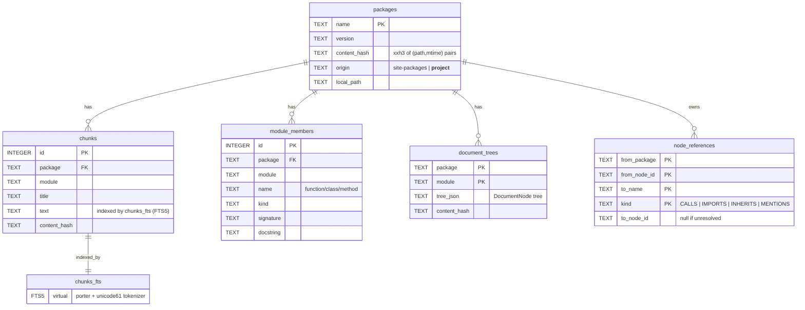

# pydocs-mcp

**Local Python docs + code-structure retrieval for AI agents — pinned to the versions you actually have installed.**

Your AI assistant remembers `requests` 2.28. You have 2.31 installed. It writes code calling a kwarg that was renamed two versions ago — and you spend the next twenty minutes debugging why a test fails. The fix isn't a smarter prompt; it's giving the AI documentation that matches **your lockfile**, not the average of every StackOverflow answer it ever read.

pydocs-mcp indexes your project source + every installed Python dependency from your `site-packages`, on your machine, in a couple of seconds. It exposes two MCP tools (`search`, `lookup`) plus a CLI mirror with the same surface and the same scoring. No network calls, no API keys, no rate limits. Just BM25 over SQLite FTS5 against the exact code your `pip install` resolved to.

It also captures a **reference graph** at indexing time (CALLS / IMPORTS / INHERITS edges), so `lookup(target=X, show="callers")` answers *"what code in this repo or any installed dep calls this method?"* — not just *"what does this method do?"*

**Install once. Index once. Then ask your AI.**

---

## Install

```bash
# With Rust acceleration (requires Rust toolchain)
pip install maturin
cd pydocs-mcp && maturin develop --release

# Without Rust (pure Python, works everywhere)
pip install -e .
```

## System requirements

### Linux

`pydocs-mcp` depends on [turbovec](https://github.com/RyanCodrai/turbovec), a Rust
vector store whose compiled wheel links against CBLAS. Ubuntu/Debian users must
install OpenBLAS with the CBLAS interface before installing the package:

```bash
sudo apt-get install -y libopenblas-pthread-dev
```

Without this, `import pydocs_mcp` fails at runtime with:
`undefined symbol: cblas_sgemm`.

### macOS / Windows

No additional system packages needed — CBLAS is provided by the Accelerate
framework (macOS) or the MSVC runtime (Windows).

For more detailed install instructions (including the `LD_PRELOAD` fallback
for environments where `update-alternatives` doesn't take effect), see
[INSTALL.md](INSTALL.md).

## Quick start

```bash
# Index your project + its installed deps and start the MCP server
pydocs-mcp serve .

# Sample CLI queries (same surface the MCP tools expose)
pydocs-mcp search "batch inference"
pydocs-mcp lookup fastapi.routing.APIRouter --show callers
```

That's it for the 30-second path. Read on for the three ways to actually integrate pydocs-mcp into your workflow.

---

## CLI `search` — every option with examples

`pydocs-mcp search` mirrors the MCP `search` tool one-to-one — same pipelines, same scoring, same rendering. The flags below are the only knobs on the client side; everything else (ranking weights, chunk strategies, formatters) is tuned via YAML at server startup.

```bash
# Free-text query across docs + APIs (kind="any" is the default).
pydocs-mcp search "batch inference"

# Multi-word queries — quote them so the shell passes one string.
pydocs-mcp search "async retry with exponential backoff"

# --kind docs       → markdown / docstring chunks only
# --kind api        → ModuleMember rows (functions, classes, signatures)
# --kind any        → both, merged + scored together (default)
pydocs-mcp search "predict" --kind api
pydocs-mcp search "rate limiter" --kind docs
pydocs-mcp search "router include" --kind any --limit 20

# Restrict to one package. PyPI names are normalized to the DB form
# (e.g., "Flask-Login" → "flask_login") so either spelling works.
pydocs-mcp search "predict" --package vllm
pydocs-mcp search "auth" -p Flask-Login          # same as -p flask_login

# Search only YOUR project source (use the __project__ sentinel).
pydocs-mcp search "handle request" -p __project__

# Restrict by source SCOPE — your project, your deps, or both.
# --scope project   → indexed under __project__
# --scope deps      → indexed dependency packages
# --scope all       → default
pydocs-mcp search "retry" --scope project
pydocs-mcp search "retry" --scope deps

# Cap result count (default 10). Top-K capping is also configurable
# server-side via YAML; --limit narrows the client-visible window.
pydocs-mcp search "logging" --limit 5

# Point at a different project (default is the cwd). Indexes that
# project's deps if it isn't already cached.
pydocs-mcp search "celery beat" --project-dir /path/to/other/project

# Skip the Rust acceleration path (forces the pure-Python fallback —
# useful for debugging the substitution boundary).
pydocs-mcp search "tokenizer" --no-rust

# Combine flags freely.
pydocs-mcp search "embed" --kind api -p sentence_transformers --scope deps --limit 25
```

The `lookup` command has its own flag set (`--show {default, tree, callers, callees, inherits}`, listed in the [CLI reference](#cli-reference) section). `search` finds candidates by relevance; `lookup` jumps to a specific known name.

---

## How does this compare to Context7 and Neuledge Context?

Three open-source projects in roughly the same MCP-doc-retrieval space. They optimize for different things — pick by what your workflow needs.

| Aspect | **pydocs-mcp** | **Context7** ([upstash/context7](https://github.com/upstash/context7)) | **Neuledge Context** ([neuledge/context](https://github.com/neuledge/context)) |
|---|---|---|---|
| Deployment | Local stdio MCP server | Hosted MCP at `mcp.context7.com` (or CLI + skills via `ctx7`) | Local stdio MCP server (`context serve`) |
| Doc source | **Your installed Python deps** + your project source, indexed in place | Curated community library docs hosted by Upstash (parsing + crawling engines are closed-source) | Community-driven package registry (~100+ libraries) downloaded then queried locally |
| Version match | Whatever you have in `site-packages` — automatic | Library + version selectable in the prompt (`use library /supabase/supabase`) | Latest from the registry's package for the library |
| Languages | Python only | Multi-language (any library Upstash has crawled) | Multi-language (registry-driven; ~100+ libraries today) |
| Retrieval method | BM25 over SQLite FTS5 | Not publicly documented | BM25 over SQLite FTS5 |
| Code structure queries | **Reference graph** — `lookup(target, show="callers"\|"callees"\|"inherits")` via captured AST edges | None (doc retrieval only) | None (doc retrieval only) |
| Project source indexing | Indexes your own code under the `__project__` package — `search ... -p __project__` works the same as searching deps | No (external library docs only) | No (registry packages only) |
| MCP tools exposed | `search`, `lookup` (2 tools, surface intentionally pinned) | `resolve-library-id`, `query-docs` (2 tools) | Doc-retrieval tools (CLI: `context serve`) |
| Privacy | **Fully offline** — zero network calls after install | Queries hit Upstash; free tier + paid for higher rate limits; OAuth + API key | Local once packages are downloaded from the registry |
| Customization | YAML pipelines (chunkers, scorers, filters, formatters); single-source-of-truth defaults via `AppConfig` | API key + HTTP headers | Registry-package mechanics; see project docs |
| Cost | **$0.** OSS (MIT). Runs locally — no API keys, no rate limits, no per-query fees. | **Free tier + paid plans.** Free tier is rate-limited and requires an API key. | **$0.** OSS (Apache-2.0). Local-first — no API keys, no rate limits, no per-query fees. |
| Vendor lock-in | None — your data is a SQLite file you can read/delete/move. | Reliance on the hosted service; the parsing + crawling engines are closed-source, so a self-host fallback isn't equivalent. | None — registry packages are pulled but retrieval and storage stay local. |
| License | MIT | MIT | Apache-2.0 |

**Pick pydocs-mcp when** you want offline, version-matched-to-your-install retrieval, you work primarily in Python, and you care about navigating code structure (callers / callees / inheritance), not just reading docs.

**Pick Context7 when** you want a hosted service that gives an LLM up-to-date docs for any popular library across many languages without you setting up an indexer — and you're fine sending queries over the network.

**Pick Neuledge Context when** you want local-first multi-language coverage from a community registry and don't need version-pinning to your installed code.

The three are not exclusive — a coding agent can mount all three MCP servers at once and route by intent (pydocs-mcp for "what calls this method?", Context7 / Neuledge for "show me Next.js 15 middleware patterns").

---

## Usage patterns

pydocs-mcp is designed to work three ways. Pick the one that matches your setup.

### A. Run as an MCP server (most common)

For Claude Code, Cursor, or any MCP-compatible client.

**Start the server** (stdio transport):

```bash
pydocs-mcp serve /path/to/project
```

The server indexes the project + installed deps on startup (or uses the cached `.db` if unchanged) and exposes two tools over MCP stdio.

**Claude Code integration** (`~/.config/claude-code/mcp_servers.json` or workspace `.claude/mcp_servers.json`):

```json
{
  "mcpServers": {
    "pydocs": {
      "command": "pydocs-mcp",
      "args": ["serve", "/path/to/your/project"]
    }
  }
}
```

**Cursor integration** (`~/.cursor/mcp.json` or `.cursor/mcp.json`):

```yaml
mcpServers:
  - name: pydocs
    command: pydocs-mcp
    args: ["serve", "/path/to/your/project"]
```

**Continue.dev integration** (`~/.continue/config.json`):

```json
{
  "mcpServers": [
    {
      "name": "pydocs",
      "command": "pydocs-mcp",
      "args": ["serve", "/path/to/your/project"]
    }
  ]
}
```

**Example client invocations** (ask your LLM to run these after the MCP server is connected):

```
search("batch inference vllm", kind="api", package="vllm", limit=20)
lookup("fastapi.routing.APIRouter")
lookup("fastapi.routing.APIRouter.include_router", show="callers")
lookup("requests.auth.HTTPBasicAuth", show="inherits")
```

The MCP surface is **fixed at two tools by design** (see CLAUDE.md §"MCP API surface vs YAML configuration"). All pipeline tuning happens server-side via YAML — clients don't need rebuilds when you adjust ranking weights or chunk strategies.

### B. Configure via YAML

Production deployments + benchmark sweeps. Both the MCP server and the CLI load pipelines from YAML at startup.

**Shipped blueprints** (copy + modify as needed):

- `python/pydocs_mcp/pipelines/chunk_search.yaml` — default chunk-search pipeline (BM25 fetch → score → metadata filter → top-K → limit → token-budget renderer)
- `python/pydocs_mcp/pipelines/member_search.yaml` — default member-search pipeline (LIKE fetch → metadata filter → top-K → limit → budget)
- `python/pydocs_mcp/pipelines/ingestion.yaml` — default ingestion pipeline (discovery → read → chunk → flatten → hash → package → reference capture)

**Pipeline schema** (`steps:` with `name:` per step):

```yaml
name: chunk_search
steps:
  - name: fetch
    type: chunk_fetcher
    params: { limit: 200 }
  - name: score
    type: bm25_scorer
    params: {}
  - name: post_filter
    type: metadata_post_filter
    params: {}
  - name: topk
    type: top_k_filter
    params: { k: 50 }
  - name: limit
    type: limit
    params: { max_results: 8 }
  - name: budget
    type: token_budget_formatter
    params: { budget: 2000 }
```

Each step entry needs a `name:` (addressable + greppable), a registered `type:`, and `params:` matching the step's dataclass fields.

**Override with a user overlay** — a single file that layers on top of the shipped defaults:

```yaml
# my-pydocs.yaml — sits next to your project, or anywhere
extraction:
  chunking:
    markdown:
      max_heading_level: 4         # default: 3
search:
  output:
    default_limit: 20              # default: 10
reference_graph:
  capture:
    enabled: true
    kinds: [calls, imports, inherits, mentions]   # opt into MENTIONS
```

Load it explicitly:

```bash
pydocs-mcp serve . --config ./my-pydocs.yaml
```

Or set `PYDOCS_CONFIG_PATH=./my-pydocs.yaml` in the environment. The config layer is: shipped `defaults/default_config.yaml` → shipped pipeline YAML → user overlay → env vars (`PYDOCS_*`, highest priority).

All tunables are listed in `python/pydocs_mcp/defaults/default_config.yaml` — read it as the canonical reference.

### C. Build pipelines in Python code

For tests, benchmarks, or embedded usage. Build an `IngestionPipeline` and a `RetrieverPipeline` programmatically, no YAML required.

```python
import asyncio
import tempfile
from pathlib import Path

from pydocs_mcp.application import ProjectIndexer
from pydocs_mcp.db import build_connection_provider, open_index_database
from pydocs_mcp.extraction import (
    AstMemberExtractor,
    PipelineChunkExtractor,
    StaticDependencyResolver,
    build_ingestion_pipeline,
)
from pydocs_mcp.models import SearchQuery
from pydocs_mcp.retrieval.config import AppConfig
from pydocs_mcp.retrieval.pipeline import (
    PerCallConnectionProvider,
    RetrieverPipeline,
    RetrieverState,
)
from pydocs_mcp.retrieval.steps import (
    BM25ScorerStep,
    ChunkFetcherStep,
    LimitStep,
    MetadataPostFilterStep,
    TokenBudgetStep,
    TopKFilterStep,
)
from pydocs_mcp.storage.factories import (
    build_sqlite_indexing_service,
    build_sqlite_uow_factory,
)
from pydocs_mcp.storage.sqlite import SqliteChunkRepository


async def main() -> None:
    # 1. Fresh SQLite + ingestion pipeline from default AppConfig
    db_path = Path(tempfile.mkstemp(suffix=".sqlite")[1])
    open_index_database(db_path).close()
    config = AppConfig.load()

    indexer = ProjectIndexer(
        indexing_service=build_sqlite_indexing_service(db_path),
        dependency_resolver=StaticDependencyResolver(),
        chunk_extractor=PipelineChunkExtractor(pipeline=build_ingestion_pipeline(config)),
        member_extractor=AstMemberExtractor(),
        uow_factory=build_sqlite_uow_factory(db_path),
    )
    await indexer.index_project(Path("/path/to/your/project"))
    await SqliteChunkRepository(provider=build_connection_provider(db_path)).rebuild_index()

    # 2. RetrieverPipeline composed from steps — sklearn-shaped, named + addressable
    provider = PerCallConnectionProvider(cache_path=db_path)
    pipeline = RetrieverPipeline(
        name="chunk_search",
        steps=(
            ("fetch", ChunkFetcherStep(provider=provider)),
            ("score", BM25ScorerStep(name="bm25_scorer")),
            ("post_filter", MetadataPostFilterStep(name="metadata_post_filter")),
            ("topk", TopKFilterStep(name="top_k_filter")),
            ("limit", LimitStep(name="limit")),
            ("budget", TokenBudgetStep(name="token_budget_formatter")),
        ),
    )

    # 3. Run a search
    state = await pipeline.run(RetrieverState(query=SearchQuery(terms="async retry")))
    if state.result is not None:
        print(state.result.items[0].text[:500])


asyncio.run(main())
```

`RetrieverPipeline` IS a `RetrieverStep`, so pipelines compose recursively — nest one as a step inside another for sub-routing. Address steps by name (`pipeline["fetch"]`) for introspection or testing.

---

## CLI reference

```bash
# Serve as an MCP server (the most common entry point)
pydocs-mcp serve /path/to/project
pydocs-mcp serve . --no-inspect --depth 2 --workers 8 --config ./my-pydocs.yaml

# Index only (no server) — useful for one-shot benchmark setups
pydocs-mcp index .
pydocs-mcp index . --force          # clear cache + re-index
pydocs-mcp index . --skip-project   # only index deps, not the project

# Search from CLI (mirrors the MCP `search` tool)
pydocs-mcp search "batch inference"
pydocs-mcp search "predict" --kind api -p vllm
pydocs-mcp search "handle request" -p __project__

# Navigate to a specific target (mirrors the MCP `lookup` tool)
pydocs-mcp lookup                                      # list packages
pydocs-mcp lookup fastapi.routing.APIRouter            # class overview
pydocs-mcp lookup fastapi.routing.APIRouter --show tree
pydocs-mcp lookup fastapi.routing.APIRouter.include_router --show callers
pydocs-mcp lookup requests.auth.HTTPBasicAuth --show inherits
```

Use `__project__` as the package name to scope a search to your own code.

---

## How it works

1. Reads `pyproject.toml` (priority) or `requirements.txt` to discover dependencies.
2. Indexes project source via AST/regex (no imports needed).
3. Indexes installed deps via `inspect` (parallel, optional — skip with `--no-inspect` for static-only).
4. Stores everything in SQLite with FTS5 full-text search.
5. Captures the reference graph (CALLS / IMPORTS / INHERITS edges) for `lookup(..., show="callers")` etc.

### Indexing is one-time per source change

**You only pay the indexing cost once.** The first run on a project walks every file in your project + every installed dep and builds the SQLite database. Subsequent runs do a quick metadata scan and skip indexing entirely if nothing changed — typical re-run latency is **&lt;100 ms** (just the hash check + a SQLite open).

How the skip decision works:

- **Per-project cache file.** Each project gets its own SQLite at `~/.pydocs-mcp/{dirname}_{path_hash}.db`, where `path_hash` is a 10-char MD5 slug of the absolute project path so two projects in different directories never share state.
- **Per-package content hash.** For every package indexed (your project + every dep), the server collects `(file_path, mtime_nanos)` pairs for all files in the package, joins them into one byte buffer, and hashes the buffer with **xxh3-64** — 16 hex chars. The hash is stored alongside the package row in `packages.content_hash`.
- **Skip when match.** Before re-indexing a package on the next run, the server recomputes the hash from current disk metadata and compares it to the stored value. **Match → skip the whole package** (no parsing, no chunking, no DB writes). Mismatch → re-extract that package only; untouched packages still skip.
- **Why mtime + path (not file contents).** Filesystem `mtime` is cheap to read in bulk, and the project's file tree is the actual source-of-truth signal. Touching a file changes its `mtime`; renaming a file changes its path. Reading file *contents* would defeat the speed goal.
- **Force a rebuild** with `pydocs-mcp index . --force` (clears the cache + re-indexes from scratch). Safe to delete `~/.pydocs-mcp/*.db` at any time — the cache is always rebuildable.

For a typical 100-deps project, a no-change re-run does a few thousand `stat()` calls + one xxh3 per package. That's bounded by your disk's metadata throughput, not by anything pydocs-mcp does.

### Database schema (simplified)

The SQLite file holds six tables. The schema is versioned via `PRAGMA user_version`; a mismatch on open drops the known tables and re-indexes from scratch.



Per-table purpose, one line each:

| Table | What it stores | Where it's read |
|---|---|---|
| `packages` | One row per indexed package + the cache-skip `content_hash`. Project source is stored under the sentinel `name = "__project__"`. | Indexing skip-check, `lookup` (list packages) |
| `chunks` | Documentation + source chunks (markdown sections, docstrings, code blocks). | `search(query, kind="docs")` via FTS5 |
| `chunks_fts` | FTS5 virtual table mirroring `chunks.title` + `chunks.text` + `chunks.package`, with Porter stemming + unicode61. | `search` BM25 ranking |
| `module_members` | Functions, classes, methods, attributes — name + signature + docstring + kind. | `search(query, kind="api")`, `lookup(target)` |
| `document_trees` | The hierarchical `DocumentNode` tree per module (used for `lookup(..., show="tree")` and structural rendering). | `lookup(..., show="tree")` |
| `node_references` | The reference graph: one row per (`from_node`, `to_name`, `kind`) edge captured during indexing (CALLS / IMPORTS / INHERITS, plus MENTIONS if opted into via YAML). | `lookup(..., show="callers"\|"callees"\|"inherits")` |

The schema is documented in [python/pydocs_mcp/db.py](python/pydocs_mcp/db.py) — read it as the canonical reference, including indexes and migration notes.

---

## Architecture

```
pydocs-mcp/
├── Cargo.toml                  # Rust dependencies
├── pyproject.toml              # Python package config (maturin mixed layout)
├── src/
│   └── lib.rs                  # Rust: walker, hasher, chunker, parser (6 PyO3 functions)
└── python/
    └── pydocs_mcp/
        ├── __init__.py         # Package version
        ├── __main__.py         # CLI entry point (serve / index / search / lookup)
        ├── _fallback.py        # Pure Python versions of Rust functions
        ├── _fast.py            # Import Rust or fallback (substitution boundary)
        ├── db.py               # SQLite schema + cache lifecycle + FTS rebuild
        ├── deps.py             # Dependency resolution (pyproject.toml, requirements.txt)
        ├── extraction/         # Chunkers, member extractors, ingestion pipeline
        │   ├── strategies/     #   chunkers, members, discovery, dependencies
        │   ├── pipeline/       #   IngestionPipeline, stages, PipelineChunkExtractor
        │   └── model/          #   DocumentNode, NodeKind, tree helpers
        ├── application/        # Use-case services (indexing, search, lookup, formatting)
        ├── storage/            # SQLite repositories, UnitOfWork, VectorStore
        ├── retrieval/          # sklearn-style RetrieverStep ABC + RetrieverPipeline
        │   ├── pipeline/       #   RetrieverStep ABC, RetrieverPipeline, RetrieverState
        │   └── steps/          #   one file per step (chunk_fetcher, bm25_scorer, …)
        ├── defaults/           # Shipped default_config.yaml
        ├── pipelines/          # Built-in pipeline YAML blueprints
        └── server.py           # MCP server (2 tools: search + lookup)
```

For the detailed architecture (data flow, SOLID principles, async patterns, MCP API rules, single-source-of-truth defaults), see [CLAUDE.md](CLAUDE.md).

---

## MCP tool reference

The MCP surface is intentionally minimal — two tools cover every workflow.

| Tool | Signature | Purpose |
|---|---|---|
| `search` | `search(query, kind, package, scope, limit)` | BM25 full-text search across indexed docs/code. `kind` ∈ `{docs, api, any}`. |
| `lookup` | `lookup(target, show)` | Navigate to a specific named target. `show` ∈ `{default, tree, callers, callees, inherits}`. Empty target lists indexed packages. |

`lookup(target=X, show="callers")`, `show="callees"`, and `show="inherits"` query the **reference graph** (CALLS, IMPORTS, INHERITS edges) — captured at indexing time from AST analysis and stored alongside the chunks. Capture is on by default and tuned via YAML (`reference_graph.capture.{enabled,kinds}`); MENTIONS edges are opt-in.

---

## Cache

Each project gets its own SQLite database at `~/.pydocs-mcp/{dirname}_{path_hash}.db`. The schema is versioned via `PRAGMA user_version`; opening a DB whose version doesn't match drops all tables and re-indexes from scratch. The cache is always rebuildable from source, so it's safe to delete at any time.

**Downgrading:** if you install an older version of `pydocs-mcp` that uses a pre-v2 schema, delete `~/.pydocs-mcp/*.db` first — otherwise the older code will fail with "no such column: pkg" against the newer schema.
