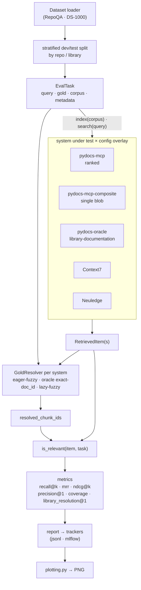

# pydocs-mcp Benchmark Suite

Real retrieval-quality evaluation for `pydocs-mcp` against a public benchmark
(**RepoQA-SNF**, arXiv 2406.06025) with **MLflow**-backed experiment tracking
and comparative slots for **Context7** and **Neuledge Context**.

The harness exists to A/B test YAML pipeline tunings (`AppConfig`) on a real
benchmark, then track every `(system × config × dataset)` combination as one
MLflow run with comparable params, metrics, and artifacts.

> An earlier placeholder harness (`fake_project/` + synthetic
> `dataset_gen.py`) was removed — it synthesized queries from the chunks
> it just indexed, so a chunker change shifted both the corpus and the
> queries together and the eval was blind. The current harness uses an
> external benchmark (RepoQA-SNF) with stable gold answers that the
> system under test cannot influence.

## How the harness works

Each run fans a dataset's tasks across one or more systems (under a config
overlay), resolves ground truth per system, then scores every system on the
same relevance signal:



The **GoldResolver** layer is what lets heterogeneous systems share one
metric suite: each system maps its own output to a `resolved_chunk_ids` set
(native pydocs fuzzy-matches gold doc contents; the oracle uses exact
`doc_id` equality; Context7/Neuledge lazily fuzzy-match their single blob),
and every metric consumes the unified `is_relevant(item, task)` predicate.

## Install

`uv`-friendly extras let you pull in only what you need:

```bash
uv pip install -e benchmarks                # core only — JSONL tracker, stdlib RepoQA loader
uv pip install -e "benchmarks[mlflow]"      # + MLflow tracker
uv pip install -e "benchmarks[all]"         # everything
```

`pip` works too — the optional extras are stock PEP 508 syntax.

## Run

The runner CLI is exposed as a module entry-point:

```bash
# Baseline run, pydocs-mcp only, against the bundled fixture (no network download).
./scripts/run_repoqa.sh \
    --systems pydocs-mcp \
    --configs <path-to-baseline.yaml> \
    --trackers jsonl \
    --fixture <path-to-fixture> \
    --limit 5

# Full sweep across YAML config variants. Each comma-separated config is one
# AppConfig overlay (see benchmarks/configs/); the runner takes the matrix of
# (systems x configs).
./scripts/run_repoqa.sh \
    --systems pydocs-mcp \
    --configs <baseline.yaml>,<no_stdlib.yaml>,<wide_chunks.yaml> \
    --trackers jsonl

# View results in MLflow UI (requires the [mlflow] extra).
mlflow ui --backend-store-uri file://./benchmarks/mlruns/
```

The runner can also be invoked directly (the `benchmarks/` package lives
under `benchmarks/src/` following the PyPA src-layout):

```bash
PYTHONPATH=benchmarks/src python -m benchmarks.eval.runner --help
```

For tests and offline development, pass a `--fixture` JSON to bypass the
RepoQA download entirely (see `benchmarks/tests/eval/fixtures/repoqa_mini.json`).

**Indexing is one-time per RepoQA task.** Each task ships its own
repo slice, so the harness indexes that slice into a fresh SQLite cache
on first touch and reuses it for every subsequent query on the same
task. The `indexing_seconds` row in the baseline JSON measures that
first-touch cost; `search_seconds` measures per-query latency after the
index is warm. Skip detection uses a per-package xxh3 hash over
`(file_path, mtime)` pairs — recomputing the hash is `O(file count)`
of `stat()` calls plus one xxh3 over that buffer, so subsequent
sweeps on unchanged repo slices skip indexing entirely (typical
re-run latency &lt;100 ms per task). The DB schema is described in
the [project README](../README.md#database-schema-simplified).

## Metrics

Every `(system × config × dataset)` run reports the following per-task metrics
plus aggregate values with a 95% bootstrap CI (1000 resamples, seed=0):

- **`recall@k`** — `1.0` iff the gold function appears in the top-`k` retrieved
  chunks under an AST-equivalent match (whitespace and comment tolerant);
  `0.0` otherwise. Reported at `k ∈ {1, 5, 10}`.
- **`mrr`** — Mean reciprocal rank. The score per task is `1/rank` of the first
  AST-matching item, or `0.0` if no match exists in the returned set. The
  aggregate is the arithmetic mean across tasks.
- **`pass@1-needle`** — `1.0` iff the top-1 retrieved item matches the gold
  needle, `0.0` otherwise. The strictest signal — sensitive to small ranking
  changes that `recall@k` smooths over.

The aggregator (`benchmarks/eval/metrics/aggregate.py`) emits the mean plus a
bootstrap confidence interval for each metric so regression gates can compare
runs without false positives from per-task variance.

## Benchmarks

One subsection per benchmark. Each subsection answers four questions in
the same order, so adding a future benchmark is a copy-paste of the shape:

1. **What it tests** — the retrieval task in one sentence.
2. **Example task** — a concrete query + gold answer so the shape is
   obvious without reading the paper.
3. **Dataset size + source** — how many tasks, where they come from.
4. **What this benchmark proxies** *and* what it does NOT — calibrate
   how much weight to put on the resulting numbers.

### RepoQA-SNF (Python subset of `repoqa-2024-06-23`)

**What it tests:** natural-language description → Python function retrieval
in long, real-world code repositories. Each task hands the system under
test a multi-file repo slice and a one-sentence English description of
one function ("the needle"); the system returns a ranked list of
candidate chunks; the harness counts whether an AST-equivalent match of
the needle's body appears in the top-K. This is the dominant query shape
for `search(query, kind, ...)` on the MCP surface.

**Example task** (from `benchmarks/tests/eval/fixtures/repoqa_mini.json`,
the 5-needle fixture shipped for hermetic CI):

```text
Query (description):
    Compute the factorial of a non-negative integer.

Repo content (file path → source, pinned to a specific commit):
    fixture_repo/__init__.py
    fixture_repo/math_helpers.py
    [in production tasks: 30–80 real Python files per repo]

Gold answer (AST-matched, comments + whitespace tolerant):
    def factorial(n: int) -> int:
        if n <= 1:
            return 1
        return n * factorial(n - 1)

Other needles in the same repo:
    - fibonacci  — Compute the n-th Fibonacci number.
    - is_prime   — Test whether n is prime.
    - gcd        — Greatest common divisor of two integers.
    - lcm        — Least common multiple via gcd.
```

A "pass" on `recall@k` means: at least one of the top-K retrieved chunks
contains a function whose AST body matches the gold needle's body
(comments + whitespace tolerant, see `benchmarks/eval/metrics/ast_match.py`).
`pass@1-needle` is the same check restricted to the top-1 result. `mrr`
rewards getting the gold high in the ranking, not just within the top-K.

**Dataset size:** 100 needles total — 10 real Python repos (HuggingFace
Transformers, vLLM, FastAPI, sympy, …) × ~10 needles each. The shipped
fixture (`repoqa_mini.json`) has 5 needles from one synthetic repo for
hermetic CI runs that don't touch the network.

**Source:** Liu, J. et al. *RepoQA: Evaluating Long Context Code
Understanding.* arXiv:2406.06025, June 2024. Apache-2.0 license, by the
EvalPlus team. Downloaded on first run to `~/.cache/pydocs-mcp/repoqa/`
and cached thereafter.

**What this benchmark proxies well:**

- **Description → function retrieval.** The 1:1 query-to-result shape
  matches the MCP `search` surface exactly.
- **Long-context indexing.** Each task ships a real repo slice, so the
  chunker and indexer are exercised on real-world Python layouts (not
  synthetic toys).
- **A/B testing YAML tunings.** Capture toggles, ranking weights,
  chunker parameters, and resolver thresholds can all be sweep-compared
  against the same dataset and metric set — the architectural payoff of
  the "behavior in YAML, surface stable" rule from `CLAUDE.md`.
- **Cross-system retrieval comparison.** `pydocs-mcp` (in-process
  pipeline) is comparable against `context7` (cloud MCP API) and
  `neuledge` (local MCP HTTP) on the same queries + the same gold answers.

**What it does NOT proxy:**

- **End-to-end LLM code generation quality.** Retrieval only — what an
  LLM does with the chunks is out of scope. The planned CodeRAG-Bench
  (DS-1000 + ODEX) integration closes this gap by scoring retrieval under
  the downstream code-generation task.
- **Multi-file / call-graph retrieval.** Each task is single-needle; the
  planned SWE-bench Verified retrieval slice covers cross-file reasoning.
- **Library-docs lookup from a natural-language intent.** RepoQA queries
  describe a *function inside a specific repo*, not "what's the right API
  in this library for what I'm trying to do." The planned DocPrompting
  CoNaLa-Docs integration covers that loop directly.
- **Multi-language coverage.** Python only.

When you read a result, treat it as evidence about the retrieval surface,
not the whole system.

### DS-1000 (CodeRAG-Bench flavor)

**What it tests:** natural-language data-science intent → library
documentation retrieval. Each task hands the system under test a
StackOverflow-derived problem stripped of its solution ("How do I
group a DataFrame and take the mean of each group?") and asks for the
library documentation a developer would need to solve it. The harness
checks whether the gold doc(s) — manually verified canonical doc-IDs —
appear in the retrieved set. This exercises the "look up the right API
doc from an English question" loop directly, complementing RepoQA-SNF's
function-inside-a-repo shape.

DS-1000 is the data-science code-generation benchmark of Lai et al.,
*DS-1000: A Natural and Reliable Benchmark for Data Science Code
Generation* (arXiv:2211.11501, 2023): 1,000 problems across seven
Python libraries (NumPy, pandas, SciPy, Matplotlib, scikit-learn,
TensorFlow, PyTorch). The retrieval framing — gold doc-ID annotations
plus a devdocs.io-derived documentation datastore — comes from
CodeRAG-Bench (Wang et al., *CodeRAG-Bench: Can Retrieval Augment Code
Generation?*, arXiv:2406.14497, 2024).

**Example task:**

```text
Query (NL intent, solution stripped):
    I have a DataFrame and I want to group by one column and compute the
    mean of another column for each group. How do I do that in pandas?

Gold answer (canonical library doc, matched by content or doc-ID):
    pandas.core.groupby.GroupBy.mean — Compute mean of groups, excluding
    missing values. (doc_id: pandas.core.groupby.GroupBy.mean)

Library: pandas   Perturbation bucket: Origin
```

**Dataset size + source:** 1,000 problems, seven libraries, downloaded
from the Hugging Face Hub (the loader pins a dataset revision for
reproducibility). The repository ships a small hand-crafted fixture
(`benchmarks/tests/eval/fixtures/ds1000_mini.json`) so hermetic tests run
without network access.

#### Prerequisites

Two Hugging Face datasets back the full (non-fixture) runs. Both
downloads require network access; the loader pins a revision so a re-run
fetches the same snapshot:

```bash
# The DS-1000 problems (queries + gold doc-ID annotations).
huggingface-cli download --repo-type dataset code-rag-bench/ds1000

# The library-documentation datastore (used by the oracle-indexing run).
huggingface-cli download --repo-type dataset code-rag-bench/library-documentation
```

For the two native-`pydocs-mcp` runs (comparison + pydocs-only), prepare
the pinned reference project so the indexer reads the exact library
versions DS-1000 was authored against:

```bash
cd benchmarks/fixtures/ds1000_reference_project
python -m venv .venv
.venv/bin/pip install -e .
```

**Why the reference project matters:** its `pyproject.toml` pins the
library versions lifted from DS-1000's own `environment.yml` (pandas
1.5.3, numpy 1.26.4, scikit-learn 1.4.0, …). Installing it materializes
those exact releases in `site-packages`, which `pydocs-mcp` then indexes.
This is the version-parity edge over Context7 and Neuledge, which serve
whatever documentation version their service currently hosts — indexing a
different release would surface API signatures the benchmark never
expected. Context7, Neuledge, and the oracle-indexing run ignore
`--corpus-dir` (they query their own index or the documentation
datastore), so the reference project is only needed for the two native
runs.

#### Three evaluation runs

DS-1000 ships **three** runner invocations rather than one, because the
systems do not all emit the same output shape. Context7 and Neuledge
return a single concatenated documentation blob per query (rank-1 only),
so ranked metrics with `k > 1` are undefined for them; pydocs-mcp can
emit either a single budgeted composite (matching that shape) or a ranked
top-K list. The three runs separate those concerns:

**1. Cross-system comparison** — matched output shapes across all three
systems:

```bash
python -m benchmarks.eval.runner --dataset ds1000 \
    --systems pydocs-mcp-composite,context7,neuledge \
    --configs ds1000_composite.yaml \
    --metrics recall@1,mrr,precision@1,coverage,library_resolution@1 \
    --trackers jsonl
```

*What it measures:* head-to-head retrieval quality when every system
returns one text payload per query. `pydocs-mcp-composite` selects the
token-budgeted `chunk_search.yaml` pipeline (one composite blob), so it is
compared apples-to-apples against Context7/Neuledge's single blob. Only
`recall@1` / `precision@1` are meaningful on single-item output (the
higher-`k` metrics collapse); `library_resolution@1` scores Context7's
library-router accuracy and is `0.0` for the other rows.

**2. Pydocs-only ranked evaluation** — keep the ranked-list signal:

```bash
python -m benchmarks.eval.runner --dataset ds1000 \
    --systems pydocs-mcp \
    --configs ds1000_ranked.yaml \
    --metrics recall@1,recall@5,recall@10,ndcg@10,mrr,precision@1,coverage \
    --trackers jsonl \
    --corpus-dir benchmarks/fixtures/ds1000_reference_project
```

*What it measures:* the full ranked-retrieval suite (NDCG@10, MRR,
recall@1/5/10) that needs `k > 1` separate items to score. `ds1000_ranked.yaml`
selects `chunk_search_ranked.yaml` (top-K separate chunks, no composite
collapse). `--corpus-dir` points the indexer at the prepared reference
project. For calibration, CodeRAG-Bench reports DS-1000 NDCG@10 reference
points of roughly BM25 ≈ 5.2, GIST-large ≈ 13.6, and Voyage-code ≈ 33.1;
pydocs-mcp's BM25-based retrieval should land in that range.

**3. Oracle indexing** — isolate retriever quality from chunking:

```bash
python -m benchmarks.eval.runner --dataset ds1000 \
    --systems pydocs-oracle \
    --configs ds1000_ranked.yaml \
    --metrics recall@1,recall@5,recall@10,ndcg@10,mrr,precision@1,coverage \
    --trackers jsonl
```

*What it measures:* the same ranked suite as run 2, but `pydocs-oracle`
writes chunks **directly** from the `code-rag-bench/library-documentation`
datastore (one row → one chunk, preserving each doc's identity) instead of
AST-extracting from source. The gap between run 3 and run 2 quantifies how
much retrieval quality pydocs-mcp's AST-based chunker costs — run 3 is the
ceiling with chunking removed from the equation.

#### Splitting and slicing

DS-1000 supports a stratified dev/test split and per-library slicing,
both deterministic:

```bash
# Tune on the dev partition, then evaluate on held-out test.
python -m benchmarks.eval.runner --dataset ds1000 --split dev   ...
python -m benchmarks.eval.runner --dataset ds1000 --split test  ...

# Restrict to specific libraries (case-insensitive, normalized).
python -m benchmarks.eval.runner --dataset ds1000 \
    --dataset-library-filter pandas,numpy ...
```

`--split {all,dev,test}` (default `all`) partitions each library
independently — preserving every library's corpus proportion — into a
seeded dev head and test tail, so you can tune YAML tunings on `dev`
without contaminating the held-out `test` numbers. `--dataset-library-filter`
takes a comma-separated list and matches against the normalized
(lower-cased) library name.

#### Ground-truth resolution

Every metric consumes a single `is_relevant(item, task)` predicate that
checks membership in a per-task set of relevant chunk IDs
(`resolved_chunk_ids`). A per-system resolver populates that set before
metrics run, so each metric stays agnostic to *how* a system decides
relevance. pydocs-mcp in native mode fuzzy-matches each indexed chunk's
text against the gold documentation contents (rapidfuzz `partial_ratio`,
threshold 85); the oracle system matches each chunk's preserved `doc_id`
against the gold doc-IDs exactly; Context7 and Neuledge — whose stores
cannot be enumerated — lazily fuzzy-match only the items they actually
returned. This single-predicate design means recall/NDCG/precision all
read relevance the same way regardless of system shape.

**What this benchmark proxies well:**

- **NL intent → library-docs retrieval.** The exact "find the right API
  doc from an English question" loop AI assistants hit, which RepoQA-SNF
  (function-inside-a-repo) does not cover.
- **Version-sensitive indexing.** The pinned reference project measures
  whether indexing the *correct* library release matters — a differential
  that version-agnostic services cannot show.
- **Retriever vs chunker attribution.** The oracle-indexing run separates
  retrieval quality from chunking quality, which a single end-to-end
  number conflates.

**What it does NOT proxy:**

- **Exhaustive relevance.** The gold annotations are a verified *subset*
  of the docs that could answer a question, so scores are a lower bound on
  true relevance — a "miss" may be a valid alternative the gold set omits.
- **Broad library coverage.** Only the seven DS-1000 libraries; not a
  general-purpose Python documentation benchmark.
- **Robustness to query perturbation.** DS-1000's perturbation buckets
  perturb the *solution code*, not the retrieval target, so retrieval
  scores are expected to stay roughly flat across buckets — flatness here
  is not a robustness signal.
- **Paraphrase-heavy gold.** The fuzzy threshold (85) is conservative and
  configurable in YAML; heavily paraphrased gold documentation may score
  `0.0` under content matching.

#### Generating DS-1000 plots

The same plotting commands documented under
[Visualizing baselines](#visualizing-baselines) apply to DS-1000, once a
real sweep has produced a baseline JSON. The result plots are
**operator-generated from real-run baseline JSON** — they require the
Hugging Face downloads, network access, and (for the native runs) the
installed reference project, so this repository does not ship pre-rendered
DS-1000 result images. After a sweep writes a baseline JSON, render the
score and timing plots exactly as for RepoQA:

```bash
# Score bars (NDCG@10 + recall@k + MRR) from a real DS-1000 sweep.
PYTHONPATH=benchmarks/src python -m benchmarks.eval.plotting \
    <your-ds1000-baseline.json> \
    --output <your-output>.png \
    --metrics recall@1,recall@5,recall@10,ndcg@10,mrr \
    --title "DS-1000 (CodeRAG-Bench, n=1000)"

# Timing percentiles (indexing + per-query latency).
PYTHONPATH=benchmarks/src python -m benchmarks.eval.plotting \
    <your-ds1000-baseline.json> \
    --output <your-output>-timings.png \
    --timings \
    --title "DS-1000 (CodeRAG-Bench, n=1000) — latency"
```

Substitute your own baseline JSON path; the apples-to-apples constraint
from [Visualizing baselines](#visualizing-baselines) applies (every
baseline in one plot must share the same `dataset` field).

#### Running the DS-1000 tests

The DS-1000 test suite is hermetic — it uses the bundled fixtures, so no
network, Hugging Face download, or reference-project venv is required:

```bash
.venv/bin/pytest benchmarks/tests/eval/ -q
```

The DS-1000-specific coverage lives in: `test_ds1000_dataset.py` (loader +
NL-strip + gold shape), `test_ds1000_split.py` and `test_split_helper.py`
(stratified dev/test split), `test_recall_at_k.py` /
`test_ndcg_at_k.py` / `test_precision_at_1.py` / `test_coverage.py` /
`test_recall_mrr_repoqa_fallback.py` (metrics and the RepoQA fallback),
`test_gold_resolver.py` (the resolution layer),
`test_pydocs_oracle_system.py` and `test_integration_oracle.py`
(oracle-indexing), and `test_ds1000_configs_load.py` (the two AppConfig
overlays load).

### Roadmap: additional benchmarks

Each future benchmark gets its own subsection above following the same
four-question pattern. Planned additions:

| Benchmark | What it would add | Status |
|---|---|---|
| **SWE-bench Verified (retrieval-only slice)** | Given a real GitHub issue from a popular Python project, retrieve the set of files a developer needs to read to fix it. Scored against the human-verified patch set (which files actually changed). Stresses cross-file retrieval: a bug fix typically spans the changed file plus its callers, tests, and helpers — the system has to surface all of them from the issue text alone, not just one needle. Jimenez et al., arXiv:2310.06770 (2023); Verified subset (500 issues) curated by OpenAI (2024). | One-file dataset plugin; not yet implemented. |
| **DocPrompting CoNaLa-Docs** | Natural-language intent → Python library doc retrieval. Tests the exact "look up the right API doc from an English question" loop that AI assistants hit. Zhou et al., arXiv:2207.05987 (2023). | Plugin scoped, deferred. |
| **CodeRAG-Bench ODEX** | Library-docs retrieval on the execution-driven ODEX split (open-domain StackOverflow problems), complementing the data-science DS-1000 split already shipped above. Wang et al., arXiv:2406.14497 (2024). | Roadmap (DS-1000 split shipped — see the [DS-1000 subsection](#ds-1000-coderag-bench-flavor)). |

Adding one means: drop a `Dataset` Protocol implementation under
`benchmarks/src/benchmarks/eval/datasets/`, register it via
`@dataset_registry.register("<name>")`, point a config at it, and write
one README subsection mirroring RepoQA-SNF's shape. No harness changes
required.

## Current baselines

Two baseline JSON files are tracked in `benchmarks/baselines/`:

| File | What | Tasks | recall@1 | recall@5 | recall@10 | MRR |
|---|---|---:|---:|---:|---:|---:|
| `repoqa_snf.json` | Real 100-needle sweep against the Python subset of `repoqa-2024-06-23` | 100 | 14.0% [7%, 21%] | 17.0% [10%, 24%] | 18.0% [11%, 26%] | 15.2% [9%, 22%] |
| `repoqa_fixture_baseline.json` | 5-needle hermetic CI gate fixture | 5 | 60.0% | 80.0% | 80.0% | 70.0% |

CIs are 95% Wilson intervals from bootstrap resampling (1000 iter, seed=0).
Both baselines were captured against the `chunk_search_ranked.yaml` preset
that returns top-K ranked separate chunks. The MCP server's default
`chunk_search.yaml` collapses to one composite chunk via
`token_budget_formatter` — correct for LLM consumers, but it structurally
caps `recall@k > 1` at 0 because there is only ever one item to retrieve.
The ranked preset drops the formatter so `recall@k` can actually measure
top-K hits; the docstring at the top of `chunk_search_ranked.yaml`
expands on the split.

The real-100-needle numbers are the headline figure: a future dense-embedding
retriever (dense embeddings + RRF) should beat `recall@10 = 18%` to be worth
landing.

## Visualizing baselines

`benchmarks.eval.plotting` produces grouped vertical bar plots from one or
more baseline JSON files. Each baseline becomes a colored bar group; each
metric becomes an X-axis category; 95% CI error bars come straight from
each metric's `ci_low` / `ci_high`. Default palette is seaborn's
`colorblind` (colorblind-safe + Nature figure-guideline compliant).

**Apples-to-apples constraint:** every baseline passed to `plot_baselines`
must come from the same `dataset` field (e.g., all from
`repoqa-2024-06-23-python`). Mixing the 5-needle CI fixture next to the
real 100-needle sweep would silently misrepresent the numbers — the
fixture is a hermetic regression test, not a competing system. The
function raises `ValueError` listing the differing datasets if you try.
To compare across datasets, call `plot_baselines` once per dataset and
arrange the figures yourself.

**Title convention:** keep the title benchmark-focused (dataset + tasks)
and let the legend carry the system / config / method names. That way
the same chart still makes sense when a dense-embedding baseline adds a
second bar group — no title rewrite needed. If you omit `--title`,
the default uses the first record's `dataset` field and `tasks_ran`.

```bash
# Today's plot — single baseline on real-100-needles. Method is in the
# legend (pydocs-mcp / baseline), not the title.
PYTHONPATH=benchmarks/src python -m benchmarks.eval.plotting \
    benchmarks/baselines/repoqa_snf.json \
    --output benchmarks/results/plots/repoqa_real.png \
    --metrics recall@1,recall@5,recall@10,mrr,pass@1-needle \
    --title "RepoQA-2024-06-23 (Python, n=100)"

# Future: side-by-side compare two configs on the SAME dataset
# (e.g., a dense-embedding retriever vs current BM25). The plot picks up
# the second bar group automatically — no code change to plotting.py,
# and the title still works because it describes the benchmark, not the
# methods being compared.
PYTHONPATH=benchmarks/src python -m benchmarks.eval.plotting \
    benchmarks/baselines/repoqa_snf.json \
    benchmarks/baselines/repoqa_snf_dense.json \
    --output benchmarks/results/plots/repoqa_real_with_dense.png \
    --title "RepoQA-2024-06-23 (Python, n=100)"
```

The legend identifies each system as `<system> / <config> (<label>) [<git_sha>, n=<tasks>]`
so a plot stays self-describing even when copy-pasted into a PR
description. Sample output (committed to `benchmarks/docs/repoqa_baselines.png`):


Programmatic API — same behavior, more flexible for notebook use:

```python
from pathlib import Path
from benchmarks.eval.plotting import plot_baselines

fig = plot_baselines(
    baselines=[
        Path("benchmarks/baselines/repoqa_snf.json"),
        # Path("benchmarks/baselines/repoqa_snf_dense.json"),  # dense-embedding baseline
    ],
    metrics=("recall@1", "recall@5", "recall@10", "mrr"),
    output=Path("benchmarks/results/plots/repoqa_real.png"),
    palette="colorblind",                       # also: "deep", "muted", "Set2"
    title="RepoQA-2024-06-23 (Python, n=100)",  # keep it benchmark-focused;
                                                # legend carries the methods.
                                                # default: <dataset> (<tasks_ran> tasks)
)
```

The returned `matplotlib.figure.Figure` is yours to further customize,
`.show()` in a notebook, or `.savefig()` again with different DPI.

### Timing plots (indexing + per-query latency)

Score metrics (`recall@k`, `MRR`, etc.) live on a 0..1 scale and look right
as vertical bars. Latency metrics live on a duration scale (with p50 / p95 /
p99 percentiles, not means + CIs) and read more naturally as **horizontal
bars**. The `plot_timings()` function does this — one subplot per timing
metric so indexing (seconds) and per-query search (milliseconds) don't get
crushed onto the same X-axis.

```bash
# Horizontal timing-percentile plot — defaults to indexing_seconds +
# search_seconds, one subplot per metric.
PYTHONPATH=benchmarks/src python -m benchmarks.eval.plotting \
    benchmarks/baselines/repoqa_snf.json \
    --output benchmarks/results/plots/repoqa_timings.png \
    --timings \
    --title "RepoQA-2024-06-23 (Python, n=100) — latency"
```

Inside each subplot, the horizontal bar marks p50; a black whisker
extends to p95; the right edge of the whisker is annotated with the
full `p50 / p95 / p99` triple, formatted per magnitude (µs / ms / s).
Sample output (committed to `benchmarks/docs/repoqa_timings.png`):


Programmatic API mirrors `plot_baselines`:

```python
from pathlib import Path
from benchmarks.eval.plotting import plot_timings

fig = plot_timings(
    baselines=[Path("benchmarks/baselines/repoqa_snf.json")],
    metrics=("indexing_seconds", "search_seconds"),   # default
    output=Path("benchmarks/results/plots/repoqa_timings.png"),
    palette="colorblind",
    title="RepoQA-2024-06-23 (Python, n=100) — latency",
)
```

Same apples-to-apples constraint as the score plot — every baseline must
share the same `dataset` field. The function raises `ValueError`
otherwise. Two BM25 vs dense configs on the same dataset add a second
bar per subplot automatically when a future baseline lands.

### Quality vs latency scatter (the Pareto trade-off)

`plot_metric_vs_latency()` puts one point per baseline on a quality-vs-
latency chart — the classic IR trade-off view. Y-axis is a chosen score
metric (default `recall@10`) with 95% CI vertical bars; X-axis is a
chosen latency percentile (default p50 of `search_seconds`, in ms) with
a horizontal bar extending to p95. Reading the chart:

- **Up-and-left = strictly better** (higher quality at lower latency).
- **Down-and-right = strictly worse.**
- **Up-and-right = the trade-off line** — typically dense / hybrid
  retrievers buy higher recall at the cost of higher per-query latency.

```bash
# Quality vs latency scatter. Today: a single dot (BM25 only).
# When a dense-embedding baseline lands, a second dot appears
# automatically on the same chart.
PYTHONPATH=benchmarks/src python -m benchmarks.eval.plotting \
    benchmarks/baselines/repoqa_snf.json \
    --output benchmarks/results/plots/repoqa_quality_vs_latency.png \
    --scatter \
    --scatter-metric recall@10 \
    --title "RepoQA-2024-06-23 (Python, n=100) — recall@10 vs latency"

# Swap the X-axis to indexing cost instead of search latency to
# get a quality-vs-indexing-cost view.
PYTHONPATH=benchmarks/src python -m benchmarks.eval.plotting \
    benchmarks/baselines/repoqa_snf.json \
    --output benchmarks/results/plots/repoqa_quality_vs_indexing.png \
    --scatter \
    --scatter-metric recall@10 \
    --scatter-latency indexing_seconds \
    --scatter-percentile p50
```

Sample output (committed to `benchmarks/docs/repoqa_quality_vs_latency.png`):


Programmatic API:

```python
from pathlib import Path
from benchmarks.eval.plotting import plot_metric_vs_latency

fig = plot_metric_vs_latency(
    baselines=[Path("benchmarks/baselines/repoqa_snf.json")],
    metric="recall@10",
    latency_metric="search_seconds",
    latency_percentile="p50",
    output=Path("benchmarks/results/plots/repoqa_quality_vs_latency.png"),
    title="RepoQA-2024-06-23 (Python, n=100) — recall@10 vs latency",
)
```

The point colors come from the same `colorblind` palette, so the same
baseline keeps the same color across all three plot types (score bars,
timing bars, and quality-vs-latency scatter).

## License and attribution

Per-benchmark licensing + citation lives in the relevant subsection under
`## Benchmarks` above (each benchmark cites its own source). Cross-cutting
attribution:

- **MLflow** — Apache-2.0, Databricks. Used as the experiment-tracking
  backend; tracking URI defaults to a local `file://` store so no network
  or remote server is required to run the harness.
- **seaborn / matplotlib** — BSD-3-Clause, used for the baseline plotting
  module described under `## Visualizing baselines`.
- Third-party attribution lands in `LICENSE-third-party` once it is added.

## Running tests

```bash
uv pip install -e "benchmarks[all]"
pytest benchmarks/ -q
```

The bundled fixture (`benchmarks/tests/eval/fixtures/repoqa_mini.json`) lets
the full test suite run without network access.
