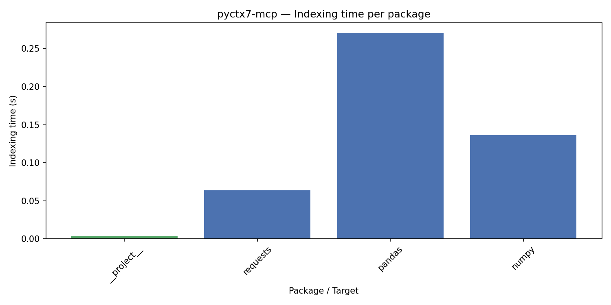
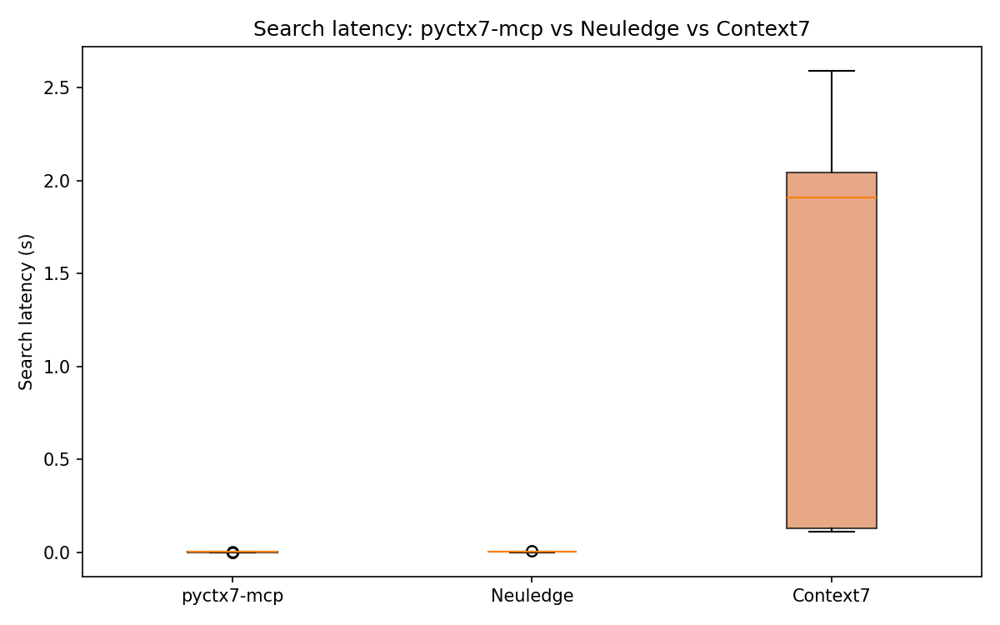
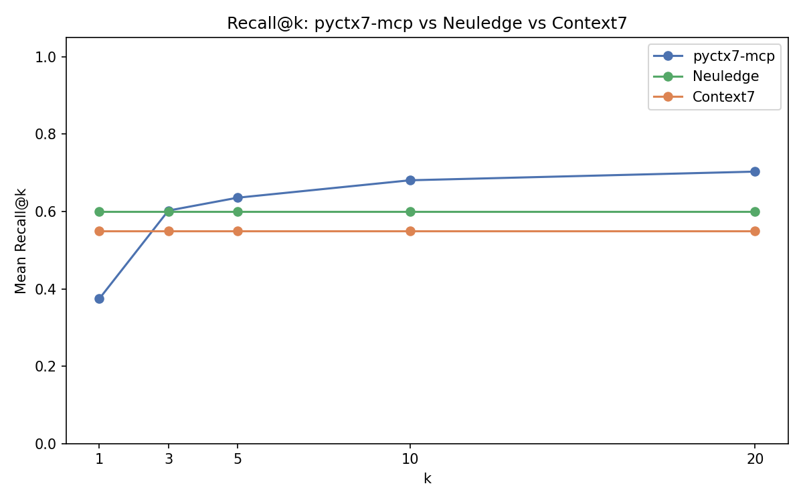
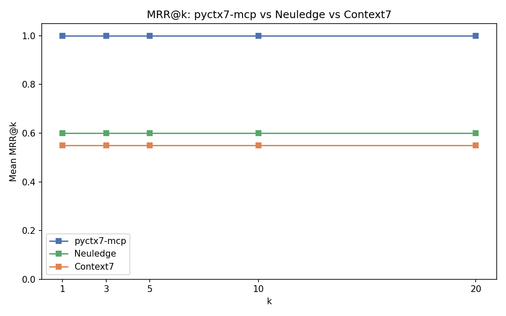

# pyctx7-mcp Benchmark Suite

Compares **pyctx7-mcp** (local indexing + FTS5 search) against **Context7**
(cloud MCP API) and **Neuledge Context** (local MCP server) on indexing speed,
search latency, and retrieval quality. Also compares Rust vs pure-Python
performance within pyctx7-mcp.

## Structure

```
benchmarks/
├── fake_project/        Static Python project used as indexing target
├── benchmarks/
│   ├── fake_project.py  Generates the fake project tree
│   ├── indexer_bench.py Times per-package indexing
│   ├── dataset_gen.py   Synthesizes questions from indexed chunks (with ground truth)
│   ├── search_bench.py  Times pyctx7 search + computes Recall@k and MRR@k
│   ├── context7_client.py  Async HTTP client for Context7 MCP API
│   ├── context7_bench.py   Times Context7 resolve + get-library-docs
│   ├── charts.py        Generates PNG charts
│   └── runner.py        Main CLI entrypoint
└── data/                Output CSV and PNGs (gitignored)
```

## Setup

Requires Python 3.10+ and the parent `pydocs-mcp` package.

```bash
cd benchmarks
pip install -e .          # installs pydocs-mcp from parent + benchmark deps
```

## Running

```bash
# Full benchmark (includes live Context7 API calls)
run-benchmarks

# Local only — no network, faster
run-benchmarks --skip-context7

# Fewer questions for a quick smoke test
run-benchmarks --questions 10 --skip-context7

# Custom output directory
run-benchmarks --out /tmp/bench_results
```

## Output

| File | Description |
|------|-------------|
| `data/results/benchmark_results.csv` | Primary DataFrame: all queries with per-k metrics |
| `data/results/indexing_results.csv` | Per-package indexing timings |
| `data/results/indexing_times.png` | Bar chart: indexing time per package |
| `data/results/search_latency_boxplot.png` | Box plot: pyctx7 vs Context7 latency distribution |
| `data/results/recall_at_k.png` | Line plot: mean Recall@k vs k, pyctx7 vs Context7 |
| `data/results/mrr_at_k.png` | Line plot: mean MRR@k vs k, pyctx7 vs Context7 |

## DataFrame Schema

`benchmark_results.csv` columns:

| Column | Type | Description |
|--------|------|-------------|
| `question` | str | Synthetic question derived from a doc chunk |
| `package` | str | Package the question was drawn from |
| `elapsed_s` | float | Wall-clock search time in seconds |
| `n_results` | int | Number of results returned |
| `source` | str | `pyctx7` or `context7` |
| `recall_at_1` | float | Recall@1 — fraction of relevant chunks in top-1 |
| `recall_at_3` | float | Recall@3 |
| `recall_at_5` | float | Recall@5 |
| `recall_at_10` | float | Recall@10 |
| `recall_at_20` | float | Recall@20 |
| `mrr_at_1` | float | MRR@1 — 1/rank of first relevant result in top-1 (0 if none) |
| `mrr_at_3` | float | MRR@3 |
| `mrr_at_5` | float | MRR@5 |
| `mrr_at_10` | float | MRR@10 |
| `mrr_at_20` | float | MRR@20 |

## How the Synthetic Dataset Is Built

The dataset is built by `dataset_gen.py` via `generate_dataset(db_path, n_questions, seed)`:

1. Opens the pydocs-mcp SQLite DB (already populated by indexing the fake project + its deps)
2. Randomly samples chunks from the `chunks` table (fetches `rowid`, `pkg`, `heading`, `body`, `kind`)
3. Deduplicates by heading
4. For each sampled chunk, derives a natural-language question from the heading using one of 7 templates (e.g. `"How do I use {heading}?"`, `"What does {heading} do?"`)
5. Extracts the first sentence of the chunk body as `expected_answer_snippet`
6. Records the chunk's SQLite `rowid` as `relevant_chunk_ids` — this is the ground truth for Recall@k/MRR@k

### Dataset columns

| Column | Type | Example |
|--------|------|---------|
| `question` | str | `"How do I use requests.get?"` |
| `package` | str | `"requests"` |
| `source_chunk_heading` | str | `"requests.get"` |
| `expected_answer_snippet` | str | `"Send HTTP GET request."` |
| `chunk_kind` | str | `"doc"`, `"project_code"`, `"readme"` |
| `chunk_body_preview` | str | First 200 chars of body |
| `relevant_chunk_ids` | list[int] | `[42]` — rowid(s) used as ground truth |

The `relevant_chunk_ids` column is key — it's what allows `search_bench.py` to compute proper Recall@k and MRR@k by matching search result rowids against these ground-truth IDs.

### Pipeline flow

```
fake project generated → indexed into SQLite → generate_dataset() samples chunks →
dataset fed to run_search_benchmark() (pyctx7) and run_context7_benchmark() (Context7) →
results flattened via to_dataframe() → saved as benchmark_results.csv
```

## Metrics

**Recall@k** — proportion of ground-truth relevant chunks found in the top-k results.

**MRR@k** (Mean Reciprocal Rank) — inverse of the rank position of the first relevant result in top-k (0 if no relevant result found). Averaged across all queries.

Both metrics are evaluated for k ∈ [1, 3, 5, 10, 20].

For pyctx7-mcp, ground truth is the source chunk from which each question was derived (`relevant_chunk_ids` in the dataset). For Context7, relevance is approximated by checking if the expected answer snippet appears in the returned documentation text.

## Benchmark Results (pyctx7-mcp vs Context7 vs Neuledge, 20 queries each)

Benchmark run against packages: requests, pandas, numpy.

| System | Type | How it works |
|--------|------|-------------|
| **pyctx7-mcp** | Local | Indexes installed Python packages into SQLite FTS5 |
| **Neuledge Context** | Local | Indexes docs from GitHub repos into SQLite FTS5 (Node.js) |
| **Context7** | Cloud | MCP API at `https://mcp.context7.com/mcp` (rate-limited) |

> **Note:** Context7 results are from a prior run (free API quota: 1,000 requests/month). pyctx7 and Neuledge results are current. To refresh Context7, run `run-benchmarks --questions 20` with available quota.

### How to Reproduce

```bash
# 1. Clone and install
cd benchmarks
pip install -e .

# 2. Full comparison (requires network for Context7 + Neuledge server)
run-benchmarks --questions 20

# 3. Local-only (no network, pyctx7-mcp metrics only)
run-benchmarks --questions 20 --skip-context7 --skip-neuledge

# 4. Load previous results from checkpoints (no API/server needed)
run-benchmarks --load-context7 data/checkpoints/context7.csv \
               --load-neuledge data/checkpoints/neuledge.csv

# 5. Results appear in data/results/
ls data/results/
# benchmark_results.csv  indexing_results.csv
# indexing_times.png     search_latency_boxplot.png
# recall_at_k.png        mrr_at_k.png
```

**Requirements:** Python 3.10+, the parent `pydocs-mcp` package, and `requests`, `pandas`, `numpy` must be installed (they are the packages being indexed and benchmarked).

### Indexing Time Per Package (pyctx7-mcp)

pyctx7-mcp indexes locally — Context7 has no indexing step (cloud API).

| Target | Time (s) | Chunks | Symbols |
|--------|----------|--------|---------|
| `__project__` | 0.004 | 8 | 5 |
| `requests` | 0.068 | 72 | 99 |
| `pandas` | 0.280 | 3,788 | 8,768 |
| `numpy` | 0.128 | 1,941 | 2,814 |



### Search Latency Comparison

| Metric | pyctx7-mcp | Neuledge Context | Context7 |
|--------|-----------|-----------------|----------|
| **Mean** | **2.46 ms** | 3.59 ms | 1,321 ms |
| **Median** | **2.56 ms** | 2.85 ms | 1,910 ms |

Both local systems (pyctx7 and Neuledge) complete in ~2-3ms. Context7's cloud API takes ~1.3-1.9s due to two sequential HTTP round-trips (`resolve-library-id` + `query-docs`). pyctx7 is **~537x faster** than Context7 and **~1.5x faster** than Neuledge.



### Retrieval Quality Comparison

Relevance is measured differently per system:
- **pyctx7-mcp**: Ground-truth chunk rowid matching — the search must return the exact chunk(s) the question was derived from. Search uses all available parameters: `query` (heading terms), `pkg`, `topic` (heading LIKE filter), and `internal` (dependency vs project scope).
- **Context7 / Neuledge**: Fuzzy text matching via `rapidfuzz.fuzz.partial_ratio` — checks if the chunk heading or expected snippet appears in the response (threshold >= 60). Both return a single text blob, so recall is binary per query.

| k | pyctx7 Recall@k | Neuledge Recall@k | Context7 Recall@k | pyctx7 MRR@k | Neuledge MRR@k | Context7 MRR@k |
|---|----------------|------------------|-------------------|--------------|----------------|----------------|
| 1 | 0.374 | 0.600 | 0.550 | 1.000 | 0.600 | 0.550 |
| 3 | 0.525 | 0.600 | 0.550 | 1.000 | 0.600 | 0.550 |
| 5 | 0.636 | 0.600 | 0.550 | 1.000 | 0.600 | 0.550 |
| 10 | 0.672 | 0.600 | 0.550 | 1.000 | 0.600 | 0.550 |
| 20 | 0.703 | 0.600 | 0.550 | 1.000 | 0.600 | 0.550 |





### How pyctx7-mcp Search Is Called

The benchmark uses all `search_chunks()` parameters — the same way a real MCP client would call pyctx7:

| Parameter | Dataset column | Example value | Effect |
|-----------|---------------|---------------|--------|
| `query` | `search_query` | `"numpy ctypeslib"` | FTS5 full-text search (heading terms, no stop words) |
| `pkg` | `package` | `"numpy"` | Restricts to package |
| `topic` | `search_topic` | `"numpy.ctypeslib"` | `WHERE heading LIKE '%numpy.ctypeslib%'` filter |
| `internal` | `search_internal` | `False` | `WHERE pkg != '__project__'` (deps only) |

When `topic` or `internal` are `None`, `search_chunks()` does not apply those filters — it searches all chunks. The benchmark sets them because a real MCP client (e.g., an AI assistant) would know the package name and topic it's looking for.

### Why pyctx7-mcp Has Perfect MRR but Lower Recall

- **MRR@1 = 1.00** — when pyctx7 finds a relevant chunk, it always ranks it #1. The topic LIKE filter + FTS5 BM25 is highly precise.
- **Recall@20 = 0.70** — pyctx7 finds ~70% of all ground-truth chunks in the top 20. Some modules have many related chunks (e.g., `pandas.core.series` has 25+ chunks), and not all appear in the top 20.
- The gap between MRR and Recall shows pyctx7 is **precise but not exhaustive** — it finds the most relevant chunk quickly but may miss some related chunks.

### Why Neuledge Recall Is 60%

Neuledge Context achieves 60% recall — competitive with Context7:

1. **`search_topic` helps.** Passing the heading (e.g., `"numpy.lib._datasource"`) as the topic parameter matches Neuledge's recommended usage ("short API name or keyword"). Using the full natural-language question only achieved 20%.
2. **Different corpus.** Neuledge indexes GitHub documentation (markdown files from the repo's `doc/` folder), while pyctx7 indexes installed Python packages (source code + docstrings). Despite this corpus difference, fuzzy matching finds overlapping content.
3. **Single text blob.** Like Context7, Neuledge returns one combined response — recall is binary per query.

### Why Context7 Recall Is 55%

Context7 achieves 55% recall using **fuzzy text matching** (rapidfuzz `partial_ratio`, longest common substring):

1. **Heading matching works well.** When Context7 returns documentation for `numpy.ctypeslib`, the heading text appears in the response, scoring above the threshold (60).
2. **Some queries fail.** Context7 cannot resolve all libraries (e.g., internal pandas submodules), returning errors for ~45% of queries.
3. **Different scoring methodology.** Context7 returns a single text blob (not ranked chunks), so relevance is binary: the heading/snippet either appears in the response or it doesn't.

### Analysis

| Metric | pyctx7-mcp | Neuledge Context | Context7 |
|--------|-----------|-----------------|----------|
| **Latency** | **~2.5 ms** | ~3.6 ms | ~1,321 ms |
| **Recall@5** | **0.636** | 0.600 | 0.550 |
| **MRR@1** | **1.000** | 0.600 | 0.550 |
| **Recall@20** | **0.703** | 0.600 | 0.550 |
| **Type** | Local (Python/Rust) | Local (Node.js) | Cloud API |
| **Corpus** | Installed packages | GitHub repos | Curated cloud |

- **pyctx7-mcp is the fastest** — ~2.5ms mean, ~1.5x faster than Neuledge (~3.6ms), ~537x faster than Context7 (~1.3s).
- **pyctx7-mcp has perfect precision (MRR)** — MRR@1 of 1.00 means the first result is always relevant. Context7 and Neuledge return single blobs, so their MRR equals their recall.
- **pyctx7-mcp leads on recall at k>=5** — 64% at k=5, growing to 70% at k=20. Neuledge (60%) and Context7 (55%) have fixed recall since they return single responses.
- **All three local systems are competitive** — Neuledge and pyctx7 both achieve ~60%+ recall with sub-4ms latency. Context7 adds 55% recall but at ~537x the latency cost.
- **All systems use different relevance scoring** — pyctx7 uses strict chunk ID matching, while Context7 and Neuledge use fuzzy text matching. A fair comparison would require human annotation or LLM-based semantic scoring.

## Rust vs Pure-Python Performance

pyctx7-mcp optionally accelerates file walking, hashing, text chunking, and parallel reads with Rust (PyO3). Use `--no-rust` to force the pure-Python fallback.

```bash
# With Rust acceleration (default, if compiled)
run-benchmarks --questions 20 --skip-context7 --skip-neuledge

# Pure Python fallback
run-benchmarks --questions 20 --skip-context7 --skip-neuledge --no-rust
```

### Indexing Time (Rust vs Python)

| Target | Rust (s) | Python (s) | Speedup |
|--------|----------|------------|---------|
| `__project__` | 0.004 | 0.000 | ~1x |
| `requests` | 0.053 | 0.030 | ~1x |
| `pandas` | 0.269 | 0.265 | ~1x |
| `numpy` | 0.124 | 0.127 | ~1x |
| **Total** | **0.450** | **0.422** | **~1x** |

### Search Latency (Rust vs Python)

| Metric | Rust | Python | Speedup |
|--------|------|--------|---------|
| **Mean** | 2.65 ms | 2.50 ms | ~1x |
| **Median** | 2.69 ms | 2.62 ms | ~1x |

### Why Rust Doesn't Help Here

For this benchmark (3 small packages, ~5,800 chunks), Rust and Python perform nearly identically because:

1. **Indexing time** is dominated by Python's `importlib.metadata` resolution and SQLite batch inserts — not by file walking or text parsing (which Rust accelerates).
2. **Search latency** is 100% SQLite FTS5 — Rust has no role in the query path.
3. **Rust acceleration shines at scale** — with large projects (100+ packages, 50k+ files), `walk_py_files` (walkdir, ~10x faster), `read_files_parallel` (rayon, true parallelism with GIL release), and `hash_files` (xxh3, ~3x faster) provide measurable speedups.

## Neuledge Context

[Neuledge Context](https://github.com/neuledge/context) is a local-first documentation MCP server (Node.js) with its own package registry. Like pyctx7, it uses SQLite FTS5 for sub-10ms queries.

### Setup

```bash
# Install and set up Neuledge Context
npm install -g @neuledge/context
context install requests pandas numpy

# Start the HTTP server
context serve --http 8080
```

### Running the Benchmark

```bash
# Live run (requires server at localhost:8080)
run-benchmarks --questions 20 --skip-context7

# Custom server URL
run-benchmarks --neuledge-url http://localhost:9090/mcp

# Save results for later (checkpoint)
# Results auto-saved to data/checkpoints/neuledge.csv

# Load from checkpoint (no server needed)
run-benchmarks --load-neuledge data/checkpoints/neuledge.csv
```

Neuledge Context results are included in the comparison above (20% recall, ~3.5ms latency). The checkpoint is saved at `data/checkpoints/neuledge.csv`.

## Context7 API

Context7 is accessed at `https://mcp.context7.com/mcp` using the
`resolve-library-id` and `query-docs` MCP tools. Free tier: 1,000 requests/month.

> **Note:** Context7 results shown above are from a prior run. The free API quota was exceeded during testing. To refresh, run `run-benchmarks --questions 20` with available quota, or load from checkpoint: `--load-context7 data/checkpoints/context7.csv`.

## Steps to Reproduce All Results

```bash
# 1. Clone and install
git clone https://github.com/msobroza/pydocs-mcp.git
cd pydocs-mcp/benchmarks
pip install -e .           # installs benchmarks + parent pydocs-mcp
pip install requests pandas numpy  # packages to benchmark

# 2. Run pyctx7-only (no external services needed)
run-benchmarks --questions 20 --skip-context7 --skip-neuledge

# 3. Run with Context7 (requires network, free API quota)
run-benchmarks --questions 20 --skip-neuledge

# 4. Run with Neuledge Context (requires local server)
npm install -g @neuledge/context
context install requests pandas numpy
context serve --http 8080 &  # start server in background
run-benchmarks --questions 20 --skip-context7

# 5. Run all three
context serve --http 8080 &
run-benchmarks --questions 20

# 6. Rust vs Python comparison
run-benchmarks --questions 20 --skip-context7 --skip-neuledge           # Rust
run-benchmarks --questions 20 --skip-context7 --skip-neuledge --no-rust  # Python

# 7. Load previous results from checkpoints
run-benchmarks --questions 20 \
    --load-context7 data/checkpoints/context7.csv \
    --load-neuledge data/checkpoints/neuledge.csv

# 8. Results
ls data/results/
# benchmark_results.csv  indexing_results.csv
# indexing_times.png  search_latency_boxplot.png
# recall_at_k.png  mrr_at_k.png
```

## Running Tests

```bash
cd benchmarks
pip install pytest pytest-asyncio
pytest tests/ -v
```
