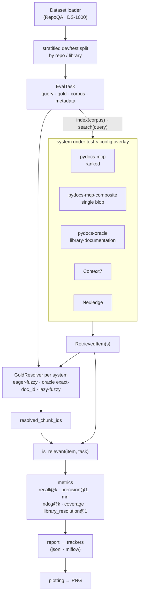
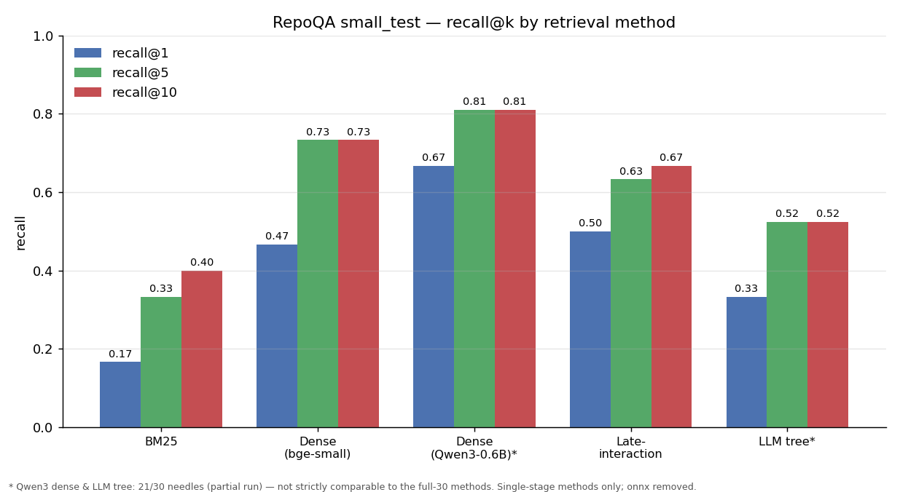
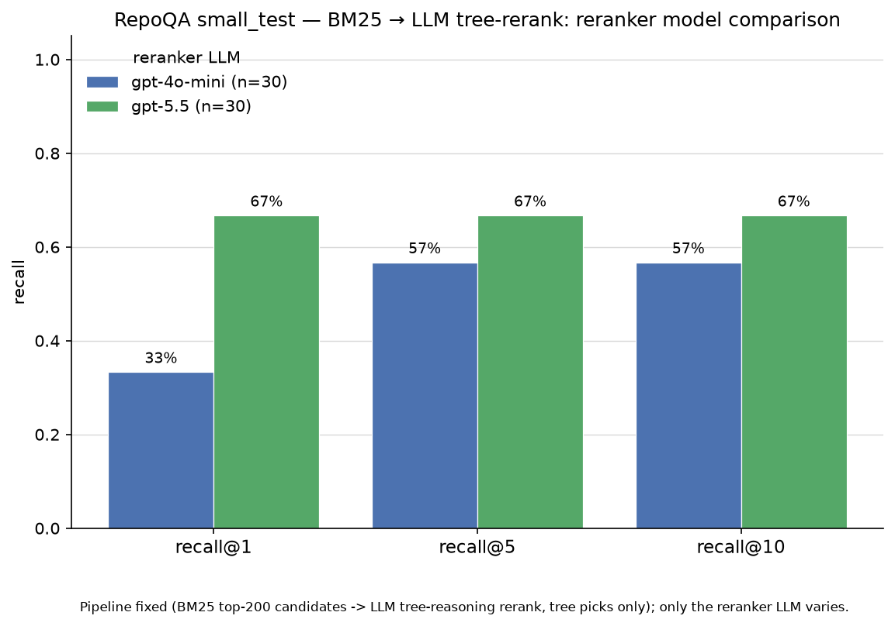
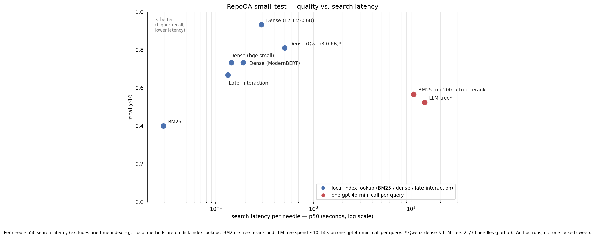
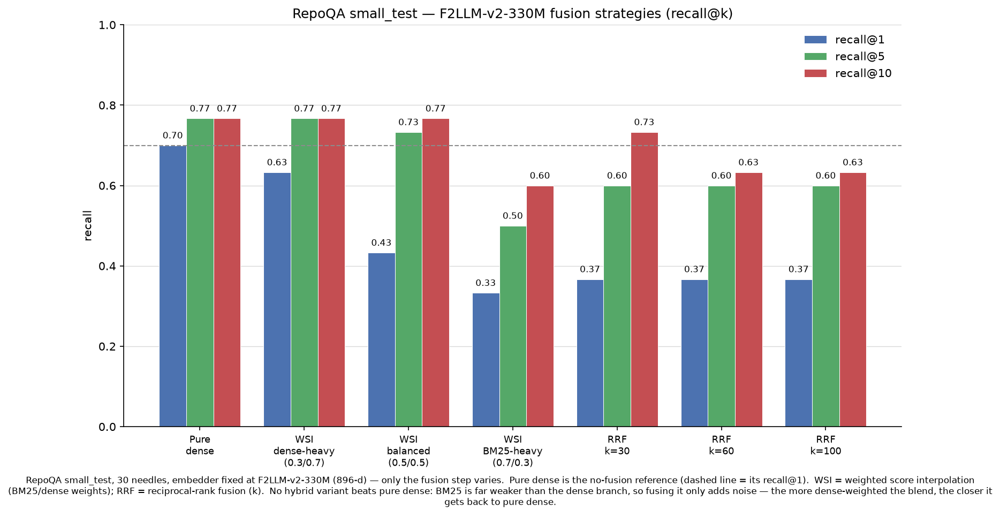
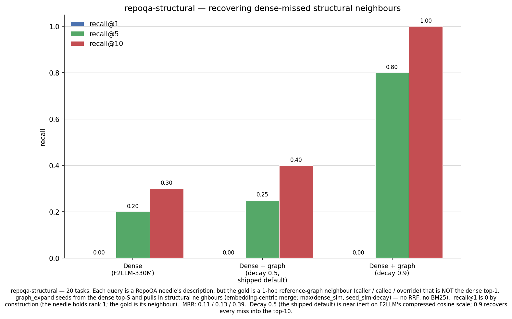
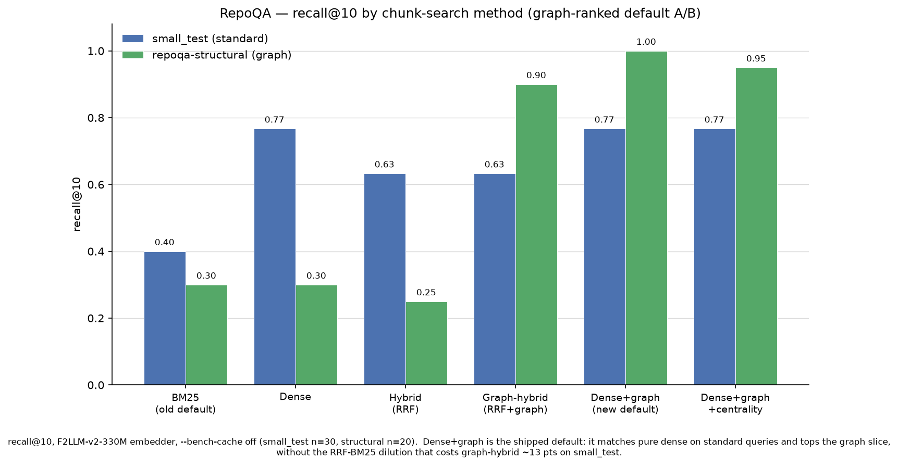
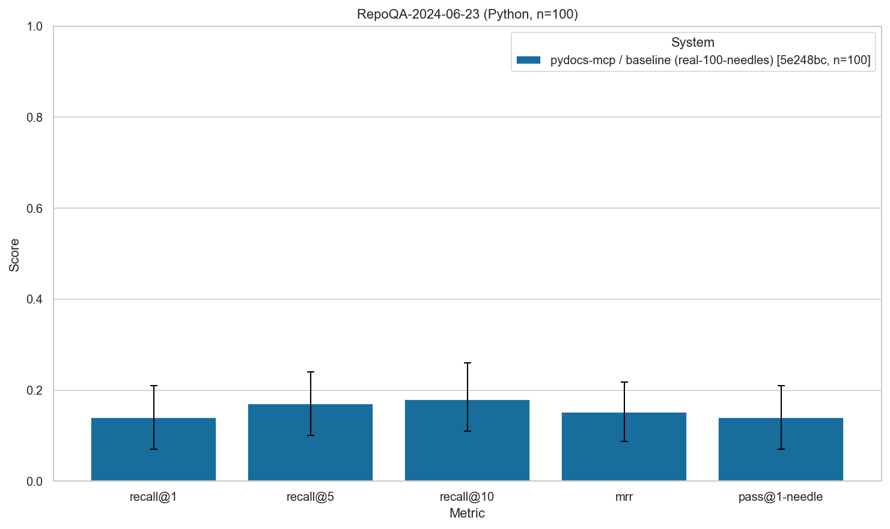
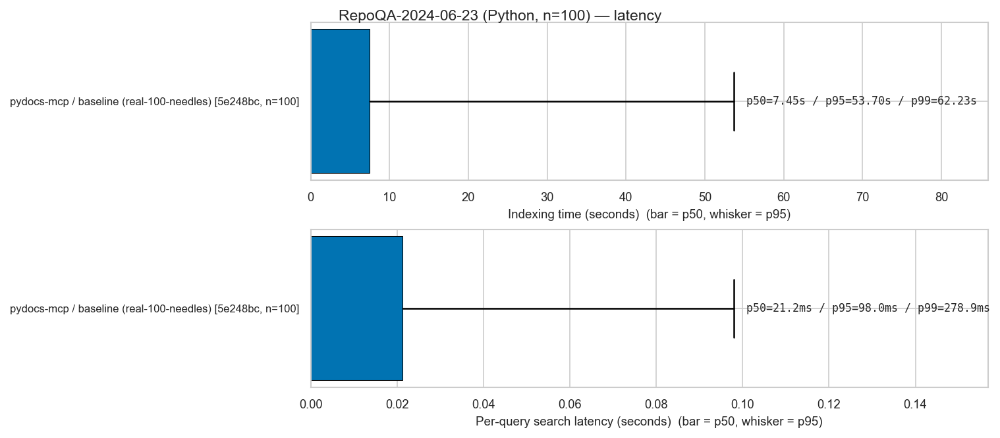
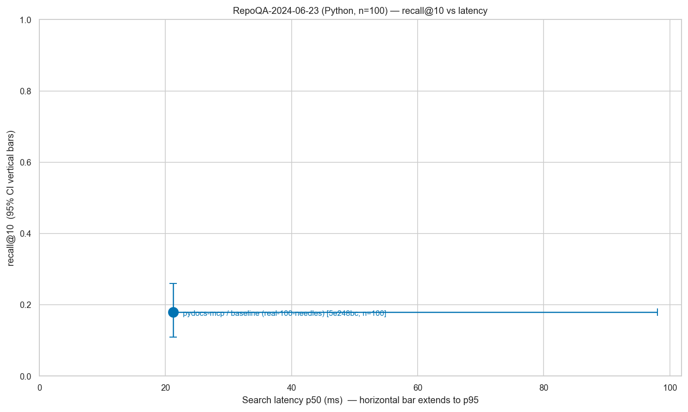

# pydocs-mcp Benchmark Suite

Real retrieval-quality evaluation for `pydocs-mcp` against public benchmarks —
**RepoQA-SNF** (arXiv:2406.06025) and **DS-1000** (CodeRAG-Bench flavor,
arXiv:2211.11501 / arXiv:2406.14497) — measured head-to-head against
**Context7** and **Neuledge Context**, with JSONL- or MLflow-backed experiment
tracking.

Its purpose: A/B-test YAML pipeline tunings (`AppConfig`) on real benchmarks and
record every `(system × config × dataset)` combination as one tracked run with
comparable params, metrics, and artifacts.

For a ready-to-run comparison of BM25 / dense / hybrid (RRF + weighted) / tree
retrieval strategies on a small RepoQA slice (`--split small_test`), see
[`EXPERIMENTS.md`](EXPERIMENTS.md).

## How the systems compare (qualitative)

pydocs-mcp, **Context7**, and **Neuledge Context** all feed docs to an AI agent
over MCP, but optimize for different things. They aren't mutually exclusive — an
agent can mount all three and route by intent. This table is the qualitative
side; the rest of this document is the same three systems scored head-to-head on
identical tasks and gold answers.

| | **pydocs-mcp** | **Context7** | **Neuledge Context** |
|---|---|---|---|
| **Deployment** | Local stdio MCP server | Hosted MCP (`mcp.context7.com`) | Local stdio MCP server |
| **Doc source** | Your installed Python deps + your own project, indexed in place | Curated community docs hosted by Upstash | Community registry (~100+ libraries), pulled then queried locally |
| **Version match** | Exactly what's in your `site-packages` — automatic | Library + version chosen in the prompt | Latest from the registry |
| **Languages** | Python | Multi-language | Multi-language (~100+ libraries) |
| **Retrieval** | Keyword (BM25) + dense embeddings + LLM tree reasoning, fused via RRF or weighted scores; optional late-interaction (ColBERT-style) and reference-graph expansion | Not publicly documented | BM25 over SQLite FTS5 |
| **Code-structure queries** | Reference graph — `get_references(direction=callers\|callees\|inherits\|impact\|governed_by)` | None (doc retrieval only) | None (doc retrieval only) |
| **Indexes your code** | Yes — under the `__project__` package | No | No |
| **Privacy** | Fully offline with the default embedder — zero network calls | Queries hit Upstash; OAuth + API key | Local once packages are downloaded |
| **Dependencies** | Lean — no PyTorch, no FAISS (Rust TurboQuant store + small ONNX embedder) | Hosted service (nothing to install) | Local service |
| **Cost** | **$0** — OSS (MIT); no keys, limits, or fees | Free tier (rate-limited) + paid plans | **$0** — OSS (Apache-2.0) |

**In short:** choose pydocs-mcp for offline, version-matched Python retrieval
where you also navigate code structure; Context7 for hosted, multi-language docs;
Neuledge for a local-first multi-language registry.



Each run fans a dataset's tasks across one or more systems (each under a config
overlay), resolves ground truth per system, then scores every system on the
**same relevance signal**. That shared signal is the core design choice — it is
what lets a cloud API (Context7), a local HTTP service (Neuledge), and an
in-process pipeline (`pydocs-mcp`) be measured with one metric suite. See
[Metrics](#metrics) for how it works.

## Metrics

Every `(system × config × dataset)` run reports the metrics below per task, plus
an aggregate value with a 95% bootstrap confidence interval (1000 resamples,
seed=0). The aggregator lives in
`benchmarks/src/benchmarks/eval/metrics/aggregate.py`.

### How relevance is decided

A single predicate — `is_relevant(item, task)`, in
`benchmarks/src/benchmarks/eval/metrics/_relevance.py` — backs every metric, so
none of them branch on the dataset. It picks one of two definitions from the
shape of the gold answer:

- **RepoQA** gold carries an AST body → relevance is an AST-equivalence match
  (whitespace- and comment-tolerant), in
  `benchmarks/src/benchmarks/eval/ast_match.py`.
- **DS-1000** gold carries doc contents / doc-IDs → relevance is set membership
  in the per-task `resolved_chunk_ids` set.

That set is populated, before metrics run, by a per-system **`GoldResolver`**
(`benchmarks/src/benchmarks/eval/gold_resolver.py`): native `pydocs-mcp`
fuzzy-matches each indexed chunk against the gold doc contents (rapidfuzz
`partial_ratio`, threshold 85); `pydocs-oracle` matches each chunk's preserved
`doc_id` exactly; Context7 and Neuledge — whose stores cannot be enumerated —
lazily fuzzy-match only the blob they actually returned.

### The metrics

| Metric | What it measures |
|---|---|
| **`recall@k`** | `1.0` if a relevant item appears in the top-`k`, else `0.0`. Reported at `k ∈ {1, 5, 10}`. |
| **`precision@1`** | `1.0` if the rank-1 item is relevant. Collapses to `recall@1` for single-item systems. |
| **`mrr`** | Mean reciprocal rank — `1/rank` of the first relevant item, `0.0` if none is found. |
| **`ndcg@k`** | Binary-relevance normalized discounted cumulative gain over the top-`k`, normalized so it lands in `[0, 1]`. Reported at `ndcg@10`. |
| **`coverage`** | `1.0` if the system surfaced **any** ground truth — a non-empty resolved set, or Context7's library-resolution signal when no enumerable store exists. A "did we find anything at all" health signal, not a ranking metric. |
| **`library_resolution@1`** | `1.0` if Context7's router resolved the task's library to the right `/org/project` id (path-segment match, with a small alias map for `torch` → `/pytorch/pytorch`). `0.0` for systems that emit no resolved library id — meaningful only in the Context7 row. |
| **`pass@1-needle`** | `1.0` if the top-1 item matches the gold needle. RepoQA's strictest signal — sensitive to small ranking changes that `recall@k` smooths over. |

**Not every metric fits every run.** Single-item systems (Context7, Neuledge,
and `pydocs-mcp-composite`) return one text payload per query, so only the
rank-1 family (`recall@1`, `precision@1`) is defined for them; the ranked
metrics (`recall@5/10`, `ndcg@10`, `mrr`) need a top-`k` list. The
[DS-1000 runs](#ds-1000-prerequisites-and-the-three-runs) show which metric set
goes with which output shape.

## Datasets

One subsection per benchmark, each answering the same four questions — **what it
tests**, an **example task**, **size + source**, and **what it does (and does
not) proxy** — so adding a benchmark is a copy-paste of the shape, and a reader
can calibrate how much weight to put on the numbers.

> The harness deliberately uses *external* benchmarks with stable gold answers.
> An earlier placeholder that synthesized queries from the chunks it had just
> indexed was removed: a chunker change shifted corpus and queries together, so
> the eval was blind. RepoQA and DS-1000 gold answers cannot be influenced by
> the system under test.

### RepoQA-SNF (Python subset of `repoqa-2024-06-23`)

**What it tests:** natural-language description → Python function retrieval in
long, real-world code repositories. Each task hands the system under test a
multi-file repo slice and a one-sentence English description of one function
("the needle"); the system returns a ranked list of candidate chunks; the
harness counts whether an AST-equivalent match of the needle's body appears in
the top-K. This is the dominant query shape for `search_codebase(query, kind, ...)`
on the MCP surface.

**Example task** (from
`benchmarks/tests/eval/fixtures/repoqa_mini.json`, the 5-needle fixture shipped
for hermetic CI):

```text
Query (description):
    Compute the factorial of a non-negative integer.

Repo content (file path → source, pinned to a specific commit):
    fixture_repo/__init__.py
    fixture_repo/math_helpers.py
    [in production tasks: 30–80 real Python files per repo]

Gold answer (AST-matched, comments + whitespace tolerant):
    def factorial(n: int) -> int:
        if n <= 1:
            return 1
        return n * factorial(n - 1)

Other needles in the same repo:
    - fibonacci  — Compute the n-th Fibonacci number.
    - is_prime   — Test whether n is prime.
    - gcd        — Greatest common divisor of two integers.
    - lcm        — Least common multiple via gcd.
```

A "pass" on `recall@k` means at least one of the top-K retrieved chunks contains
a function whose AST body matches the gold needle's (the
[relevance predicate](#how-relevance-is-decided) handles the match);
`pass@1-needle` is the same check restricted to rank-1; `mrr` rewards ranking
the gold high.

**Dataset size:** 100 needles total — 10 real Python repos (HuggingFace
Transformers, vLLM, FastAPI, sympy, …) × ~10 needles each. The shipped fixture
(`repoqa_mini.json`) has 5 needles from one synthetic repo for hermetic CI runs
that don't touch the network.

**Source:** Liu, J. et al. *RepoQA: Evaluating Long Context Code Understanding.*
arXiv:2406.06025, June 2024. Apache-2.0, by the EvalPlus team. Downloaded on
first run to `~/.cache/pydocs-mcp/repoqa/` and cached thereafter.

**Proxies well:** description → function retrieval (the 1:1 shape matches MCP
`search`); long-context indexing on real Python layouts; A/B testing of YAML
tunings against a fixed dataset + metric set; cross-system retrieval comparison
(`pydocs-mcp` vs `context7` vs `neuledge` on identical queries + gold).

**Does NOT proxy:** end-to-end LLM code-generation quality (retrieval only);
multi-file / call-graph retrieval (each task is single-needle); library-docs
lookup from an intent (RepoQA describes a function *inside a specific repo* —
DS-1000 covers the intent → docs loop); multi-language coverage (Python only).

### DS-1000 (CodeRAG-Bench flavor)

**What it tests:** natural-language data-science intent → library-documentation
retrieval. Each task hands the system a StackOverflow-derived problem stripped of
its solution ("How do I group a DataFrame and take the mean of each group?") and
asks for the library documentation a developer would need. The harness checks
whether the gold doc(s) — manually verified canonical doc-IDs — appear in the
retrieved set. This exercises the "look up the right API doc from an English
question" loop directly, complementing RepoQA-SNF's function-inside-a-repo shape.

**Example task:**

```text
Query (NL intent, solution stripped):
    I have a DataFrame and I want to group by one column and compute the
    mean of another column for each group. How do I do that in pandas?

Gold answer (canonical library doc, matched by content or doc-ID):
    pandas.core.groupby.GroupBy.mean — Compute mean of groups, excluding
    missing values. (doc_id: pandas.core.groupby.GroupBy.mean)

Library: pandas   Perturbation bucket: Origin
```

**Dataset size + source:** 1,000 problems across seven Python libraries (NumPy,
pandas, SciPy, Matplotlib, scikit-learn, TensorFlow, PyTorch), from Lai et al.,
*DS-1000: A Natural and Reliable Benchmark for Data Science Code Generation*
(arXiv:2211.11501, 2023). The retrieval framing — gold doc-ID annotations plus a
documentation datastore — comes from Wang et al., *CodeRAG-Bench: Can Retrieval
Augment Code Generation?* (arXiv:2406.14497, 2024). The loader pins a Hugging
Face revision for reproducibility; a small hand-crafted fixture
(`benchmarks/tests/eval/fixtures/ds1000_mini.json`) lets hermetic tests run
without network access.

**Proxies well:** NL intent → library-docs retrieval (the loop RepoQA does not
cover); version-sensitive indexing (the pinned reference project measures
whether indexing the *correct* library release matters — a differential
version-agnostic services cannot show); retriever-vs-chunker attribution (the
oracle-indexing run separates retrieval quality from chunking quality).

**Does NOT proxy:** exhaustive relevance (gold is a verified *subset* of valid
docs, so scores are a lower bound — a "miss" may be a valid alternative the gold
omits); broad library coverage (only the seven libraries); robustness to query
perturbation (DS-1000 perturbs the *solution code*, not the retrieval target, so
scores stay roughly flat across buckets — flatness is not a robustness signal);
paraphrase-heavy gold (the fuzzy threshold of 85 is conservative and YAML-tunable;
heavily paraphrased docs may score `0.0` under content matching — this applies
only to the native source runs; the canonical oracle run matches gold by exact
doc-title, so it is unaffected).

### RepoQA-structural (reference-graph split)

A derived split that stress-tests **structural** retrieval — the code you reach by
following the call / inheritance graph, not by matching text. Built from RepoQA by
[`scripts/build_structural_recall.py`](scripts/build_structural_recall.py): for
each needle it keeps the original natural-language description as the query but
swaps the gold to a **1-hop reference-graph neighbour** (a caller, a callee, or an
overriding subclass method) that is *not* the dense top-1, while requiring the
needle itself to be in the dense top-K — so the neighbour is reachable by seeding
graph expansion from a dense hit.

- **What it measures.** Whether the `graph_expand` retrieval step recovers
  structurally-adjacent answers a dense embedder misses (its text doesn't match
  the query, but it calls / is called by / overrides a function that does).
- **Gold.** The neighbour's function body, AST-matched (same scorer as RepoQA).
- **Registered as** `repoqa-structural`
  ([`datasets/structural_recall.py`](src/benchmarks/eval/datasets/structural_recall.py)).
  The fixture (`fixtures/structural_recall.json`) is a **thin overlay** — repo
  source is reconstructed from the cached RepoQA release at eval time, so it stays
  tiny (no duplicated repo trees).
- **Run it.** See [EXPERIMENTS.md §6](EXPERIMENTS.md) for the generate + compare
  commands.

### SWE-QA-Pro (primary code-QA track)

**What it measures.** Repository-level code-comprehension questions →
file-level retrieval. Each task hands the system a real Python repo pinned to a
commit and a natural-language question about it ("How does the variational QAOA
model override the minimize method?"); the system returns ranked chunks, and the
harness checks whether the file(s) the gold answer cites appear in the retrieved
set. This is the dominant query shape for `get_context` / `search_codebase` on
whole real-world codebases (not single needles).

- **Dataset size + source.** 260 QA pairs over 26 Python-only repos (10 each),
  MIT, from `TIGER-Lab/SWE-QA-Pro-Bench` (arXiv:2603.16124). Each row carries a
  full 40-hex `commit_id`, a `qa_type` (What / Where / How / Why + 12
  sub-classes), a `cluster` id, and near-regular `(path.py: line N-M)` answer
  citations (96% of rows). Pinned at dataset revision `596892da…`.
- **Gold.** File-level pseudo-qrels: the answer's path citations, resolved
  against the pinned repo's file tree, become `GoldAnswer.file_set`. Rows whose
  answer cites no resolvable file are dropped **with a logged count** (no silent
  caps). Registered as `swe-qa-pro`
  ([`datasets/swe_qa_pro.py`](src/benchmarks/eval/datasets/swe_qa_pro.py)); the
  committed mini fixture (`fixtures/swe_qa_pro_mini.jsonl`) drives hermetic CI
  without network access.
- **Per-category reporting.** Because every row is tagged with a `qa_type`, the
  report grows a `## By qa_type` breakout (What / Where / How / Why) whenever ≥2
  categories are present — this is why SWE-QA-Pro is the **primary** track for
  per-category analysis. Once decision capture lands, the 65 **Why** rows also
  feed `get_why`'s acceptance probe.
- **Run it.**

  ```bash
  # Config zoo: benchmarks/configs/swe_qa_pro_{bm25,dense,hybrid_rrf_k60,graph}.yaml
  python -m benchmarks.eval.runner \
      --dataset swe-qa-pro \
      --configs benchmarks/configs/swe_qa_pro_bm25.yaml,benchmarks/configs/swe_qa_pro_hybrid_rrf_k60.yaml
  ```

  The loader fetches the pinned `data/test.jsonl` and clones each repo pin into
  `~/.cache/pydocs-mcp/swe-qa-pro/` on first run, then reuses the cache. Corpora
  are redistributed-by-download — cloned into the cache, never committed (they
  belong to their authors).

**Pseudo-qrel caveat** — the same caveat governs both SWE-QA corpora, so read it
once here:

> The datasets ship QA pairs, not qrels, so retrieval evaluation derives
> **pseudo-qrels**: a file/symbol is relevant to a question iff it is cited in
> the gold answer (path and dotted-name extraction with normalization). This is
> a documented approximation — good for *comparing our own configs* on nDCG@10,
> recall@{5,10,20}, MRR; not publishable as absolute IR quality.

### SWE-QA (secondary code-QA track)

**What it measures.** The same repository-level code-QA → file retrieval shape as
SWE-QA-Pro, on a larger but noisier corpus. Complements SWE-QA-Pro with more
repos and more questions, at the cost of coarser labels and no per-question
taxonomy.

- **Dataset size + source.** 720 QA pairs over 15 Python repos, Apache-2.0, from
  `swe-qa/SWE-QA-Benchmark`. The HF release columns are
  `question` + `answer` **only** — the repo is inferred from the split name, and
  there are **no commit pins in the data**. Pins (short SHAs) live in the
  companion GitHub repo (`peng-weihan/SWE-QA-Bench`, `repo_commit.txt`) and are
  transcribed into the adapter's `_REPO_PINS`. It is **unverified** that the
  720-row release was built against exactly those commits, so labels stay
  **file-level** for this corpus (safe under line drift). Pinned at dataset
  revision `07e206aa…`.
- **Gold.** File-level pseudo-qrels, same extraction as SWE-QA-Pro; citations are
  noisier (~8% bare filenames resolved by unique basename), citation-free rows
  drop with a logged count. Registered as `swe-qa`
  ([`datasets/swe_qa.py`](src/benchmarks/eval/datasets/swe_qa.py)); the committed
  mini fixture (`fixtures/swe_qa_mini.jsonl`) drives hermetic CI. There is **no
  per-question taxonomy** in the release, so per-category breakouts come from
  SWE-QA-Pro; SWE-QA gets per-repo breakouts only.
- **Run it.**

  ```bash
  # --split selects one repo (e.g. matplotlib) or "default" for all 15.
  python -m benchmarks.eval.runner \
      --dataset swe-qa \
      --configs benchmarks/configs/swe_qa_pro_bm25.yaml \
      --split matplotlib
  ```

  The loader fetches the per-repo `data/<repo>.jsonl` files and clones each pin
  into `~/.cache/pydocs-mcp/swe-qa/` on first run. Corpora are
  redistributed-by-download — never committed.

The **pseudo-qrel caveat** above applies identically to this corpus —
comparative, not absolute, IR quality.

### Agent track (paired agent-efficiency, manual — never CI)

**What it measures.** Not retrieval quality, but *agent efficiency at answer
quality parity*. The same headless coding agent answers repository questions
twice per task: once with bare file/search tools (`Read` / `Grep` / `Glob` /
`Bash`), once with the pydocs-mcp server attached. A blind LLM judge scores both
answers against the gold answer, and the report aggregates the cost / wall-clock
/ turn / tool-call / file-read / cache-token deltas **per task, paired** — so the
efficiency numbers are honest only where the two arms scored at quality parity.

**This is manual and expensive by design — it never runs in CI.** A full run
spawns a real headless agent per arm and spends real money (~$5–10 per arm per
repo). Everything pure and Protocol-seamed is unit-tested offline
([`tests/eval/agent_track/`](tests/eval/agent_track/)); only an operator runs the
paid path, and only after the preflight passes.

- **Preflight first.** Before any paid run, verify the environment contract —
  the headless CLI is present, its JSON output carries the parsed fields (a
  one-token probe capped at $0.01), `pydocs_mcp` imports, the MCP config boots,
  and there is disk headroom:

  ```bash
  python -m benchmarks.eval.agent_track --preflight
  ```

- **Run it.** Resumable through a JSONL ledger (re-running skips completed
  pairs and never re-attempts a discarded task); `--max-tasks` / `--max-usd`
  bound the run:

  ```bash
  python -m benchmarks.eval.agent_track \
      --dataset swe-qa-pro \
      --max-tasks 12 \
      --max-usd 60 \
      --report runs/agent_track_report.md
  ```

The full runbook — cost expectations, the preflight-first rule, resume
semantics, and how to read the paired-delta report — lives in
[`AGENT_TRACK.md`](AGENT_TRACK.md).

### Optimizing the harness's own text artifacts (manual — never CI)

The optimize layer turns the paired agent track into a fitness function and
searches for better versions of two text artifacts — the product `tool_docs`
surface and the `usage_skill` seed document — accepting a candidate only on a
held-out split with a real margin. It is a stack of many paired runs, so it is
manual, preflight-gated, budget-capped, and never CI. Walk the whole pipeline
spending nothing first:

```bash
python -m benchmarks.optimize \
    --config benchmarks/src/benchmarks/optimize/configs/optimize_tool_docs.yaml --dry-run
```

The spend model, how to read an `OptimizationResult`, and how to land a proposed
diff live in the [`AGENT_TRACK.md`](AGENT_TRACK.md) "Optimization" chapter.

### Roadmap: additional benchmarks

Each future benchmark gets its own subsection following the same four-question
pattern. Planned additions:

| Benchmark | What it would add | Status |
|---|---|---|
| **SWE-bench Verified (retrieval-only slice)** | Given a real GitHub issue, retrieve the set of files a developer needs to read to fix it, scored against the human-verified patch set. Stresses cross-file retrieval (the changed file plus its callers, tests, and helpers). Jimenez et al., arXiv:2310.06770 (2023); Verified subset (500 issues) curated by OpenAI (2024). | One-file dataset plugin; not yet implemented. |
| **DocPrompting CoNaLa-Docs** | Natural-language intent → Python library doc retrieval. Zhou et al., arXiv:2207.05987 (2023). | Plugin scoped, deferred. |
| **CodeRAG-Bench ODEX** | Library-docs retrieval on the execution-driven ODEX split (open-domain StackOverflow problems), complementing the DS-1000 split. Wang et al., arXiv:2406.14497 (2024). | Roadmap (DS-1000 split shipped — see the [DS-1000 subsection](#ds-1000-coderag-bench-flavor)). |

Adding one means: drop a `Dataset` Protocol implementation under
`benchmarks/src/benchmarks/eval/datasets/`, register it via
`@dataset_registry.register("<name>")`, point a config at it, and write one
README subsection mirroring the shape above. No harness changes required.

## Sweep protocol

The RepoQA `small_test` slice has absorbed many recorded tuning sweeps
(method comparison, fusion weights, graph A/B) — treat every test-derived
split as **held out**, never as an iteration surface. All tuning iterates on
`small_dev`: the same-size mirror of `small_test` drawn from the `dev`
partition (same Hamilton largest-remainder apportionment, same seed, same
~30-task target — see `benchmarks/src/benchmarks/eval/datasets/_split.py`).

The promotion ladder is strictly one-way:

1. **Iterate on `--split small_dev`** — unlimited sweeps, warm index cache
   (`--bench-cache on`). Compare configs on recall@5 (headline) with MRR as
   the tiebreaker.
2. **Promote to full `--split dev`** only configs that beat the frozen
   baseline beyond noise. At ~30 tasks, bootstrap CIs on recall@1 are
   ±0.15-wide, so require non-overlapping CIs or — better — a paired
   per-task check (McNemar / paired bootstrap on the per-task 0/1 outcomes;
   the harness already writes per-task JSONL events, so this is pure
   post-processing).
3. **One confirmatory run** on full `--split test`, with `--bench-cache
   off`, plus the structural gate: recall@10 on `--dataset
   repoqa-structural` must not regress (do-no-harm). A config that loses at
   test goes back to `small_dev` — its variants do not get fresh test
   shots.

A config graduates to the frozen baseline when it (a) wins on dev, (b)
confirms on test with the paired check, and (c) does not regress the
structural gate. Then commit its result JSON to `benchmarks/baselines/`
(config path + git SHA inside), flip the shipped YAML default, and it
becomes the new gate. The baselines directory doubles as the audit log of
how many times the test split has been consumed — budget roughly one
confirmatory batch per release. Any RepoQA-tuned promotion must also not
regress DS-1000 `--split test` — the cheap insurance against tuning into
RepoQA's clean one-sentence query idiom.

## Results

### Method comparison (RepoQA `small_test`)

Retrieval methods on the RepoQA `small_test` split — each query is a
function description and the gold is that function (one notebook per method lives
in [`notebooks/`](../notebooks/)). Higher is better.



| Method | Config | recall@1 | recall@5 | recall@10 | MRR | needles |
|---|---|---:|---:|---:|---:|---:|
| BM25 (keyword / FTS5) | `repoqa_bm25.yaml` | 0.167 | 0.333 | 0.400 | 0.238 | 30 |
| BM25 top-200 → tree rerank (2-stage, gpt-4o-mini) | `repoqa_bm25_tree_rerank.yaml` | 0.333 | 0.567 | 0.567 | 0.424 | 30 |
| BM25 top-200 → tree rerank (2-stage, gpt-5.5) | `repoqa_bm25_tree_rerank_gpt55.yaml` | 0.667 | 0.667 | 0.667 | 0.667 | 30 |
| Dense (bge-small, 384-d) | `repoqa_dense.yaml` | 0.467 | 0.733 | 0.733 | 0.567 | 30 |
| Dense (gte-modernbert-base, 768-d) | `repoqa_dense_modernbert.yaml` | 0.533 | 0.733 | 0.733 | 0.601 | 30 |
| Dense (Qwen3-0.6B, 1024-d) | `repoqa_dense_st.yaml` | 0.667 | 0.810 | 0.810 | 0.738 | 21\* |
| Dense (F2LLM-v2-330M, 896-d) | `repoqa_dense_f2llm_330m.yaml` | 0.700 | 0.767 | 0.767 | 0.725 | 30 |
| **Dense (F2LLM-v2-0.6B, 1024-d)** | `repoqa_dense_f2llm.yaml` | **0.900** | **0.900** | **0.933** | **0.906** | 30 |
| Late-interaction (ColBERT / MaxSim) | `repoqa_li.yaml` | 0.500 | 0.633 | 0.667 | 0.549 | 30 |
| LLM tree reasoning (gpt-4o-mini) | `repoqa_tree.yaml` | 0.333 | 0.524 | 0.524 | 0.398 | 21\* |

> \* **Partial runs** (21 of 30 needles) — *indicative, not strictly comparable*
> to the full-30 rows. These numbers come from ad-hoc runs across one session,
> not a single locked sweep; regenerate a clean, comparable sweep with the
> commands in [§Running the benchmarks](#running-the-benchmarks). The `onnx`
> dense provider was removed; `li_edge` only has a partial run and is omitted.
> **gte-modernbert-base**, **F2LLM-v2-330M**, and **F2LLM-v2-0.6B** are full-30 runs
> served on GPU via sentence-transformers (2048-token cap, `batch_size: 4` for the
> F2LLM models), each in a dedicated process so CUDA memory is freed between embedders.
> **BM25 → tree rerank** is the lone two-stage method: the LLM (gpt-4o-mini or
> gpt-5.5) re-ranks BM25's **top-200** candidate pool (`k=200`), which is why its
> recall@10 can exceed BM25's own top-10; the rest are single-stage. Swapping the
> reranker LLM to **gpt-5.5** doubles recall@1 (0.33 → 0.67) — see
> [§Reranker model: gpt-4o-mini vs gpt-5.5](#reranker-model-gpt-4o-mini-vs-gpt-55).
> (LLM tree also uses gpt-4o-mini.) The chart is rendered from this table by
> [`scripts/plot_method_comparison.py`](scripts/plot_method_comparison.py).

**Takeaways.** Vector methods clearly beat lexical BM25 (semantic vs. exact-term
matching); the code-specialized **F2LLM-v2-0.6B** embedder leads by a wide margin
(recall@1 **0.90**, recall@10 **0.93**), well ahead of the general-purpose
**Qwen3-0.6B**, with **gte-modernbert-base** mid-pack (it ties bge-small at
recall@10 but edges it at recall@1); **dense (bge-small)** and
**late-interaction** are close (LI edges bge at recall@1, bge leads at
recall@5/10); **LLM tree reasoning** works — once `qualified_name` is persisted
(schema v7) — but trails the vector methods on this split and is the most
expensive (one LLM call per query). **BM25 → tree rerank** roughly doubles BM25's
recall@1 (0.17 → 0.33) and lifts recall@5 to 0.57 by re-ranking BM25's top-200
candidate pool (`k=200`) with gpt-4o-mini — reaching tree-reasoning quality, still behind dense.
Upgrading that reranker to **gpt-5.5** doubles recall@1 again (0.33 → 0.67) and lifts
recall@10 to 0.67, closing much of the gap to the mid-pack dense methods (see below).

**Model size matters for F2LLM.** The smaller **F2LLM-v2-330M** (896-d) lands at
recall@1 **0.70** / recall@10 **0.77** (MRR 0.73) — clearly below its 0.6B sibling
(0.90 / 0.93) but still topping the general-purpose **Qwen3-0.6B** and
**gte-modernbert-base** at recall@1, at a slightly lower search latency (0.23s p50).
So the code-specialized family wins at both sizes, but ~half the parameters costs
~0.16 recall@10 here.

#### Reranker model: gpt-4o-mini vs gpt-5.5

Holding the two-stage pipeline fixed (BM25 top-200 → LLM tree-reasoning rerank,
tree picks only) and varying **only** the reranker LLM, on the same 30-needle
`small_test` split:



| Reranker | recall@1 | recall@5 | recall@10 | MRR | search / needle (p50) |
|---|---:|---:|---:|---:|---:|
| gpt-4o-mini | 0.333 | 0.567 | 0.567 | 0.424 | 10.6s |
| **gpt-5.5** | **0.667** | **0.667** | **0.667** | **0.667** | 8.8s |

**gpt-5.5 doubles recall@1** (0.33 → 0.67) and lifts MRR by +0.24. For gpt-5.5,
recall@1 = recall@5 = recall@10 = MRR: when it surfaces the gold it ranks it
**first** — no "buried at rank 2–10" cases — whereas gpt-4o-mini's recall@1
(0.33) sits well below its recall@10 (0.57). Median latency is comparable
(gpt-5.5 slightly faster), but gpt-5.5 has a heavier tail (p99 ~43s vs ~17s) from
occasional long reasoning bursts. gpt-5.5 is a reasoning model, so its temperature
is forced to the model default (the client omits the unsupported `temperature=0`),
making its rerank mildly non-deterministic. Rendered by
[`scripts/plot_reranker_model_comparison.py`](scripts/plot_reranker_model_comparison.py).
n=30 with a wide CI (`[0.50, 0.83]`) — the recall@1 / MRR gaps are large; the
recall@10 gap (+0.10) is smaller relative to that noise.

#### Quality vs. search latency



Per-needle **p50 search latency** (the query path only — excludes one-time
indexing), from each run's per-task `search_seconds`:

| Method | recall@10 | search / needle (p50) |
|---|---:|---:|
| BM25 | 0.400 | 0.03s |
| Late-interaction | 0.667 | 0.13s |
| Dense (bge-small) | 0.733 | 0.15s |
| Dense (ModernBERT) | 0.733 | 0.19s |
| Dense (F2LLM-330M) | 0.767 | 0.23s |
| Dense (F2LLM-0.6B) | 0.933 | 0.29s |
| Dense (Qwen3-0.6B) | 0.810 | 0.51s |
| BM25 → tree rerank (gpt-4o-mini) | 0.567 | 10.6s |
| BM25 → tree rerank (gpt-5.5) | 0.667 | 8.8s |
| LLM tree | 0.524 | 13.7s |

Two tiers: **local index lookups** (BM25 / dense / late-interaction) answer in
**0.03–0.51 s**, while the **LLM methods** (BM25 → tree rerank, LLM tree) spend
**~10–14 s** on one `gpt-4o-mini` call per query — a 20–450× gap. **Dense
(F2LLM-0.6B)** is now the dominant point (highest recall@10, 0.93, at **0.29 s**),
beating Qwen3 on both quality *and* latency, so on quality-per-second the LLM
approaches are the weakest here.

### Hybrid fusion sweep (F2LLM-v2-330M)

Does pairing the dense branch with BM25 help? We ran the **same F2LLM-v2-330M**
embedder through six fusion strategies on RepoQA `small_test` (30 needles) — only
the fusion step varies, so this isolates *fusion* from the embedder. **None beat
pure dense.**



| Fusion | Config | recall@1 | recall@5 | recall@10 | MRR |
|---|---|---:|---:|---:|---:|
| **Pure dense (no fusion)** | `repoqa_dense_f2llm_330m.yaml` | **0.700** | **0.767** | **0.767** | **0.725** |
| WSI dense-heavy (0.3 BM25 / 0.7 dense) | `repoqa_hybrid_wsi_dense_f2llm.yaml` | 0.633 | 0.767 | 0.767 | 0.674 |
| WSI balanced (0.5 / 0.5) | `repoqa_hybrid_wsi_balanced_f2llm.yaml` | 0.433 | 0.733 | 0.767 | 0.573 |
| WSI BM25-heavy (0.7 BM25 / 0.3 dense) | `repoqa_hybrid_wsi_bm25_f2llm.yaml` | 0.333 | 0.500 | 0.600 | 0.401 |
| RRF k=30 | `repoqa_hybrid_rrf_k30_f2llm.yaml` | 0.367 | 0.600 | 0.733 | 0.481 |
| RRF k=60 | `repoqa_hybrid_rrf_k60_f2llm.yaml` | 0.367 | 0.600 | 0.633 | 0.460 |
| RRF k=100 | `repoqa_hybrid_rrf_k100_f2llm.yaml` | 0.367 | 0.600 | 0.633 | 0.460 |

All seven are full-30-needle GPU runs; p50 search latency is ~0.23 s across the
board (fusion is cheap — the cost is the dense embed, shared by all). The chart is
rendered from this table by
[`scripts/plot_hybrid_fusion_330m.py`](scripts/plot_hybrid_fusion_330m.py).

**Takeaways.** **Pure dense wins.** BM25 is far weaker than the code-specialized
dense branch (BM25 alone is recall@1 0.17), so blending it in mostly injects noise.
Within **WSI** (weighted score interpolation) recall tracks the dense weight
monotonically — dense-heavy (0.63) → balanced (0.43) → BM25-heavy (0.33) at
recall@1 — so the more you trust BM25 the worse it gets, and dense-heavy WSI only
*approaches* pure dense without passing it. **RRF** flattens to recall@1 0.37
regardless of `k`, because it keeps only ranks and discards score magnitude —
throwing away exactly the dense branch's calibrated confidence. So for a strong
code embedder, **skip fusion**; if you must fuse, weight dense heavily and prefer
WSI over RRF.

### Structural recall (graph expansion)

The [`repoqa-structural`](#repoqa-structural-reference-graph-split) split isolates
what the `graph_expand` step adds: each query is a RepoQA needle's description, but
the gold is a 1-hop reference-graph neighbour (caller / callee / override) that
dense retrieval does **not** rank first. Embedder is **F2LLM-v2-330M** (896-d) for
both columns — the only difference is the graph step. Higher is better.



| Method | Config | recall@1 | recall@5 | recall@10 | MRR | tasks |
|---|---|---:|---:|---:|---:|---:|
| Dense (F2LLM-v2-330M, 896-d) | `repoqa_dense_f2llm330m.yaml` | 0.00 | 0.20 | 0.30 | 0.113 | 20 |
| Dense + graph (decay 0.5, old default) | `graph_expand`, decay 0.5 | 0.00 | 0.25 | 0.40 | 0.128 | 20 |
| **Dense + graph (decay 0.9)** | `repoqa_dense_graph_f2llm330m.yaml` | 0.00 | **0.80** | **1.00** | **0.386** | 20 |

> **recall@1 is 0 by construction** — the gold is a *neighbour* of the needle, and
> the needle itself holds dense rank 1, so the neighbour lands at rank ≥ 2; the
> meaningful metrics are recall@5/10 and MRR. The graph branch is
> **embedding-centric**: it seeds from the dense top-S and merges each discovered
> neighbour by `max(dense_sim, seed_sim·decay)` — **no RRF, no BM25**. Chart
> rendered from this table by
> [`scripts/plot_structural_recall.py`](scripts/plot_structural_recall.py).

**Takeaways.** On the queries dense ranks poorly, a 1-hop graph expansion from the
dense hit **recovers every miss into the top-10 (recall@10 0.30 → 1.00)** and more
than triples MRR (0.11 → 0.39) at decay 0.9. The `graph_expand` **decay knob is
decisive**: the old default 0.5 is near-inert on F2LLM's compressed cosine scale
(recall@10 0.30 → 0.40 only), so the shipped default is now **0.9**. This is the
graph's home turf — on the standard RepoQA split (where the gold *is* the
described function) pure dense already wins, and graph expansion only adds
neighbours *below* the answer, leaving recall@1 unchanged.

### Graph-ranked default

The two sweeps above settle the out-of-box default (previously BM25-only):
**fusion doesn't help** a strong code embedder, and **graph expansion transforms**
structurally-reachable retrieval. This A/B runs six chunk-search methods across
**both** splits with the same **F2LLM-v2-330M** embedder (`--bench-cache off`).
Each cell is recall@1 / recall@10 / MRR:



| Method | Config | small_test (standard, n=30) | structural (graph, n=20) |
|---|---|---|---|
| BM25 (old default) | `repoqa_bm25.yaml` | 0.17 / 0.40 / 0.24 | 0.05 / 0.30 / 0.11 |
| Dense | `repoqa_dense_f2llm330m.yaml` | 0.70 / 0.77 / 0.73 | 0.00 / 0.30 / 0.11 |
| Hybrid (RRF k=60) | `repoqa_hybrid_rrf_k60_f2llm.yaml` | 0.37 / 0.63 / 0.46 | 0.05 / 0.25 / 0.10 |
| Graph-hybrid (RRF + graph) | `repoqa_graph_hybrid_f2llm330m.yaml` | 0.27 / 0.63 / 0.37 | 0.25 / 0.90 / 0.47 |
| **Dense + graph (new default)** | `repoqa_dense_graph_f2llm330m.yaml` | **0.70 / 0.77 / 0.73** | **0.00 / 1.00 / 0.39** |
| Dense + graph + centrality | `repoqa_dense_graph_centrality_f2llm330m.yaml` | 0.57 / 0.77 / 0.65 | 0.35 / 0.95 / 0.62 |

> Chart rendered from this table by
> [`scripts/plot_graph_default_ab.py`](scripts/plot_graph_default_ab.py).

**Takeaways.** **`dense + graph_expand` is the new shipped default**
(`chunk_search_graph.yaml`). It matches pure dense on standard queries (recall@10
0.77 — zero regression) *and* tops the structural slice (1.00), strictly
dominating the old BM25 default on both (0.40 → 0.77 standard, 0.30 → 1.00
structural). Two negative results pin down *why* it's dense+graph and nothing
fancier: **RRF-hybrid dilutes** the strong dense branch (graph-hybrid drops to
0.63 on standard — the ~13-pt cost of mixing in weak BM25), and **centrality
reranking hurts standard recall@1** (0.70 → 0.57, pushing the exact match below
the graph-central API). `graph_expand` is pure SQL (no `[graph]` extra), and the
default index already builds the dense `.tq` sidecar, so the flip adds no indexing
cost. The ordering also holds with the general-purpose **bge-small** default
embedder (dense recall@10 0.73 vs BM25 0.40 — see Method comparison), so the flip
helps out-of-box, not just with F2LLM.

### Current baselines

Two baseline JSON files are tracked in `benchmarks/baselines/`:

| File | What | Tasks | recall@1 | recall@5 | recall@10 | MRR |
|---|---|---:|---:|---:|---:|---:|
| `repoqa_snf.json` | Real 100-needle sweep against the Python subset of `repoqa-2024-06-23` | 100 | 14.0% [7%, 21%] | 17.0% [10%, 24%] | 18.0% [11%, 26%] | 15.2% [9%, 22%] |
| `repoqa_fixture_baseline.json` | 5-needle hermetic CI gate fixture | 5 | 60.0% | 80.0% | 80.0% | 70.0% |

CIs are 95% intervals from bootstrap resampling (1000 iter, seed=0). Both were
captured against the `chunk_search_ranked.yaml` preset, which returns top-K
ranked separate chunks. The MCP server's default (`chunk_search_graph.yaml`)
instead collapses to one composite chunk via `token_budget_formatter` (correct for LLM
consumers, but it structurally caps `recall@k > 1` at 0 — there is only ever one
item to retrieve). The ranked preset drops the formatter so `recall@k` can
measure top-K hits.

The real-100-needle row is the headline figure. A **dense + hybrid retriever
already ships in `pydocs-mcp`** (the `chunk_search_dense*` / `chunk_search_hybrid*`
pipeline presets: an embedding-backed `dense_fetcher` for candidate generation,
RRF fusion, and a post-fusion `dense_scorer` re-rank) and works end-to-end in
both the MCP server and the benchmark harness
(the harness persists the dense `.tq` sidecar at index time). No dense baseline
has been recorded yet; when one is, it should beat `recall@10 = 18%` to be worth
adopting as the default.

### Visualizing baselines

`benchmarks.eval.plotting` turns baseline JSON files into figures. All commands
below assume the package is installed (see [Install](#install)); from a source
checkout without installing, prefix them with `PYTHONPATH=benchmarks/src`.

**Apples-to-apples constraint:** every baseline in one figure must share the same
`dataset` field (e.g. all `repoqa-2024-06-23-python`). Mixing the 5-needle CI
fixture next to the real 100-needle sweep would misrepresent the numbers, so the
plotting functions raise `ValueError` listing the differing datasets. To compare
across datasets, plot each separately. The same commands work for DS-1000 once a
real sweep has produced a baseline JSON — substitute your own path and a
`DS-1000` title.

**Title convention:** keep titles benchmark-focused (dataset + tasks) and let the
legend carry system / config / method names, so a chart still reads correctly
when a second bar group (e.g. a dense baseline) is added — no title rewrite
needed. Omitting `--title` defaults it to the first record's `dataset` and
`tasks_ran`.

#### Score bars (`recall@k`, `mrr`, `ndcg@10`, …)

Grouped vertical bars: one colored group per baseline, one X-axis category per
metric, 95% CI error bars from each metric's `ci_low` / `ci_high`. Default
palette is seaborn's `colorblind` (colorblind-safe + Nature figure-guideline
compliant).

```bash
# Single baseline on the real 100 needles. Method is in the legend, not the title.
python -m benchmarks.eval.plotting \
    benchmarks/baselines/repoqa_snf.json \
    --output benchmarks/results/plots/repoqa_real.png \
    --metrics recall@1,recall@5,recall@10,mrr,pass@1-needle \
    --title "RepoQA-2024-06-23 (Python, n=100)"

# Side-by-side compare on the SAME dataset (e.g. a dense baseline vs current BM25).
# The plot picks up the second bar group automatically — no code change.
python -m benchmarks.eval.plotting \
    benchmarks/baselines/repoqa_snf.json \
    benchmarks/baselines/repoqa_snf_dense.json \
    --output benchmarks/results/plots/repoqa_real_with_dense.png \
    --title "RepoQA-2024-06-23 (Python, n=100)"
```

The legend identifies each system as
`<system> / <config> (<label>) [<git_sha>, n=<tasks>]`, so a figure stays
self-describing when pasted into a PR description.



Programmatic API — same behavior, handy in a notebook:

```python
from pathlib import Path
from benchmarks.eval.plotting import plot_baselines

fig = plot_baselines(
    baselines=[
        Path("benchmarks/baselines/repoqa_snf.json"),
        # Path("benchmarks/baselines/repoqa_snf_dense.json"),  # dense baseline
    ],
    metrics=("recall@1", "recall@5", "recall@10", "mrr"),
    output=Path("benchmarks/results/plots/repoqa_real.png"),
    palette="colorblind",                       # also: "deep", "muted", "Set2"
    title="RepoQA-2024-06-23 (Python, n=100)",  # default: <dataset> (<tasks_ran> tasks)
)
```

The returned `matplotlib.figure.Figure` is yours to customize, `.show()`, or
re-`.savefig()` at a different DPI.

#### Timing bars (indexing + per-query latency)

Latency lives on a duration scale with p50 / p95 / p99 percentiles, so
`plot_timings()` draws **horizontal** bars — one subplot per timing metric, so
indexing (seconds) and search (milliseconds) don't get crushed onto one axis.
The bar marks p50, a whisker extends to p95, and the right edge is annotated with
the full p50 / p95 / p99 triple (µs / ms / s by magnitude).

```bash
python -m benchmarks.eval.plotting \
    benchmarks/baselines/repoqa_snf.json \
    --output benchmarks/results/plots/repoqa_timings.png \
    --timings \
    --title "RepoQA-2024-06-23 (Python, n=100) — latency"
```



```python
from pathlib import Path
from benchmarks.eval.plotting import plot_timings

fig = plot_timings(
    baselines=[Path("benchmarks/baselines/repoqa_snf.json")],
    metrics=("indexing_seconds", "search_seconds"),   # default
    output=Path("benchmarks/results/plots/repoqa_timings.png"),
    palette="colorblind",
    title="RepoQA-2024-06-23 (Python, n=100) — latency",
)
```

#### Quality-vs-latency scatter (the Pareto view)

`plot_metric_vs_latency()` puts one point per baseline on a quality-vs-latency
chart — the classic IR trade-off. Y is a score metric (default `recall@10`) with
95% CI bars; X is a latency percentile (default p50 of `search_seconds`, in ms)
with a whisker to p95. **Up-and-left is strictly better**; up-and-right is the
trade-off line where dense / hybrid retrievers buy recall at higher latency.

```bash
# Today: a single dot (BM25 only). A recorded dense baseline adds a second dot.
python -m benchmarks.eval.plotting \
    benchmarks/baselines/repoqa_snf.json \
    --output benchmarks/results/plots/repoqa_quality_vs_latency.png \
    --scatter \
    --scatter-metric recall@10 \
    --title "RepoQA-2024-06-23 (Python, n=100) — recall@10 vs latency"

# Swap the X-axis to indexing cost for a quality-vs-indexing-cost view.
python -m benchmarks.eval.plotting \
    benchmarks/baselines/repoqa_snf.json \
    --output benchmarks/results/plots/repoqa_quality_vs_indexing.png \
    --scatter \
    --scatter-metric recall@10 \
    --scatter-latency indexing_seconds \
    --scatter-percentile p50
```



```python
from pathlib import Path
from benchmarks.eval.plotting import plot_metric_vs_latency

fig = plot_metric_vs_latency(
    baselines=[Path("benchmarks/baselines/repoqa_snf.json")],
    metric="recall@10",
    latency_metric="search_seconds",
    latency_percentile="p50",
    output=Path("benchmarks/results/plots/repoqa_quality_vs_latency.png"),
    title="RepoQA-2024-06-23 (Python, n=100) — recall@10 vs latency",
)
```

Point colors come from the same `colorblind` palette, so a baseline keeps its
color across all three plot types.

## Running the benchmarks

### Install

`uv`-friendly extras pull in only what you need (`pip` works too — the extras are
stock PEP 508):

```bash
uv pip install -e benchmarks                # core only — JSONL tracker, stdlib RepoQA loader
uv pip install -e "benchmarks[mlflow]"      # + MLflow tracker
uv pip install -e "benchmarks[all]"         # everything
```

The package follows the PyPA src-layout (`benchmarks/src/`). Commands below
assume it is installed; from a bare source checkout, prefix any
`python -m benchmarks.…` command with `PYTHONPATH=benchmarks/src`.

### Running a sweep

The runner is a module entry-point. Each comma-separated config is one
`AppConfig` overlay (see `benchmarks/configs/`); the runner takes the matrix of
`(systems × configs)`.

```bash
# Baseline run, pydocs-mcp only, against the bundled fixture (no network download).
./scripts/run_repoqa.sh \
    --systems pydocs-mcp \
    --configs <path-to-baseline.yaml> \
    --trackers jsonl \
    --fixture <path-to-fixture> \
    --limit 5

# Full sweep across config variants.
./scripts/run_repoqa.sh \
    --systems pydocs-mcp \
    --configs <baseline.yaml>,<no_stdlib.yaml>,<wide_chunks.yaml> \
    --trackers jsonl

# Equivalent direct invocation (and --help for the full flag list).
python -m benchmarks.eval.runner --help

# View results in MLflow UI (requires the [mlflow] extra).
mlflow ui --backend-store-uri file://./benchmarks/mlruns/
```

For offline development, pass a `--fixture` JSON to bypass the RepoQA download
(see `benchmarks/tests/eval/fixtures/repoqa_mini.json`).

### DS-1000: prerequisites and the three runs

**Prerequisites.** The full (non-fixture) runs need two Hugging Face datasets
(the loader pins a revision so a re-run fetches the same snapshot):

```bash
# The DS-1000 problems (queries + gold doc-ID annotations).
huggingface-cli download --repo-type dataset code-rag-bench/ds1000

# The library-documentation datastore (used by the oracle-indexing run).
huggingface-cli download --repo-type dataset code-rag-bench/library-documentation
```

The two native-`pydocs-mcp` runs also need the pinned reference project so the
indexer reads the exact library versions DS-1000 was authored against:

```bash
cd benchmarks/fixtures/ds1000_reference_project
python -m venv .venv
.venv/bin/pip install -e .
```

Its `pyproject.toml` pins the versions from DS-1000's own `environment.yml`
(pandas 1.5.3, numpy 1.26.4, scikit-learn 1.4.0, …). Installing it materializes
those exact releases in `site-packages`, which `pydocs-mcp` then indexes — the
version-parity edge over Context7 and Neuledge, which serve whatever doc version
their service currently hosts. Context7, Neuledge, and the oracle run ignore
`--corpus-dir` (they query their own index or the datastore), so the reference
project is only needed for the two native runs.

**Why three runs.** The systems do not all emit the same output shape: Context7
and Neuledge return a single concatenated blob per query (rank-1 only), so
ranked metrics with `k > 1` are undefined for them; `pydocs-mcp` can emit either
a single budgeted composite (matching that shape) or a ranked top-K list. The
three runs separate those concerns.

**1. Cross-system comparison** — matched single-blob output across all three
systems:

```bash
python -m benchmarks.eval.runner --dataset ds1000 \
    --systems pydocs-mcp-composite,context7,neuledge \
    --configs ds1000_composite.yaml \
    --metrics recall@1,mrr,precision@1,coverage,library_resolution@1 \
    --trackers jsonl
```

`pydocs-mcp-composite` selects the token-budgeted `chunk_search.yaml` (one
composite blob), compared apples-to-apples against Context7/Neuledge's single
blob. Only `recall@1` / `precision@1` are meaningful here; `library_resolution@1`
scores Context7's library-router accuracy and is `0.0` for the other rows.

**2. Pydocs-only ranked** — keep the ranked-list signal:

```bash
python -m benchmarks.eval.runner --dataset ds1000 \
    --systems pydocs-mcp \
    --configs ds1000_ranked.yaml \
    --metrics recall@1,recall@5,recall@10,ndcg@10,mrr,precision@1,coverage \
    --trackers jsonl \
    --corpus-dir benchmarks/fixtures/ds1000_reference_project
```

The full ranked suite that needs `k > 1` separate items. `ds1000_ranked.yaml`
selects `chunk_search_ranked.yaml` (top-K separate chunks, no composite
collapse); `--corpus-dir` points the indexer at the reference project. For
calibration, CodeRAG-Bench reports DS-1000 NDCG@10 reference points of roughly
BM25 ≈ 5.2, GIST-large ≈ 13.6, Voyage-code ≈ 33.1; `pydocs-mcp`'s BM25-based
ranked preset should land in that range.

**3. Oracle indexing — the canonical, CodeRAG-Bench-comparable run.** This is
the **standard DS-1000 retrieval eval**: it mirrors CodeRAG-Bench's own setup
(`retrieval/create/ds1000.py`) one-to-one, so the numbers are comparable to
their published reference points.

```bash
python -m benchmarks.eval.runner --dataset ds1000 \
    --systems pydocs-oracle \
    --dataset-full-prompt \
    --configs ds1000_ranked.yaml \
    --metrics recall@1,recall@5,recall@10,ndcg@10,mrr,precision@1,coverage \
    --trackers jsonl
```

Three pieces make it canonical, matching the upstream builder:

- **Corpus = the documentation datastore.** `pydocs-oracle` writes one chunk per
  `code-rag-bench/library-documentation` row (preserving each doc's identity in
  the chunk `title`) instead of AST-extracting from source. The library is taken
  from each row's `doc_id` prefix (e.g. `numpy.reference.arrays.scalars` →
  `numpy`), since the rows carry only `{doc_id, doc_content}`.
- **Ground truth = exact gold-title match.** Relevance is exact membership of a
  retrieved chunk's `title` in the task's gold `doc_id`s — the same key the
  upstream qrels use (`docs[*].title` matched against the corpus `doc_id`). This
  is `PydocsOracleGoldResolver`; the fuzzy-content threshold of the native runs
  does NOT apply here.
- **Query = the full prompt.** `--dataset-full-prompt` sends the unstripped
  `prompt` (NL problem + code stub) to the retriever, exactly as the upstream
  builder does (`query = example["prompt"]`). Without the flag the loader keeps
  only the NL question (a stricter, non-canonical variant).

Add `--dataset-library-filter numpy` for a fast single-library smoke. For
calibration, CodeRAG-Bench reports DS-1000 NDCG@10 reference points of roughly
BM25 ≈ 5.2, GIST-large ≈ 13.6, Voyage-code ≈ 33.1; the `ds1000_ranked.yaml`
(BM25/FTS5) preset lands in the BM25 range. Secondarily, the gap between this run
and run 2 quantifies how much retrieval quality the AST-based source chunker
costs — run 3 is the ceiling with chunking removed.

**Splitting and slicing** (both deterministic):

```bash
# Tune on the dev partition, then evaluate on held-out test.
python -m benchmarks.eval.runner --dataset ds1000 --split dev   ...
python -m benchmarks.eval.runner --dataset ds1000 --split test  ...

# Restrict to specific libraries (case-insensitive, normalized).
python -m benchmarks.eval.runner --dataset ds1000 \
    --dataset-library-filter pandas,numpy ...
```

`--split {all,dev,test,small_test,small_dev}` (default `all`) partitions each
library independently — preserving every library's corpus proportion — into a
seeded dev head and test tail, so you can tune on `dev` without contaminating
the held-out `test` numbers. `small_test` and `small_dev` are fixed-size
(~30-task) Hamilton-apportioned stratified subsamples of the `test` tail and
the `dev` head respectively — same apportionment, same seed, same target size;
see [Sweep protocol](#sweep-protocol) for which one a sweep should use.
The same `--split` applies to RepoQA (partitioned by repo).
`--dataset-library-filter` takes a comma-separated list matched against the
normalized (lower-cased) library name. `--dataset-full-prompt` (DS-1000 only)
queries with the unstripped `prompt` — the canonical CodeRAG-Bench query; omit
it to query with the NL question alone (the loader's `_strip_query` default).

### Indexing and caching

**Indexing is one-time per RepoQA task.** Each task ships its own repo slice, so
the harness indexes that slice into a SQLite cache on first touch and reuses it
for every subsequent query on the same task. The `indexing_seconds` row in a
baseline JSON measures that first-touch cost; `search_seconds` measures per-query
latency once the index is warm. The DB schema is described in the
[project documentation](../DOCUMENTATION.md#database-schema-simplified).

That index is also **persisted across sweeps and reused** — see
[Index cache](#index-cache-faster-repeated-sweeps) below for how each
`(corpus, ingestion-config)` is indexed once and shared across conditions and
re-runs, and how to inspect or clear it.

### Index cache (faster repeated sweeps)

Each `(corpus, ingestion-config)` is indexed once and reused across tasks
and across sweeps that share an ingestion pipeline. Controlled by
`--bench-cache on|off` (default `on`). The cache lives at
`~/.pydocs-mcp/bench/` (outside the repo).

```bash
# inspect / clear the cache
python -m benchmarks.eval.bench_cache_cli info
python -m benchmarks.eval.bench_cache_cli evict

# run all experiments, then free the disk (cache used during the run,
# wiped when it finishes — even if the run errors)
python -m benchmarks.eval.runner --bench-cache-cleanup ...

# reproduce pre-cache numbers exactly
python -m benchmarks.eval.runner --bench-cache off ...
```

The cache key folds the ingestion pipeline hash, so changing the embedder
or the ingestion YAML rebuilds automatically. A change to the corpus
*contents* under the same path is NOT auto-detected — run `bench_cache
evict` or `--bench-cache off` after editing a corpus in place.

`--bench-cache-cleanup` evicts the WHOLE cache at the end (not just this
run's entries) — don't pass it while a concurrent sweep shares the cache.

**Reading indexing time:** a cache HIT makes `index()` a ~0 s lookup, so
warm tasks record NO `indexing_seconds` (the metric would otherwise read
"0.0 s"). Take true indexing-time numbers from a COLD run — the first
sweep after `bench_cache_cli evict`, or any `--bench-cache off` run. Warm
sweeps still give correct quality + `search_seconds`. The sweep is
sequential (one task at a time, no concurrency), so a cold run's timing
is uncontended.

### Running the tests

```bash
uv pip install -e "benchmarks[all]"
pytest benchmarks/ -q
```

The whole suite is hermetic — the bundled fixtures
(`benchmarks/tests/eval/fixtures/`: `repoqa_mini.json`, `ds1000_mini.json`,
`ds1000_50.json`) let it run with no network, Hugging Face download, or
reference-project venv. DS-1000 coverage lives under
`benchmarks/tests/eval/`, including: the dataset loader and NL-strip
(`test_ds1000_dataset.py`); the stratified dev/test split
(`test_ds1000_split.py`, `test_split_helper.py`, `test_ds1000_stratified_fixture.py`);
the metrics (`test_recall_at_k.py`, `test_ndcg_at_k.py`, `test_precision_at_1.py`,
`test_coverage.py`, `test_library_resolution_metric.py`,
`test_recall_mrr_repoqa_fallback.py`, `test_is_relevant.py`); the relevance layer
(`test_gold_resolver.py`); the composite + oracle systems
(`test_pydocs_composite_mode.py`, `test_pydocs_mcp_composite_variant.py`,
`test_pydocs_oracle_system.py`, `test_context7_oracle.py`,
`test_integration_oracle.py`); the AppConfig overlays (`test_ds1000_configs_load.py`,
`test_ds1000_reference_project_fixture.py`); and the end-to-end smoke across all
three runs (`test_ds1000_smoke.py`).

## License and attribution

Per-benchmark licensing + citation lives in the relevant subsection under
[Datasets](#datasets) (each benchmark cites its own source). Cross-cutting:

- **MLflow** — Apache-2.0, Databricks. Experiment-tracking backend; the tracking
  URI defaults to a local `file://` store, so no remote server is required.
- **seaborn / matplotlib** — BSD-3-Clause, used for the plotting module.
- Third-party attribution lands in `LICENSE-third-party` once it is added.
