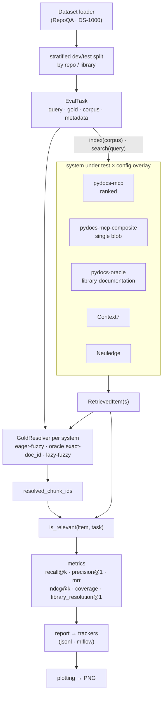

# pydocs-mcp Benchmark Suite

Real retrieval-quality evaluation for `pydocs-mcp` against public benchmarks —
**RepoQA-SNF** (arXiv:2406.06025) and **DS-1000** (CodeRAG-Bench flavor,
arXiv:2211.11501 / arXiv:2406.14497) — measured head-to-head against
**Context7** and **Neuledge Context**, with JSONL- or MLflow-backed experiment
tracking.

Its purpose: A/B-test YAML pipeline tunings (`AppConfig`) on real benchmarks and
record every `(system × config × dataset)` combination as one tracked run with
comparable params, metrics, and artifacts.

For a ready-to-run comparison of BM25 / dense / hybrid (RRF + weighted) / tree
retrieval strategies on a small RepoQA slice (`--split small_test`), see
[`EXPERIMENTS.md`](EXPERIMENTS.md).



Each run fans a dataset's tasks across one or more systems (each under a config
overlay), resolves ground truth per system, then scores every system on the
**same relevance signal**. That shared signal is the core design choice — it is
what lets a cloud API (Context7), a local HTTP service (Neuledge), and an
in-process pipeline (`pydocs-mcp`) be measured with one metric suite. See
[Metrics](#metrics) for how it works.

## Metrics

Every `(system × config × dataset)` run reports the metrics below per task, plus
an aggregate value with a 95% bootstrap confidence interval (1000 resamples,
seed=0). The aggregator lives in
`benchmarks/src/benchmarks/eval/metrics/aggregate.py`.

### How relevance is decided

A single predicate — `is_relevant(item, task)`, in
`benchmarks/src/benchmarks/eval/metrics/_relevance.py` — backs every metric, so
none of them branch on the dataset. It picks one of two definitions from the
shape of the gold answer:

- **RepoQA** gold carries an AST body → relevance is an AST-equivalence match
  (whitespace- and comment-tolerant), in
  `benchmarks/src/benchmarks/eval/ast_match.py`.
- **DS-1000** gold carries doc contents / doc-IDs → relevance is set membership
  in the per-task `resolved_chunk_ids` set.

That set is populated, before metrics run, by a per-system **`GoldResolver`**
(`benchmarks/src/benchmarks/eval/gold_resolver.py`): native `pydocs-mcp`
fuzzy-matches each indexed chunk against the gold doc contents (rapidfuzz
`partial_ratio`, threshold 85); `pydocs-oracle` matches each chunk's preserved
`doc_id` exactly; Context7 and Neuledge — whose stores cannot be enumerated —
lazily fuzzy-match only the blob they actually returned.

### The metrics

| Metric | What it measures |
|---|---|
| **`recall@k`** | `1.0` if a relevant item appears in the top-`k`, else `0.0`. Reported at `k ∈ {1, 5, 10}`. |
| **`precision@1`** | `1.0` if the rank-1 item is relevant. Collapses to `recall@1` for single-item systems. |
| **`mrr`** | Mean reciprocal rank — `1/rank` of the first relevant item, `0.0` if none is found. |
| **`ndcg@k`** | Binary-relevance normalized discounted cumulative gain over the top-`k`, normalized so it lands in `[0, 1]`. Reported at `ndcg@10`. |
| **`coverage`** | `1.0` if the system surfaced **any** ground truth — a non-empty resolved set, or Context7's library-resolution signal when no enumerable store exists. A "did we find anything at all" health signal, not a ranking metric. |
| **`library_resolution@1`** | `1.0` if Context7's router resolved the task's library to the right `/org/project` id (path-segment match, with a small alias map for `torch` → `/pytorch/pytorch`). `0.0` for systems that emit no resolved library id — meaningful only in the Context7 row. |
| **`pass@1-needle`** | `1.0` if the top-1 item matches the gold needle. RepoQA's strictest signal — sensitive to small ranking changes that `recall@k` smooths over. |

**Not every metric fits every run.** Single-item systems (Context7, Neuledge,
and `pydocs-mcp-composite`) return one text payload per query, so only the
rank-1 family (`recall@1`, `precision@1`) is defined for them; the ranked
metrics (`recall@5/10`, `ndcg@10`, `mrr`) need a top-`k` list. The
[DS-1000 runs](#ds-1000-prerequisites-and-the-three-runs) show which metric set
goes with which output shape.

## Datasets

One subsection per benchmark, each answering the same four questions — **what it
tests**, an **example task**, **size + source**, and **what it does (and does
not) proxy** — so adding a benchmark is a copy-paste of the shape, and a reader
can calibrate how much weight to put on the numbers.

> The harness deliberately uses *external* benchmarks with stable gold answers.
> An earlier placeholder that synthesized queries from the chunks it had just
> indexed was removed: a chunker change shifted corpus and queries together, so
> the eval was blind. RepoQA and DS-1000 gold answers cannot be influenced by
> the system under test.

### RepoQA-SNF (Python subset of `repoqa-2024-06-23`)

**What it tests:** natural-language description → Python function retrieval in
long, real-world code repositories. Each task hands the system under test a
multi-file repo slice and a one-sentence English description of one function
("the needle"); the system returns a ranked list of candidate chunks; the
harness counts whether an AST-equivalent match of the needle's body appears in
the top-K. This is the dominant query shape for `search(query, kind, ...)` on
the MCP surface.

**Example task** (from
`benchmarks/tests/eval/fixtures/repoqa_mini.json`, the 5-needle fixture shipped
for hermetic CI):

```text
Query (description):
    Compute the factorial of a non-negative integer.

Repo content (file path → source, pinned to a specific commit):
    fixture_repo/__init__.py
    fixture_repo/math_helpers.py
    [in production tasks: 30–80 real Python files per repo]

Gold answer (AST-matched, comments + whitespace tolerant):
    def factorial(n: int) -> int:
        if n <= 1:
            return 1
        return n * factorial(n - 1)

Other needles in the same repo:
    - fibonacci  — Compute the n-th Fibonacci number.
    - is_prime   — Test whether n is prime.
    - gcd        — Greatest common divisor of two integers.
    - lcm        — Least common multiple via gcd.
```

A "pass" on `recall@k` means at least one of the top-K retrieved chunks contains
a function whose AST body matches the gold needle's (the
[relevance predicate](#how-relevance-is-decided) handles the match);
`pass@1-needle` is the same check restricted to rank-1; `mrr` rewards ranking
the gold high.

**Dataset size:** 100 needles total — 10 real Python repos (HuggingFace
Transformers, vLLM, FastAPI, sympy, …) × ~10 needles each. The shipped fixture
(`repoqa_mini.json`) has 5 needles from one synthetic repo for hermetic CI runs
that don't touch the network.

**Source:** Liu, J. et al. *RepoQA: Evaluating Long Context Code Understanding.*
arXiv:2406.06025, June 2024. Apache-2.0, by the EvalPlus team. Downloaded on
first run to `~/.cache/pydocs-mcp/repoqa/` and cached thereafter.

**Proxies well:** description → function retrieval (the 1:1 shape matches MCP
`search`); long-context indexing on real Python layouts; A/B testing of YAML
tunings against a fixed dataset + metric set; cross-system retrieval comparison
(`pydocs-mcp` vs `context7` vs `neuledge` on identical queries + gold).

**Does NOT proxy:** end-to-end LLM code-generation quality (retrieval only);
multi-file / call-graph retrieval (each task is single-needle); library-docs
lookup from an intent (RepoQA describes a function *inside a specific repo* —
DS-1000 covers the intent → docs loop); multi-language coverage (Python only).

### DS-1000 (CodeRAG-Bench flavor)

**What it tests:** natural-language data-science intent → library-documentation
retrieval. Each task hands the system a StackOverflow-derived problem stripped of
its solution ("How do I group a DataFrame and take the mean of each group?") and
asks for the library documentation a developer would need. The harness checks
whether the gold doc(s) — manually verified canonical doc-IDs — appear in the
retrieved set. This exercises the "look up the right API doc from an English
question" loop directly, complementing RepoQA-SNF's function-inside-a-repo shape.

**Example task:**

```text
Query (NL intent, solution stripped):
    I have a DataFrame and I want to group by one column and compute the
    mean of another column for each group. How do I do that in pandas?

Gold answer (canonical library doc, matched by content or doc-ID):
    pandas.core.groupby.GroupBy.mean — Compute mean of groups, excluding
    missing values. (doc_id: pandas.core.groupby.GroupBy.mean)

Library: pandas   Perturbation bucket: Origin
```

**Dataset size + source:** 1,000 problems across seven Python libraries (NumPy,
pandas, SciPy, Matplotlib, scikit-learn, TensorFlow, PyTorch), from Lai et al.,
*DS-1000: A Natural and Reliable Benchmark for Data Science Code Generation*
(arXiv:2211.11501, 2023). The retrieval framing — gold doc-ID annotations plus a
documentation datastore — comes from Wang et al., *CodeRAG-Bench: Can Retrieval
Augment Code Generation?* (arXiv:2406.14497, 2024). The loader pins a Hugging
Face revision for reproducibility; a small hand-crafted fixture
(`benchmarks/tests/eval/fixtures/ds1000_mini.json`) lets hermetic tests run
without network access.

**Proxies well:** NL intent → library-docs retrieval (the loop RepoQA does not
cover); version-sensitive indexing (the pinned reference project measures
whether indexing the *correct* library release matters — a differential
version-agnostic services cannot show); retriever-vs-chunker attribution (the
oracle-indexing run separates retrieval quality from chunking quality).

**Does NOT proxy:** exhaustive relevance (gold is a verified *subset* of valid
docs, so scores are a lower bound — a "miss" may be a valid alternative the gold
omits); broad library coverage (only the seven libraries); robustness to query
perturbation (DS-1000 perturbs the *solution code*, not the retrieval target, so
scores stay roughly flat across buckets — flatness is not a robustness signal);
paraphrase-heavy gold (the fuzzy threshold of 85 is conservative and YAML-tunable;
heavily paraphrased docs may score `0.0` under content matching).

### Roadmap: additional benchmarks

Each future benchmark gets its own subsection following the same four-question
pattern. Planned additions:

| Benchmark | What it would add | Status |
|---|---|---|
| **SWE-bench Verified (retrieval-only slice)** | Given a real GitHub issue, retrieve the set of files a developer needs to read to fix it, scored against the human-verified patch set. Stresses cross-file retrieval (the changed file plus its callers, tests, and helpers). Jimenez et al., arXiv:2310.06770 (2023); Verified subset (500 issues) curated by OpenAI (2024). | One-file dataset plugin; not yet implemented. |
| **DocPrompting CoNaLa-Docs** | Natural-language intent → Python library doc retrieval. Zhou et al., arXiv:2207.05987 (2023). | Plugin scoped, deferred. |
| **CodeRAG-Bench ODEX** | Library-docs retrieval on the execution-driven ODEX split (open-domain StackOverflow problems), complementing the DS-1000 split. Wang et al., arXiv:2406.14497 (2024). | Roadmap (DS-1000 split shipped — see the [DS-1000 subsection](#ds-1000-coderag-bench-flavor)). |

Adding one means: drop a `Dataset` Protocol implementation under
`benchmarks/src/benchmarks/eval/datasets/`, register it via
`@dataset_registry.register("<name>")`, point a config at it, and write one
README subsection mirroring the shape above. No harness changes required.

## Results

### Current baselines

Two baseline JSON files are tracked in `benchmarks/baselines/`:

| File | What | Tasks | recall@1 | recall@5 | recall@10 | MRR |
|---|---|---:|---:|---:|---:|---:|
| `repoqa_snf.json` | Real 100-needle sweep against the Python subset of `repoqa-2024-06-23` | 100 | 14.0% [7%, 21%] | 17.0% [10%, 24%] | 18.0% [11%, 26%] | 15.2% [9%, 22%] |
| `repoqa_fixture_baseline.json` | 5-needle hermetic CI gate fixture | 5 | 60.0% | 80.0% | 80.0% | 70.0% |

CIs are 95% intervals from bootstrap resampling (1000 iter, seed=0). Both were
captured against the `chunk_search_ranked.yaml` preset, which returns top-K
ranked separate chunks. The MCP server's default `chunk_search.yaml` instead
collapses to one composite chunk via `token_budget_formatter` (correct for LLM
consumers, but it structurally caps `recall@k > 1` at 0 — there is only ever one
item to retrieve). The ranked preset drops the formatter so `recall@k` can
measure top-K hits.

The real-100-needle row is the headline figure. A **dense + hybrid retriever
already ships in `pydocs-mcp`** (the `chunk_search_dense*` / `chunk_search_hybrid*`
pipeline presets, with embedding-backed `dense_fetcher` / `dense_scorer` and RRF
fusion) and works end-to-end in both the MCP server and the benchmark harness
(the harness persists the dense `.tq` sidecar at index time). No dense baseline
has been recorded yet; when one is, it should beat `recall@10 = 18%` to be worth
adopting as the default.

### Visualizing baselines

`benchmarks.eval.plotting` turns baseline JSON files into figures. All commands
below assume the package is installed (see [Install](#install)); from a source
checkout without installing, prefix them with `PYTHONPATH=benchmarks/src`.

**Apples-to-apples constraint:** every baseline in one figure must share the same
`dataset` field (e.g. all `repoqa-2024-06-23-python`). Mixing the 5-needle CI
fixture next to the real 100-needle sweep would misrepresent the numbers, so the
plotting functions raise `ValueError` listing the differing datasets. To compare
across datasets, plot each separately. The same commands work for DS-1000 once a
real sweep has produced a baseline JSON — substitute your own path and a
`DS-1000` title.

**Title convention:** keep titles benchmark-focused (dataset + tasks) and let the
legend carry system / config / method names, so a chart still reads correctly
when a second bar group (e.g. a dense baseline) is added — no title rewrite
needed. Omitting `--title` defaults it to the first record's `dataset` and
`tasks_ran`.

#### Score bars (`recall@k`, `mrr`, `ndcg@10`, …)

Grouped vertical bars: one colored group per baseline, one X-axis category per
metric, 95% CI error bars from each metric's `ci_low` / `ci_high`. Default
palette is seaborn's `colorblind` (colorblind-safe + Nature figure-guideline
compliant).

```bash
# Single baseline on the real 100 needles. Method is in the legend, not the title.
python -m benchmarks.eval.plotting \
    benchmarks/baselines/repoqa_snf.json \
    --output benchmarks/results/plots/repoqa_real.png \
    --metrics recall@1,recall@5,recall@10,mrr,pass@1-needle \
    --title "RepoQA-2024-06-23 (Python, n=100)"

# Side-by-side compare on the SAME dataset (e.g. a dense baseline vs current BM25).
# The plot picks up the second bar group automatically — no code change.
python -m benchmarks.eval.plotting \
    benchmarks/baselines/repoqa_snf.json \
    benchmarks/baselines/repoqa_snf_dense.json \
    --output benchmarks/results/plots/repoqa_real_with_dense.png \
    --title "RepoQA-2024-06-23 (Python, n=100)"
```

The legend identifies each system as
`<system> / <config> (<label>) [<git_sha>, n=<tasks>]`, so a figure stays
self-describing when pasted into a PR description.


Programmatic API — same behavior, handy in a notebook:

```python
from pathlib import Path
from benchmarks.eval.plotting import plot_baselines

fig = plot_baselines(
    baselines=[
        Path("benchmarks/baselines/repoqa_snf.json"),
        # Path("benchmarks/baselines/repoqa_snf_dense.json"),  # dense baseline
    ],
    metrics=("recall@1", "recall@5", "recall@10", "mrr"),
    output=Path("benchmarks/results/plots/repoqa_real.png"),
    palette="colorblind",                       # also: "deep", "muted", "Set2"
    title="RepoQA-2024-06-23 (Python, n=100)",  # default: <dataset> (<tasks_ran> tasks)
)
```

The returned `matplotlib.figure.Figure` is yours to customize, `.show()`, or
re-`.savefig()` at a different DPI.

#### Timing bars (indexing + per-query latency)

Latency lives on a duration scale with p50 / p95 / p99 percentiles, so
`plot_timings()` draws **horizontal** bars — one subplot per timing metric, so
indexing (seconds) and search (milliseconds) don't get crushed onto one axis.
The bar marks p50, a whisker extends to p95, and the right edge is annotated with
the full p50 / p95 / p99 triple (µs / ms / s by magnitude).

```bash
python -m benchmarks.eval.plotting \
    benchmarks/baselines/repoqa_snf.json \
    --output benchmarks/results/plots/repoqa_timings.png \
    --timings \
    --title "RepoQA-2024-06-23 (Python, n=100) — latency"
```


```python
from pathlib import Path
from benchmarks.eval.plotting import plot_timings

fig = plot_timings(
    baselines=[Path("benchmarks/baselines/repoqa_snf.json")],
    metrics=("indexing_seconds", "search_seconds"),   # default
    output=Path("benchmarks/results/plots/repoqa_timings.png"),
    palette="colorblind",
    title="RepoQA-2024-06-23 (Python, n=100) — latency",
)
```

#### Quality-vs-latency scatter (the Pareto view)

`plot_metric_vs_latency()` puts one point per baseline on a quality-vs-latency
chart — the classic IR trade-off. Y is a score metric (default `recall@10`) with
95% CI bars; X is a latency percentile (default p50 of `search_seconds`, in ms)
with a whisker to p95. **Up-and-left is strictly better**; up-and-right is the
trade-off line where dense / hybrid retrievers buy recall at higher latency.

```bash
# Today: a single dot (BM25 only). A recorded dense baseline adds a second dot.
python -m benchmarks.eval.plotting \
    benchmarks/baselines/repoqa_snf.json \
    --output benchmarks/results/plots/repoqa_quality_vs_latency.png \
    --scatter \
    --scatter-metric recall@10 \
    --title "RepoQA-2024-06-23 (Python, n=100) — recall@10 vs latency"

# Swap the X-axis to indexing cost for a quality-vs-indexing-cost view.
python -m benchmarks.eval.plotting \
    benchmarks/baselines/repoqa_snf.json \
    --output benchmarks/results/plots/repoqa_quality_vs_indexing.png \
    --scatter \
    --scatter-metric recall@10 \
    --scatter-latency indexing_seconds \
    --scatter-percentile p50
```


```python
from pathlib import Path
from benchmarks.eval.plotting import plot_metric_vs_latency

fig = plot_metric_vs_latency(
    baselines=[Path("benchmarks/baselines/repoqa_snf.json")],
    metric="recall@10",
    latency_metric="search_seconds",
    latency_percentile="p50",
    output=Path("benchmarks/results/plots/repoqa_quality_vs_latency.png"),
    title="RepoQA-2024-06-23 (Python, n=100) — recall@10 vs latency",
)
```

Point colors come from the same `colorblind` palette, so a baseline keeps its
color across all three plot types.

## Running the benchmarks

### Install

`uv`-friendly extras pull in only what you need (`pip` works too — the extras are
stock PEP 508):

```bash
uv pip install -e benchmarks                # core only — JSONL tracker, stdlib RepoQA loader
uv pip install -e "benchmarks[mlflow]"      # + MLflow tracker
uv pip install -e "benchmarks[all]"         # everything
```

The package follows the PyPA src-layout (`benchmarks/src/`). Commands below
assume it is installed; from a bare source checkout, prefix any
`python -m benchmarks.…` command with `PYTHONPATH=benchmarks/src`.

### Running a sweep

The runner is a module entry-point. Each comma-separated config is one
`AppConfig` overlay (see `benchmarks/configs/`); the runner takes the matrix of
`(systems × configs)`.

```bash
# Baseline run, pydocs-mcp only, against the bundled fixture (no network download).
./scripts/run_repoqa.sh \
    --systems pydocs-mcp \
    --configs <path-to-baseline.yaml> \
    --trackers jsonl \
    --fixture <path-to-fixture> \
    --limit 5

# Full sweep across config variants.
./scripts/run_repoqa.sh \
    --systems pydocs-mcp \
    --configs <baseline.yaml>,<no_stdlib.yaml>,<wide_chunks.yaml> \
    --trackers jsonl

# Equivalent direct invocation (and --help for the full flag list).
python -m benchmarks.eval.runner --help

# View results in MLflow UI (requires the [mlflow] extra).
mlflow ui --backend-store-uri file://./benchmarks/mlruns/
```

For offline development, pass a `--fixture` JSON to bypass the RepoQA download
(see `benchmarks/tests/eval/fixtures/repoqa_mini.json`).

### DS-1000: prerequisites and the three runs

**Prerequisites.** The full (non-fixture) runs need two Hugging Face datasets
(the loader pins a revision so a re-run fetches the same snapshot):

```bash
# The DS-1000 problems (queries + gold doc-ID annotations).
huggingface-cli download --repo-type dataset code-rag-bench/ds1000

# The library-documentation datastore (used by the oracle-indexing run).
huggingface-cli download --repo-type dataset code-rag-bench/library-documentation
```

The two native-`pydocs-mcp` runs also need the pinned reference project so the
indexer reads the exact library versions DS-1000 was authored against:

```bash
cd benchmarks/fixtures/ds1000_reference_project
python -m venv .venv
.venv/bin/pip install -e .
```

Its `pyproject.toml` pins the versions from DS-1000's own `environment.yml`
(pandas 1.5.3, numpy 1.26.4, scikit-learn 1.4.0, …). Installing it materializes
those exact releases in `site-packages`, which `pydocs-mcp` then indexes — the
version-parity edge over Context7 and Neuledge, which serve whatever doc version
their service currently hosts. Context7, Neuledge, and the oracle run ignore
`--corpus-dir` (they query their own index or the datastore), so the reference
project is only needed for the two native runs.

**Why three runs.** The systems do not all emit the same output shape: Context7
and Neuledge return a single concatenated blob per query (rank-1 only), so
ranked metrics with `k > 1` are undefined for them; `pydocs-mcp` can emit either
a single budgeted composite (matching that shape) or a ranked top-K list. The
three runs separate those concerns.

**1. Cross-system comparison** — matched single-blob output across all three
systems:

```bash
python -m benchmarks.eval.runner --dataset ds1000 \
    --systems pydocs-mcp-composite,context7,neuledge \
    --configs ds1000_composite.yaml \
    --metrics recall@1,mrr,precision@1,coverage,library_resolution@1 \
    --trackers jsonl
```

`pydocs-mcp-composite` selects the token-budgeted `chunk_search.yaml` (one
composite blob), compared apples-to-apples against Context7/Neuledge's single
blob. Only `recall@1` / `precision@1` are meaningful here; `library_resolution@1`
scores Context7's library-router accuracy and is `0.0` for the other rows.

**2. Pydocs-only ranked** — keep the ranked-list signal:

```bash
python -m benchmarks.eval.runner --dataset ds1000 \
    --systems pydocs-mcp \
    --configs ds1000_ranked.yaml \
    --metrics recall@1,recall@5,recall@10,ndcg@10,mrr,precision@1,coverage \
    --trackers jsonl \
    --corpus-dir benchmarks/fixtures/ds1000_reference_project
```

The full ranked suite that needs `k > 1` separate items. `ds1000_ranked.yaml`
selects `chunk_search_ranked.yaml` (top-K separate chunks, no composite
collapse); `--corpus-dir` points the indexer at the reference project. For
calibration, CodeRAG-Bench reports DS-1000 NDCG@10 reference points of roughly
BM25 ≈ 5.2, GIST-large ≈ 13.6, Voyage-code ≈ 33.1; `pydocs-mcp`'s BM25-based
ranked preset should land in that range.

**3. Oracle indexing** — isolate retriever quality from chunking:

```bash
python -m benchmarks.eval.runner --dataset ds1000 \
    --systems pydocs-oracle \
    --configs ds1000_ranked.yaml \
    --metrics recall@1,recall@5,recall@10,ndcg@10,mrr,precision@1,coverage \
    --trackers jsonl
```

`pydocs-oracle` writes chunks **directly** from the
`code-rag-bench/library-documentation` datastore (one row → one chunk, preserving
each doc's identity) instead of AST-extracting from source. The gap between run 3
and run 2 quantifies how much retrieval quality the AST-based chunker costs — run
3 is the ceiling with chunking removed.

**Splitting and slicing** (both deterministic):

```bash
# Tune on the dev partition, then evaluate on held-out test.
python -m benchmarks.eval.runner --dataset ds1000 --split dev   ...
python -m benchmarks.eval.runner --dataset ds1000 --split test  ...

# Restrict to specific libraries (case-insensitive, normalized).
python -m benchmarks.eval.runner --dataset ds1000 \
    --dataset-library-filter pandas,numpy ...
```

`--split {all,dev,test}` (default `all`) partitions each library independently —
preserving every library's corpus proportion — into a seeded dev head and test
tail, so you can tune on `dev` without contaminating the held-out `test` numbers.
The same `--split` applies to RepoQA (partitioned by repo).
`--dataset-library-filter` takes a comma-separated list matched against the
normalized (lower-cased) library name.

### Indexing and caching

**Indexing is one-time per RepoQA task.** Each task ships its own repo slice, so
the harness indexes that slice into a SQLite cache on first touch and reuses it
for every subsequent query on the same task. The `indexing_seconds` row in a
baseline JSON measures that first-touch cost; `search_seconds` measures per-query
latency once the index is warm. The DB schema is described in the
[project documentation](../DOCUMENTATION.md#database-schema-simplified).

That index is also **persisted across sweeps and reused** — see
[Index cache](#index-cache-faster-repeated-sweeps) below for how each
`(corpus, ingestion-config)` is indexed once and shared across conditions and
re-runs, and how to inspect or clear it.

### Index cache (faster repeated sweeps)

Each `(corpus, ingestion-config)` is indexed once and reused across tasks
and across sweeps that share an ingestion pipeline. Controlled by
`--bench-cache on|off` (default `on`). The cache lives at
`~/.pydocs-mcp/bench/` (outside the repo).

```bash
# inspect / clear the cache
python -m benchmarks.eval.bench_cache_cli info
python -m benchmarks.eval.bench_cache_cli evict

# run all experiments, then free the disk (cache used during the run,
# wiped when it finishes — even if the run errors)
python -m benchmarks.eval.runner --bench-cache-cleanup ...

# reproduce pre-cache numbers exactly
python -m benchmarks.eval.runner --bench-cache off ...
```

The cache key folds the ingestion pipeline hash, so changing the embedder
or the ingestion YAML rebuilds automatically. A change to the corpus
*contents* under the same path is NOT auto-detected — run `bench_cache
evict` or `--bench-cache off` after editing a corpus in place.

`--bench-cache-cleanup` evicts the WHOLE cache at the end (not just this
run's entries) — don't pass it while a concurrent sweep shares the cache.

**Reading indexing time:** a cache HIT makes `index()` a ~0 s lookup, so
warm tasks record NO `indexing_seconds` (the metric would otherwise read
"0.0 s"). Take true indexing-time numbers from a COLD run — the first
sweep after `bench_cache_cli evict`, or any `--bench-cache off` run. Warm
sweeps still give correct quality + `search_seconds`. The sweep is
sequential (one task at a time, no concurrency), so a cold run's timing
is uncontended.

### Running the tests

```bash
uv pip install -e "benchmarks[all]"
pytest benchmarks/ -q
```

The whole suite is hermetic — the bundled fixtures
(`benchmarks/tests/eval/fixtures/`: `repoqa_mini.json`, `ds1000_mini.json`,
`ds1000_50.json`) let it run with no network, Hugging Face download, or
reference-project venv. DS-1000 coverage lives under
`benchmarks/tests/eval/`, including: the dataset loader and NL-strip
(`test_ds1000_dataset.py`); the stratified dev/test split
(`test_ds1000_split.py`, `test_split_helper.py`, `test_ds1000_stratified_fixture.py`);
the metrics (`test_recall_at_k.py`, `test_ndcg_at_k.py`, `test_precision_at_1.py`,
`test_coverage.py`, `test_library_resolution_metric.py`,
`test_recall_mrr_repoqa_fallback.py`, `test_is_relevant.py`); the relevance layer
(`test_gold_resolver.py`); the composite + oracle systems
(`test_pydocs_composite_mode.py`, `test_pydocs_mcp_composite_variant.py`,
`test_pydocs_oracle_system.py`, `test_context7_oracle.py`,
`test_integration_oracle.py`); the AppConfig overlays (`test_ds1000_configs_load.py`,
`test_ds1000_reference_project_fixture.py`); and the end-to-end smoke across all
three runs (`test_ds1000_smoke.py`).

## License and attribution

Per-benchmark licensing + citation lives in the relevant subsection under
[Datasets](#datasets) (each benchmark cites its own source). Cross-cutting:

- **MLflow** — Apache-2.0, Databricks. Experiment-tracking backend; the tracking
  URI defaults to a local `file://` store, so no remote server is required.
- **seaborn / matplotlib** — BSD-3-Clause, used for the plotting module.
- Third-party attribution lands in `LICENSE-third-party` once it is added.
