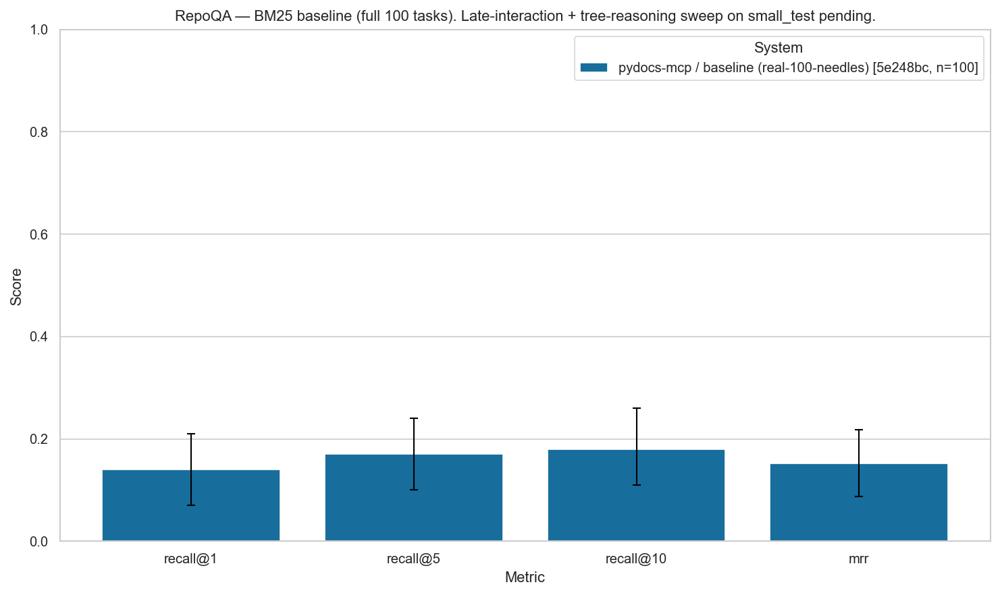

# Late-interaction vs BM25 vs LLM tree-reasoning evaluation

**Status: PLACEHOLDER — full small_test sweep in flight.**

This directory will hold the side-by-side comparison of the three opt-in
retrieval methods that pydocs-mcp ships, all measured on the
`--split small_test` stratified subsample (30 tasks per dataset):

| Method | Config | Cost per query |
|---|---|---|
| BM25 baseline | `benchmarks/configs/repoqa_bm25.yaml` / `benchmarks/configs/ds1000_ranked.yaml` | free, FTS5 lookup |
| BM25 + Late-Interaction (ColBERT/MaxSim, LateOn-Code via PyLate + fast-plaid), RRF-fused | `benchmarks/configs/repoqa_hybrid_li_rrf.yaml` / `benchmarks/configs/ds1000_hybrid_li_rrf.yaml` | local CPU encode + MaxSim |
| Vectorless LLM tree-reasoning (gpt-4o-mini, OpenAI) | `benchmarks/configs/repoqa_tree.yaml` | ~$0.001 / query |

Reproduce locally:

```bash
set -a; source python/pydocs_mcp/.env; set +a   # OPENAI_API_KEY for the tree config

PYTHONPATH=benchmarks/src python -m benchmarks.eval.runner \
  --dataset repoqa --split small_test --systems pydocs-mcp \
  --configs benchmarks/configs/repoqa_bm25.yaml,\
benchmarks/configs/repoqa_hybrid_li_rrf.yaml,\
benchmarks/configs/repoqa_tree.yaml \
  --report benchmarks/reports/late_interaction_eval/repoqa.md

PYTHONPATH=benchmarks/src python -m benchmarks.eval.runner \
  --dataset ds1000 --split small_test --systems pydocs-mcp \
  --configs benchmarks/configs/ds1000_ranked.yaml,\
benchmarks/configs/ds1000_hybrid_li_rrf.yaml,\
benchmarks/configs/ds1000_tree.yaml \
  --report benchmarks/reports/late_interaction_eval/ds1000.md
```

The late-interaction extra is required:

```bash
pip install 'pydocs-mcp[late-interaction]'   # pulls pylate + fast-plaid + sentence-transformers + torch
```

## Placeholder figure



The shipped `benchmarks/baselines/repoqa_snf.json` is the only real
baseline data this directory holds today — measured on the full 100-task
RepoQA split, BM25 only. Recall@10 = 0.18 (95% CI 0.11-0.26),
MRR = 0.15. This figure will be replaced by the three-method
`repoqa.png` / `ds1000.png` comparison plots as soon as the sweep
completes.
