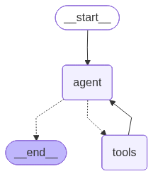

# Ask-your-docs agent

A **LangGraph ReAct** conversational agent that uses **pydocs-mcp** as its tool
server to answer questions about the documentation and code of your indexed
projects, with a **Streamlit** chat UI. It ships inside pydocs-mcp behind the
`ask-your-docs` extra, so installing it adds the `ask-your-docs` command.

What it demonstrates:

- **Multi-repo**: one agent over a directory of pre-built pydocs-mcp indexes
  (`pydocs-mcp serve --workspace ...`, read-only).
- **Grounded answers**: a system prompt that forces every answer through the
  pydocs-mcp tools (`search_codebase`, `get_symbol`, `get_references`, …),
  cites `project` + `package.module`, infers the right project when the user
  doesn't name one, asks a clarifying question when things stay ambiguous, and
  ends with a runnable usage-example snippet built from the retrieved
  signatures.
- **Scoped retrieval**: sidebar pickers pin a project / package / own-code-vs-
  dependencies slice, enforced deterministically on the tool calls (a
  `langchain-mcp-adapters` interceptor rewrites the arguments) rather than left
  to the model.
- **Conversation memory**: the last N messages are kept, and follow-up
  questions are **reformulated** into standalone queries before hitting the
  tools ("what does *it* return?" → "what does `backend.db.Pool.acquire`
  return?").
- **Your LLM**: any model served over the OpenAI API protocol — OpenAI itself
  or a local vLLM / Ollama / LiteLLM endpoint via the base URL.
- **GPU indexing, CPU serving**: embed the corpus once on GPU
  (Qwen3-Embedding-4B, torch), then serve queries on CPU via OpenVINO.

The code lives in `pydocs_mcp/ask_your_docs/`; this directory holds the two
embedding configs and this guide.

## Architecture

The chat agent is a **LangGraph ReAct** loop, shown here exactly as LangGraph
draws its own graph (`agent.get_graph().draw_mermaid_png()`):

<p align="center">
  
</p>

- **`agent`** — the LLM (your OpenAI-protocol model). Each turn it either calls a
  pydocs-mcp tool or, once it has enough grounding, returns the final answer
  (`agent ⇢ __end__`).
- **`tools`** — the six pydocs-mcp tools (`search_codebase`, `get_symbol`,
  `get_references`, `get_context`, `get_overview`, `get_why`). Results flow back
  into `agent`, which loops until it can answer.

End to end: **Streamlit UI → LangGraph agent → pydocs-mcp (stdio subprocess) →
read-only `.db` + `.tq` index bundles.** Before any tool runs, a
`langchain-mcp-adapters` interceptor rewrites its arguments to the sidebar's
pinned project / package / code scope, so retrieval stays inside the chosen
slice no matter what the model asks for.

<!-- agent-graph.png is the compiled agent's own graph, regenerated with
     agent.get_graph().draw_mermaid_png() (see pydocs_mcp.ask_your_docs.agent). -->

## Setup

```bash
pip install "pydocs-mcp[ask-your-docs]"          # from PyPI
# ...or from a checkout of this repo:
#   pip install -e ".[ask-your-docs]"

export OPENAI_API_KEY=sk-...   # any placeholder works for local servers
```

The agent works out of the box with the default fastembed embedder. For the
Qwen3 GPU-index / CPU-serve recipe below, also install the embedder extras:

```bash
pip install "pydocs-mcp[ask-your-docs,sentence-transformers,openvino]"
```

## 1. Index your repos (GPU, once per repo)

```bash
pydocs-mcp --config configs/index_gpu.yaml index ~/code/frontend --cache-dir ~/pydocs-index --gpu
pydocs-mcp --config configs/index_gpu.yaml index ~/code/backend  --cache-dir ~/pydocs-index --gpu
```

Each run writes a portable `{name}_{hash}.db` + `.tq` bundle into the
workspace directory.

## 2. Chat

```bash
ask-your-docs --workspace ~/pydocs-index --config configs/serve_cpu_openvino.yaml
```

`ask-your-docs` launches the Streamlit UI. Flags (`--workspace`, `--model`,
`--base-url`, `--config`, `--port`) prefill the sidebar; anything after `--`
is forwarded to `streamlit run` (e.g. `-- --server.headless true`). You can
also set `PYDOCS_WORKSPACE`, `PYDOCS_MODEL`, `OPENAI_BASE_URL`, `PYDOCS_CONFIG`
in the environment instead. Answers cite `project` + `package.module` and
render code in fenced blocks.

The sidebar's **Scope** pickers (project / own code vs dependencies / package)
pin every question to a slice of the corpus. A `langchain-mcp-adapters` tool
interceptor forces the pin onto the tool calls — the `project` on every tool,
and the `package` / own-vs-dependency filters on the search tools — so the
choice is enforced deterministically rather than trusted to the model. The
question is also prefixed with a `[pinned scope: ...]` note so the agent knows
why. Toggle **Light mode** at the top of the sidebar to switch the palette.

### Graph explorer

The app has a second page (sidebar → **Graph**) that visualizes a project's
structure as a **zoom / drill-down**: the canvas shows the direct children of
the current focus (a breadcrumb up top), and clicking a container — package
`⬡`, module `◆`, class `■`, or doc file `▲` — zooms into it; click a breadcrumb
segment to zoom back out. Node types are shown by shape + colour (legend) and
edges are coloured by relationship (calls / imports / inherits). Leaves
(functions, methods, decisions) open a docstring panel. A **Hide test files**
toggle and node/edge filters trim the view. Click **➕ Add to question** on any
node to attach it to your next chat question. The page reads the index bundles
directly (read-only) — no model calls.

Use the **Content** selector to switch between **Codebase** (modules, classes,
functions), **Documentation** (markdown files and architectural decisions), or
both — with `documents` / `concerns` links from docs and decisions to the code.

## Why two embedding configs?

Embedding the *corpus* is the expensive part, so it runs once on GPU
(`index_gpu.yaml`). At serve time only the short *query* text is embedded, so
CPU via OpenVINO is plenty (`serve_cpu_openvino.yaml` — sentence-transformers
auto-exports the model on first load). The serve step is read-only and
validates only that model + dim match the bundles, so the two files
interoperate.

**The one rule: index with `index_gpu.yaml`, serve with
`serve_cpu_openvino.yaml` — never re-index with the serve file.** The
`backend` key is part of the chunk-cache identity, so indexing under it would
re-embed the whole corpus on CPU.

| Free to differ between the two files | Must stay identical |
|---|---|
| `batch_size`, `device` (`--gpu`), `query_prompt_name` | `provider`, `model_name`, `dim`, `max_seq_length`, `normalize`, `bit_width` |

(`backend` / `model_file_name` are the deliberate exception: identical vector
space, different runtime — which is exactly why the serve file is serve-only.)

Prefer a lighter setup? Swap both configs to
`Qwen/Qwen3-Embedding-0.6B` + `dim: 1024` (or drop `--config` entirely to use
the built-in `BAAI/bge-small-en-v1.5` default — then index without a config
too, so the embedders match).
