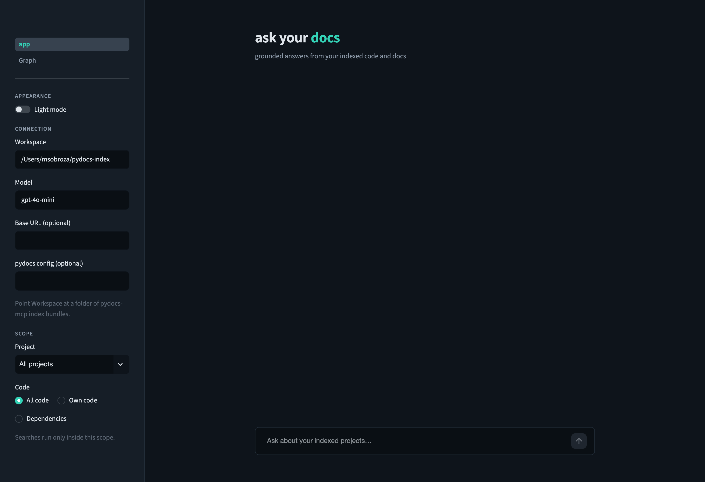
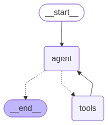
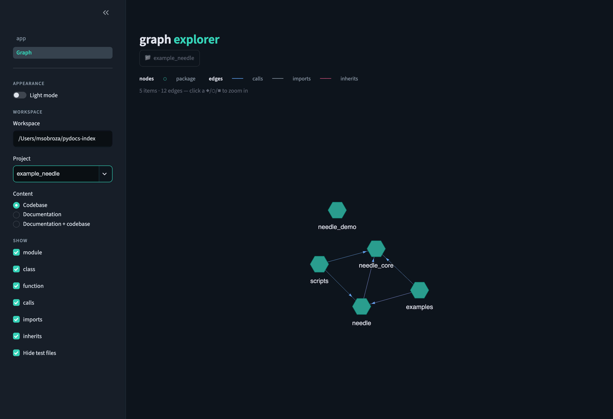

# Ask-your-docs agent

A **LangGraph ReAct** conversational agent that uses **pydocs-mcp** as its tool
server to answer questions about the documentation and code of your indexed
projects, with a **Streamlit** chat UI. It ships inside pydocs-mcp behind the
`harness-ask-your-docs` extra, so installing it adds the `harness-ask-your-docs` command.

<p align="center">
  
</p>

What it demonstrates:

- **Multi-repo**: one agent over a directory of pre-built pydocs-mcp indexes
  (`pydocs-mcp serve --workspace ...`, read-only).
- **Grounded answers**: a system prompt that forces every answer through the
  pydocs-mcp tools (`search_codebase`, `get_symbol`, `get_references`, …),
  cites `project` + `package.module`, infers the right project when the user
  doesn't name one, asks a clarifying question when things stay ambiguous, and
  ends with a runnable usage-example snippet built from the retrieved
  signatures.
- **Scoped retrieval**: sidebar pickers pin a project / package / own-code-vs-
  dependencies slice, enforced deterministically on the tool calls (a
  `langchain-mcp-adapters` interceptor rewrites the arguments) rather than left
  to the model.
- **Conversation memory**: the last N messages are kept, and follow-up
  questions are **reformulated** into standalone queries before hitting the
  tools ("what does *it* return?" → "what does `backend.db.Pool.acquire`
  return?").
- **Your LLM**: any model served over the OpenAI API protocol, hosted or local,
  via the base URL — with an internal token service or an environment-variable
  key as the bearer, and the endpoint's models listed in the UI.
- **GPU indexing, CPU serving**: embed the corpus once on GPU
  (Qwen3-Embedding-4B, torch), then serve queries on CPU via OpenVINO.

The code lives in `pydocs_mcp/harness/ask_your_docs/`; this directory holds the two
embedding configs and this guide.

## Architecture

The chat agent is a **LangGraph ReAct** loop, shown here exactly as LangGraph
draws its own graph (`agent.get_graph().draw_mermaid_png()`):

<p align="center">
  
</p>

- **`agent`** — the LLM (your OpenAI-protocol model). Each turn it either calls a
  pydocs-mcp tool or, once it has enough grounding, returns the final answer
  (`agent ⇢ __end__`).
- **`tools`** — the nine pydocs-mcp tools (`search_codebase`, `get_symbol`,
  `get_references`, `get_context`, `get_overview`, `get_why`, `grep`, `glob`,
  `read_file`). Results flow back into `agent`, which loops until it can answer.

End to end: **Streamlit UI → LangGraph agent → pydocs-mcp (stdio subprocess) →
read-only `.db` + `.tq` index bundles.** Before any tool runs, a
`langchain-mcp-adapters` interceptor rewrites its arguments to the sidebar's
pinned project / package / code scope, so retrieval stays inside the chosen
slice no matter what the model asks for. Each browser session holds ONE pydocs-mcp
subprocess for all of its questions: it starts with the first question, is closed when
the tab disconnects or the model changes, and is restarted (with a notice) if it stops.

<!-- agent-graph.png is the compiled agent's own graph, regenerated with
     agent.get_graph().draw_mermaid_png() (see pydocs_mcp.harness.ask_your_docs.agent).
     Every registered architecture (text_react / inline / vision_subagent /
     auto) builds a graph exposing get_graph(), so the picture can be
     regenerated per architecture by selecting it in YAML first. -->

## Setup

```bash
pip install "pydocs-mcp[harness-ask-your-docs]"          # from PyPI
# ...or from a checkout of this repo:
#   pip install -e ".[harness-ask-your-docs]"

export OPENAI_API_KEY=sk-...   # any placeholder works for local servers
```

The agent works out of the box with the default fastembed embedder. For the
Qwen3 GPU-index / CPU-serve recipe below, also install the embedder extras:

```bash
pip install "pydocs-mcp[harness-ask-your-docs,sentence-transformers,openvino]"
```

## 1. Index your repos (GPU, once per repo)

```bash
pydocs-mcp --config configs/index_gpu.yaml index ~/code/frontend --cache-dir ~/pydocs-index --gpu
pydocs-mcp --config configs/index_gpu.yaml index ~/code/backend  --cache-dir ~/pydocs-index --gpu
```

Each run writes a portable `{name}_{hash}.db` + `.tq` bundle into the
workspace directory.

## 2. Chat

```bash
harness-ask-your-docs --workspace ~/pydocs-index --config configs/serve_cpu_openvino.yaml
```

`harness-ask-your-docs` launches the Streamlit UI. The chat model's endpoint
comes from the `ask_your_docs.llm` block of the same YAML the `--config` flag
points at: `base_url` (an OpenAI-format endpoint), `auth.token_url` (an
internal token service whose response body is the bearer; set `token_field`
when the body is JSON) or `auth.api_key_env` (the name of the environment
variable holding a key), and `vision` (`true`, `false`, `null` to detect, or
`{model: …}` to send images to a second model on the same endpoint).
`OPENAI_BASE_URL` / `LLM_MODEL` override the YAML, `--base-url` / `--model`
override those, and the sidebar's **Connection** dialog overrides everything
for the session — it lists the endpoint's models (with a ↻ to re-ask the
endpoint), renews the token and tests the connection. With no `llm` block the
agent uses the vendor default endpoint and `OPENAI_API_KEY`, as before. The
pydocs-mcp server the UI starts sees the environment of the shell you launched
from, minus trace variables, exported shell functions and values containing
`${...}`. So an exported `OPENAI_BASE_URL` also re-points that server's OpenAI
clients (an `embedding.provider: openai` embedder whose `embedding.base_url` is
null, and the LLM client) and sends them their key. Set the chat endpoint with
`--base-url` or `ask_your_docs.llm.base_url`, and embeddings with
`embedding.base_url`. Keys are never put in YAML or on the command line: the
dialog has no key field, no launch flag carries one, and only a token's last
four characters are ever shown.

Above the dialog button, one status line reads host, model, bearer and vision
verdict (`vision: yes (configured)`), and it is where the connection warnings
land: a session endpoint that differs from the configured `base_url`, a bearer
sent over plain `http` to a non-loopback host, a key variable that is unset, a
token service that would not answer. None of that crashes the page — a failed
bearer or a failed model listing leaves the dialog reachable with the reason in
its caption, and every failure the UI renders, a rejected bearer included, is
redacted.

`--workspace` / `--config` / `--port` and `PYDOCS_WORKSPACE` / `PYDOCS_CONFIG`
prefill the sidebar; anything after `--` is forwarded to `streamlit run` (e.g.
`-- --server.headless true`). Answers cite `project` + `package.module` and
render code in fenced blocks.

The agent's behavior is configured under the `ask_your_docs:` block of the
same pydocs-mcp YAML the `--config` flag points at: `architecture` (`auto`
routes by the detected model capability — it builds
`multimodal.preferred_architecture`, `inline` by default, on a vision model,
and the separate describe hop whenever `ask_your_docs.llm.vision` names a
second model; `text_react` pins the classic text agent; `inline` /
`vision_subagent` are the image-capable graphs), `multimodal.detection` (the
capability-detection ladder, short-circuited when `ask_your_docs.llm.vision`
states the answer — the status line's vision cell shows the verdict and its
source), `multimodal.text_only_fallback` (`reject` | `describe`), and `images`
limits. Every key also accepts an env override of the form
`PYDOCS_ASK_YOUR_DOCS__ARCHITECTURE=inline`
(`PYDOCS_` prefix, `__`-nested path). On vision-capable models, attach
images (screenshots, error dialogs, diagrams) with the paperclip in the
chat input; recent images stay reinspectable — when a later question
refers back to one, the agent's `reinspect_images` tool re-reads just the
relevant image(s) against the new question (`images.session_retention`
bounds the store).

The sidebar's **Scope** pickers (project / own code vs dependencies / package)
pin every question to a slice of the corpus. A `langchain-mcp-adapters` tool
interceptor forces the pin onto the tool calls — the `project` on every tool,
and the `package` / own-vs-dependency filters on the search tools — so the
choice is enforced deterministically rather than trusted to the model. The
question is also prefixed with a `[pinned scope: ...]` note so the agent knows
why. Toggle **Light mode** at the top of the sidebar to switch the palette.

### Activity panel

Every answer has a panel above it. Collapsed, it is one line — `Done in 6.4 s · 4
steps · 3 files · reasoning shown`, `Answered without searching · 1.1 s` when no tool
was called, or `Stopped after 3 steps · … · the model endpoint rejected the request`
when the turn failed. Expanded, it lists the steps in plain words: the rephrased
question (when the rewrite changed it), the pinned scope, each tool call with its
outcome and up to three file chips, notes such as `Results were cut off at the
limit`, and the model's reasoning for each round. Below the answer, **Sources** lists
the files the answer names and **Also looked at** the rest. The sidebar's **Show
technical details** toggle adds, per call, the arguments the model proposed, the
arguments actually sent after the scope pin, the result's `meta` and a preview of
the raw result. A failed or stopped turn stays in the chat with its steps.

Reasoning appears only when the endpoint returns it (OpenRouter's `reasoning`, vLLM /
DeepSeek's `reasoning_content`); the request is never changed to ask for it. A
separate caption under the status line says what to expect from this model
(`Reasoning: shown (seen in answers)`, `hidden by provider`, `not shared by this
model`, `unknown until the first answer`), learned from its answers without any extra
call. The reasoning is the model's working notes: it can be incomplete or differ from
what the model actually did, and it can quote the files the agent read. It is shown
as plain text, collapsed by default, and redacted like everything in the panel — the
bearer and the value of the configured key variable are masked — but a secret that
sits inside one of your repository files cannot be recognised. Set
`ask_your_docs.ui.reasoning.display: hidden` to keep it off the page.

The panel is tuned under `ask_your_docs.ui` in the same YAML:

```yaml
ask_your_docs:
  ui:
    activity:
      enabled: true              # false = the plain spinner + answer
      live: true                 # false = no streaming; the panel is built after the turn
      technical_details: false   # default of the sidebar toggle
      collapse_when_done: true   # failed / stopped turns always stay expanded
      history_keep: 20           # older turns keep only their summary line + sources
    reasoning:
      display: collapsed         # collapsed | expanded | hidden
      max_chars: 20000           # per turn; head + tail are kept
```

Set `live: false` if your server streams tool calls badly: the model is then called
without streaming, exactly as with the panel off.

### Graph explorer

<p align="center">
  
</p>

The app has a second page (sidebar → **Graph**) that visualizes a project's
structure as a **zoom / drill-down**: the canvas shows the direct children of
the current focus (a breadcrumb up top), and clicking a container — package
`⬡`, module `◆`, class `■`, or doc file `▲` — zooms into it; click a breadcrumb
segment to zoom back out. Node types are shown by shape + colour (legend) and
edges are coloured by relationship (calls / imports / inherits). Leaves
(functions, methods, decisions) open a docstring panel. A **Hide test files**
toggle and node/edge filters trim the view. Click **➕ Add to question** on any
node to attach it to your next chat question. The page reads the index bundles
directly (read-only) — no model calls.

Use the **Content** selector to switch between **Codebase** (modules, classes,
functions), **Documentation** (markdown files and architectural decisions), or
both — with `documents` / `concerns` links from docs and decisions to the code.

## Why two embedding configs?

Embedding the *corpus* is the expensive part, so it runs once on GPU
(`index_gpu.yaml`). At serve time only the short *query* text is embedded, so
CPU via OpenVINO is plenty (`serve_cpu_openvino.yaml` — sentence-transformers
auto-exports the model on first load). The serve step is read-only and
validates only that model + dim match the bundles, so the two files
interoperate.

**The one rule: index with `index_gpu.yaml`, serve with
`serve_cpu_openvino.yaml` — never re-index with the serve file.** The
`backend` key is part of the chunk-cache identity, so indexing under it would
re-embed the whole corpus on CPU.

| Free to differ between the two files | Must stay identical |
|---|---|
| `batch_size`, `device` (`--gpu`), `query_prompt_name` | `provider`, `model_name`, `dim`, `max_seq_length`, `normalize`, `bit_width` |

(`backend` / `model_file_name` are the deliberate exception: identical vector
space, different runtime — which is exactly why the serve file is serve-only.)

Prefer a lighter setup? Swap both configs to
`Qwen/Qwen3-Embedding-0.6B` + `dim: 1024` (or drop `--config` entirely to use
the built-in `BAAI/bge-small-en-v1.5` default — then index without a config
too, so the embedders match).
